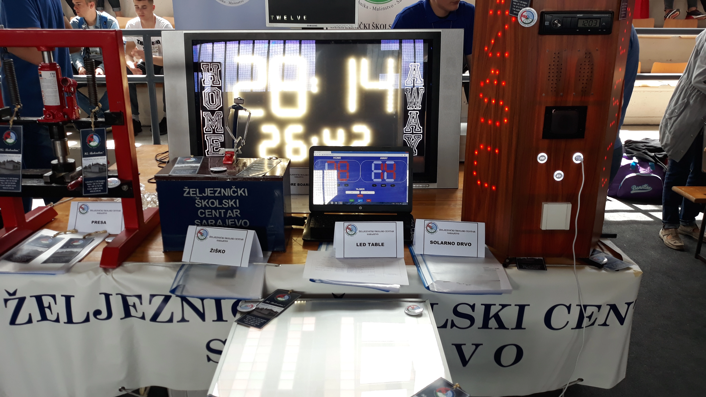

  

  <b>👋 Über mich 👋</b>


**Hinweis**: Diese Seite wurde mit Hilfe von [DeepL](https://www.deepl.com/translator) und [Google Translate](https://translate.google.com/) ins Deutsche übersetzt.


## Wie alles begann

Hallo, mein Name ist Luka. Ich bin ein junger Netzwerkadministrator und Cybersicherheitsexperte. Ich interessiere mich für Technik, seit ich klein war, und alles begann mit meiner ersten Computerreparatur, einem defekten RAM-Stick, den ich ersetzen musste. Danach fing ich an, mit der Elektronik in PCs zu experimentieren, und nach einiger Zeit hatte ich ein gewisses Grundwissen darüber, wie Computer funktionieren.

Im Laufe der Zeit erwarb ich immer mehr Kenntnisse, und ich begann damit, meine Familie und Freunde im IT-Bereich zu unterstützen. Ich begann mit Anleitungen zur Verwendung von Computern, ging dann zur Neuinstallation von Betriebssystemen über und erwarb danach einige grundlegende A+ Kenntnisse über Computersysteme.

## Oberschule

Ich habe das [Eisenbahn-Schulzentrum](https://zsc.edu.ba/) mit dem Titel Elektrotechniker abgeschlossen. Dank vieler Professoren an dieser Schule habe ich neue Kenntnisse über verschiedene elektronische Komponenten, Telekommunikationssysteme usw.

### Erstes Jahr

Im ersten Jahr habe ich Kenntnisse über elektrische Komponenten (Widerstände, Kondensatoren, Spulen usw.) erworben und meine Lötfähigkeiten verbessert. Ich habe den ersten Platz beim Schülerwettbewerb im Fach Grundlagen der Elektrotechnik gewonnen.
   Ich besuchte auch mehrere Highschool-Abschnitte, darunter:
>   + Elektrochemie,
>   + Englische Sprache,
>   + Grundlagen der Elektrotechnik,
>   + Mathematik.

### Zweites Jahr

Während des zweiten Jahres hatte ich die Gelegenheit, mit einer Gruppe von Klassenkameraden an dem Projekt "Arduino Scoreboard" zu arbeiten, das uns den ersten Platz beim staatlichen Wettbewerb (IX Fest der Arbeit in Hadžići einbrachte.

   

      
   

   + The Arduino Scoreboard is made using an Arduino microcontroller, and a WiFi module that connects us to the HTML web page (which you can see on the laptop) and with it we control the numbers and time on the traffic light. The numbers are handmade from an LED strip that acts like seven-segment displays.

### Drittes Jahr

Das Arduino Scoreboard wird mit einem Arduino-Mikrocontroller und einem WiFi-Modul erstellt, das uns mit der HTML-Webseite verbindet (die Sie auf dem Laptop sehen können) und mit der wir die Zahlen und die Zeit an der Ampel steuern. Die Zahlen werden aus einem LED-Streifen handgefertigt, der wie Sieben-Segment-Anzeigen wirkt.

   

      
   

   
Wie im Vorjahr nahmen wir an der X Fest der Arbeit teil, die in Zenica stattfand. Als Projekt hatten wir einen Solarbaum, der uns den ersten Platz einbrachte.

   

      
   

### Viertes Jahr

Im letzten Jahr haben wir hauptsächlich über Telekommunikation gelernt, wo ich für meine Abschlussarbeit ein Thema über Funkempfänger hatte. Das Projekt, an dem wir für das XI Fest der Arbeit gearbeitet haben, ist ein LED-Schreibtisch, der mit einem Arduino-Mikrocontroller programmiert wurde, um Muster anzuzeigen.

   

      
   

   
Dieses Projekt brachte uns im dritten Jahr in Folge den ersten Platz ein.

## ITAcademy

Nach dem Abitur habe ich mich entschieden, meine Kenntnisse der Informatik an der ITAcademy im Bereich Netzwerkadministration fortzusetzen. Insbesondere die CCNA-Vorbereitung (Cisco Certified Network Administrator), bei der ich lernte, viele Netzwerkgeräte einzurichten und zu konfigurieren, sowie fortgeschrittene Kenntnisse in der Verwendung von Windows Server- und Linux-Betriebssystemen. Nach meinem Abschluss an der ITAcademy habe ich mich entschieden, mein aktuelles Wissen im Bereich Cybersicherheit zu erweitern. Ich bin derzeit der Erste in Bosnien und Herzegowina am TryHackMe-Tisch.

 

   
 

## Meine Hobbies

+ ⌨️ `[Linux OS]`

   Fortgeschrittene Kenntnisse in der Verwendung von Linux-Betriebssystemen, verschiedenen Distributionen und fortgeschrittene Kenntnisse des Terminals und seiner Befehle. Ich habe mich für das Betriebssystem Linux entschieden, weil ich gerne mit verschiedenen TWMs (Tiling Window Manager) experimentiere. Ich habe diese Distributionen unten verwendet:

  >   + Ubuntu Linux
  >   + Debian Linux
  >   + Pop!_OS
  >   + Kali Linux
  >   + Parrot OS
  >   + Arch Linux
  >   + Artix Linux
  >   + Manjaro Linux
  >   + Gentoo Linux

+ 💿 `[Elektronik]`

   Ich experimentiere immer mit Elektronik, von Computern über Handys, Fernseher usw.

   Wenn etwas kaputt ist, versuche ich es immer selbst zu zerlegen und zu reparieren, und wenn ich etwas nicht weiß, gibt es immer einen guten Freund namens Internet. Ich bin auch mit der Hard- und Softwareseite vieler elektronischer Geräte vertraut.

+ 🤖 `[Cybersecurity]`

   Ich verbringe den größten Teil meiner Freizeit damit, über neue Hackerangriffe zu recherchieren und zu lesen und wie dieser Angriff durchgeführt wurde.

   Wenn es sich um Malware handelt, erstelle ich eine virtuelle Maschine, installiere die schädliche Datei und analysiere sie dann. Was die Datei gerade auf dem System tut, mit welchen anderen Dateien kommuniziert sie, was schreibt sie in den Speicher usw. Genau aus diesem Grund habe ich diesen Blog gestartet, um diesen Prozess zu dokumentieren.

+ 📚 `[Arduino Programmierung]`

   Viele Projekte können auf einem Arduino-Mikrocontroller durchgeführt werden. Der Arduino dient uns als Gehirn elektronischer Bauteile.

   Es ist auch großartig für Anfänger, die etwas über Elektronik lernen möchten, aber das bedeutet nicht, dass das Arduino nur für sie gedacht ist. Mit diesem Mikrocontroller können wir viele komplexe Projekte durchführen.

+ 🖥️ `[Raspberry Pi]` 

   Der Raspberry Pi ist ein kleiner Computer mit Prozessor, Speicher usw. Er eröffnet viele neue Möglichkeiten für noch komplexere Projekte als Arduino, wie: Satellitenverfolgung, Arcade-Automaten mit alten Spielen, SNES (Super Nintendo)-Emulator, usw.

+ 💻 `[Alte Konsolen]` 

   Ich sammle alte Spielkonsolen und mache dann Projekte darauf.

   Ein Beispiel für ein Projekt, an dem ich gearbeitet habe, ist die Installation eines Linux-Betriebssystems auf einem Nintedno 3DS. Ich modifiziere auch Konsolen wie zum Beispiel Xbox 360 mit einem RGH oder JTAG-Chip.

+ 📁 `[Aktivist für digitalen Datenschutz]` 

   Dass große Unternehmen wie Google und Facebook uns ausspionieren, ist schon lange bekannt. Sie versetzen uns in eine Lage, in der ein normaler Bürger 24 Stunden am Tag überwacht wird. Leider wird in Bosnien und Herzegowina das Thema digitaler Datenschutz nicht so oft erwähnt. Warum haben Unternehmen überhaupt das Recht, Daten über uns zu sammeln?

   Ihre Privatsphäre, Ihre Kontrolle über Ihre Daten und Ihre Meinungsfreiheit im Internet!
   

## Vielen Dank für Ihre Zeit 💙

