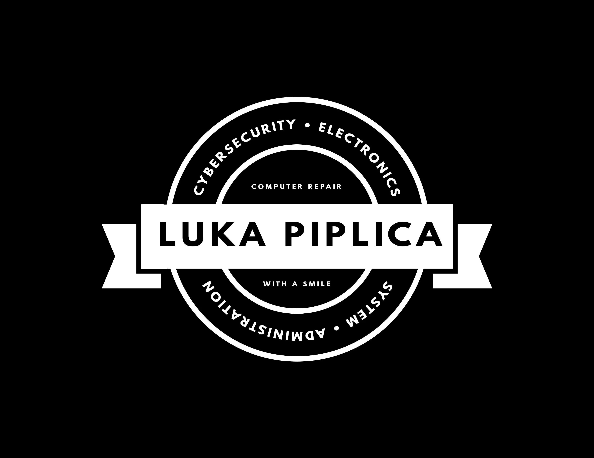
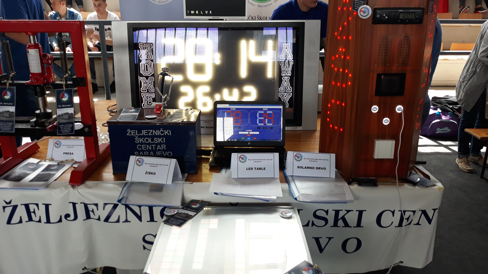
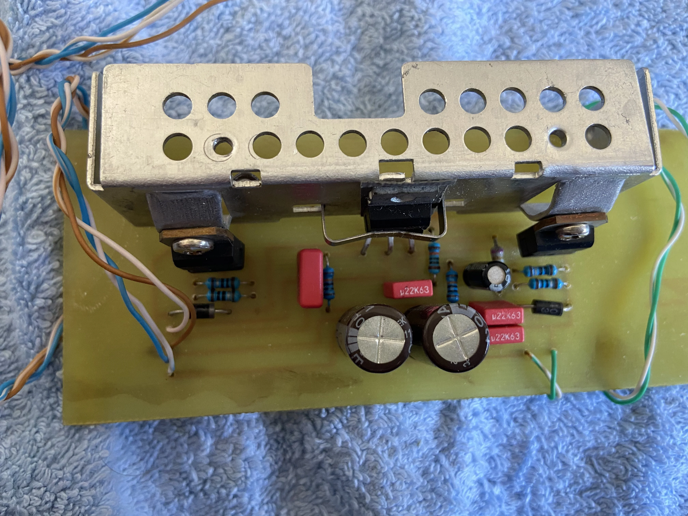
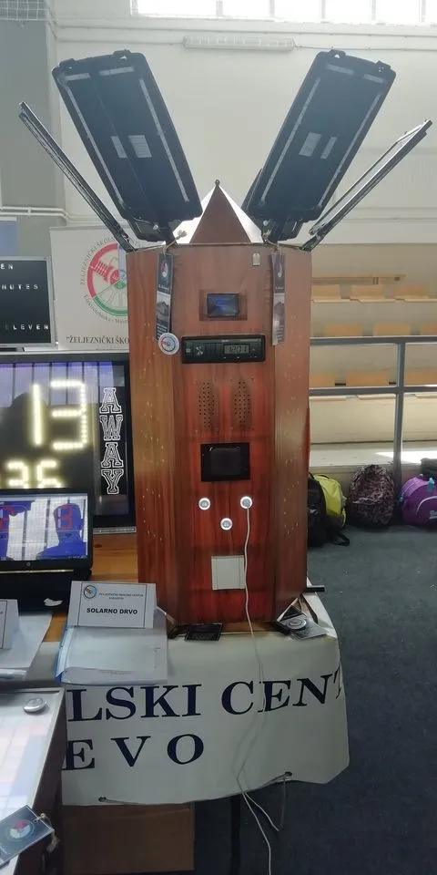
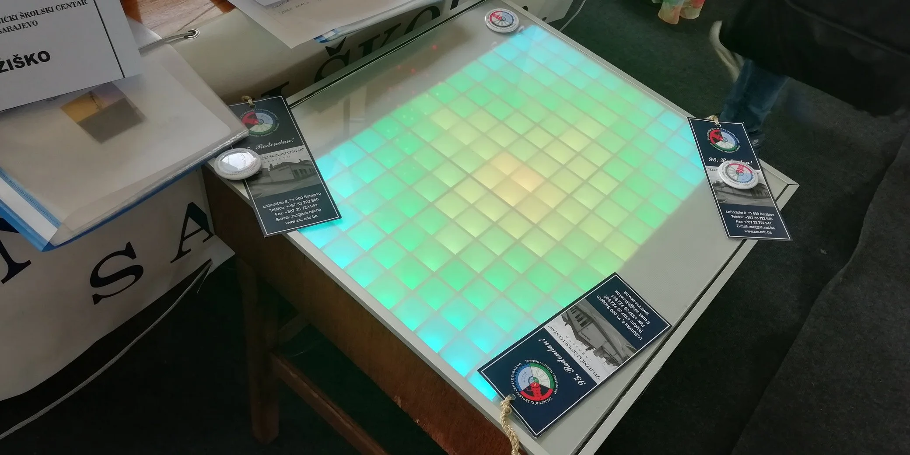
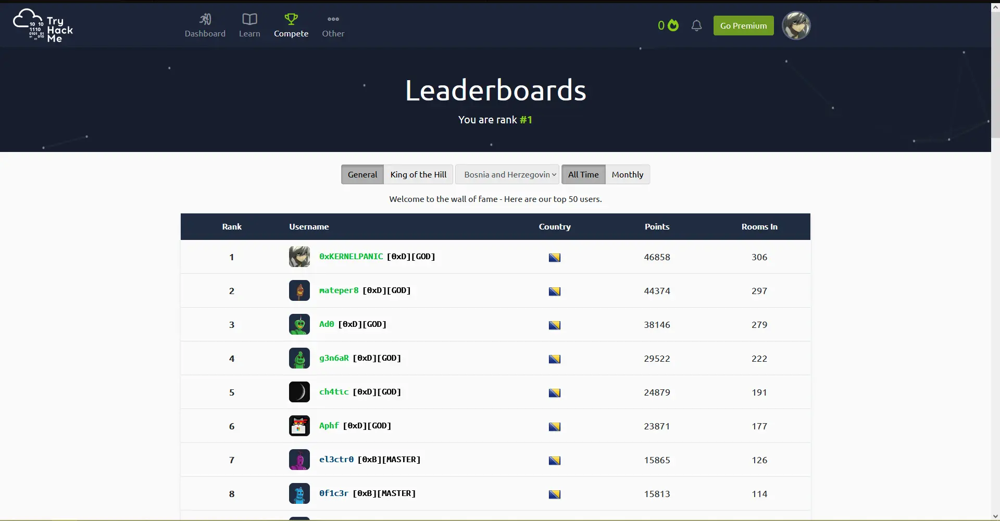

  

  <b>👋 About Me👋</b>

## How it all started

Hi, my name is Luka. I'm a young network administrator and cybersecurity reasercher. I'm into technology since I was little, and everything began with my first computer repair, a faulty RAM stick which I had to replace. After that I began experimenting with electronics inside PC's and after some time I got some basic level knowledge on how computers work.

I gained more knowledge as time passed by and I started by being an IT support for my family and friends starting with instructions on how to use a computer, then moving to reinstalling operating systems and after that I gained some basic A+ knowledge on computer systems.

## High School

I finished [Railway School Center](https://zsc.edu.ba/) with the title of electrical tehnician. Thanks to many professors in this school, I gained new knowledge about various electronic components, telecommunication systems, etc.

### First Year

During the first year, I gained knowledge about electrical components (resistors, capacitors, coils, etc.) and improved my soldering skills. I won first place in the school competition in the subject Basics of Electrical Engineering.
   I also attended several high school sections including:
>   + electrochemistry,
>   + English language,
>   + basics of electrical engineering,
>   + mathematics.

### Second Year

During the second year, I had the opportunity to work with a group of classmates on the project "Arduino Scoreboard", which brought us won first place in the state competition (IX Labor Fest) in Hadžići.

   

      
   

   + The Arduino Scoreboard is made using an Arduino microcontroller, and a WiFi module that connects us to the HTML web page (which you can see on the laptop) and with it we control the numbers and time on the traffic light. The numbers are handmade from an LED strip that acts like seven-segment displays.

### Third year

During my third year, I learned to make my own PCB's as well as advanced knowledge about transistors. This year we had to make something for our final project, I had the opportunity to work on an audio amplifier project.

   

      
   

   
As in previous year, we participated in the X Labor Fest, which was held in Zenica. As a project we had a solar tree which brought us first place.

   

      
   

### Fourth year

In the final year, we mostly learned about telecommunications, where I had a topic about radio recievers for my final work. The project we worked on for the XI Labor Fest is an LED desk programmed with an Arduino microcontroller to display patterns.

   

      
   

   
This project brought us the first place for the third year in a row.

## ITAcademy

After graduating from high school, I decided to continue my knowledge of information technology at the ITAcademy in the field of network administration. Specifically CCNA (Cisco Certified Network Administrator) preparation, where I learned to set up and configure many network devices, as well as advanced knowledge in using Windows Server and Linux operating systems. After graduating from the ITAcademy, I decided to expand my current knowledge in the cybersecurity sector. I am currently first in Bosnia and Herzegovina on the TryHackMe table.

 

   
 

## My hobbies

+ ⌨️ `[Linux OS]`

   Advanced knowledge of using Linux operating systems, various distributions and advanced knowledge of the terminal and its commands. I opted for the Linux operating system because I like to experiment with different TWMs (Tiling Window Manager). I have used these distributions below:

  >   + Ubuntu Linux
  >   + Debian Linux
  >   + Pop!_OS
  >   + Kali Linux
  >   + Parrot OS
  >   + Arch Linux
  >   + Artix Linux
  >   + Manjaro Linux
  >   + Gentoo Linux

+ 💿 `[Electronics]`

   I always experiment with electronics, from computers to cell phones, televisions, etc.

   If something is broken I always try to disassemble and fix it myself, and if I don’t know something there is always a good friend called the Internet. I am also familiar with the hardware and software side of many electronic devices.

+ 🤖 `[Cybersecurity]`

   I spend most of my free time researching and reading about new hacker attacks and how that attack was carried out.

   If it is some malware then I make a virtual machine and install the malicious file and then analyze it. What the file is currently doing on the system, what other files is it communicating with, what is it  writing to memory, etc. This is exactly why I started this blog so I could document this process.

+ 📚 `[Arduino programming]`

   Many projects can be done on an Arduino microcontroller. The Arduino serves us as the brain of electronic components.

   It’s also great for beginners who want to learn about electronics, but that doesn’t mean the Arduino is just meant for them. We can do many complex projects with this microcontroller.

+ 🖥️ `[Raspberry Pi]` 

   The Raspberry Pi is a small computer with a processor, memory, etc. It opens up a lot of new opportunities for even more complex projects than Arduino, such as: satellite tracking, arcade machines with old games, SNES (Super Nintendo) emulator, etc.

+ 💻 `[Old consoles]` 

   I collect old game consoles and then do projects on them.

   An example of a project I was working on is installing a Linux OS on a Nintedno 3DS. I also modify consoles like for example Xbox 360 with an RGH or JTAG chip.

+ 📁 `[Digital privacy activist]` 

   It has long been known that big companies like Google and Facebook are spying on us. They put us in a position where a normal citizen is monitored 24 hours a day. Unfortunately, in Bosnia and Herzegovina, the topic of digital privacy is not so much mentioned. Why do companies have the right to collect data about us at all ?

   Your privacy, your control over your data and your freedom of speech on the internet ! 
   

## Thank you for your time 💙

