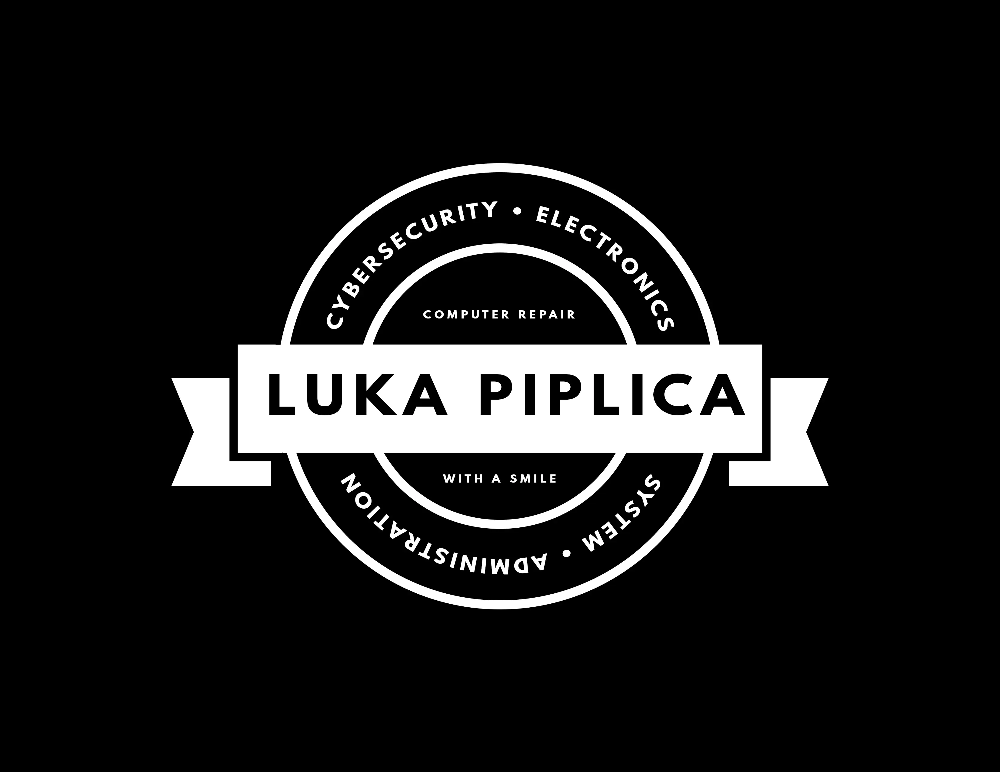
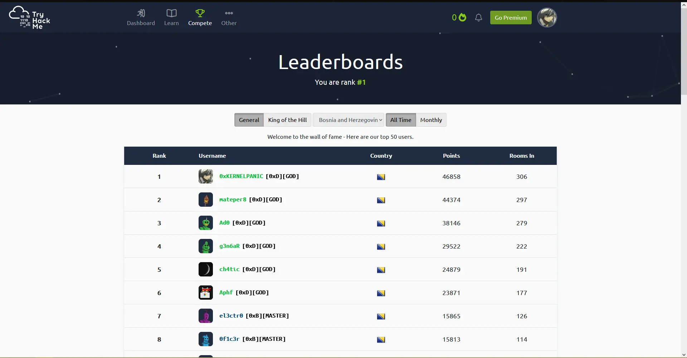

  

  <b>👋 O meni 👋</b>

## Kako je sve počelo

Bok, moje ime je Luka. Mladi sam mrežni administrator, a u svoje slobodno vrijeme volim istraživati o svemu što je povezano sa kibernetičkom sigurnošću. Tehnologijom se bavim od malih nogu, a sve je počelo s mojom prvom popravkom računala, neispravna RAM pločica koju sam morao zamijeniti. Nakon toga sam počeo eksperimentisati s elektronikom unutar osobnog računala i nakon nekog vremena stekao sam osnovno znanje o tome kako računala rade.

Stjecao sam sve više znanja kako je vrijeme prolazilo i počeo sam primjenjivati to znanje tako što sam bio IT podrška svojoj obitelji i prijateljima počevši od uputa o korištenju raznih tehnoloških uređaja, zatim sam prešao na instalaciju operativnih sustava i nakon toga sam stekao neko osnovno A+ znanje o računarima.

## Srednja škola

Završio sam [Željeznički školski centar](https://zsc.edu.ba/) sa zvanjem elektrotehničara elektronike. Zahvaljujući brojnim profesorima u ovoj školi stekao sam nova znanja o raznim elektroničkim komponentama, telekomunikacijskim sustavima i sl. 

### Prva godina

Tijekom prve godine stekao sam znanja o električnim komponentama (otpornici, kondenzatori, zavojnice itd.) i unaprijedio sam svoje vještine lemljenja. Osvojio sam prvo mjesto na školskom natjecanju iz predmeta osnove elektrotehnike.
   Također sam pohađao nekoliko sekcija srednje škole uključujući:
>   + elektrokemija,
>   + engleski jezik,
>   + osnove elektrotehnike,
>   + matematika.

### Druga godina

Tijekom druge godine sam imao priliku raditi s grupom kolega iz razreda na projektu "Arduino Scoreboard", koji nam je donio osvojeno prvo mjesto na državnom natjecanju (IX Festival Rada) u Hadžićima.

   

      
   

   + Arduino Scoreboard napravljen je pomoću Arduino mikrokontrolera, te WiFi modula koji nas spaja na HTML web stranicu (koju možete vidjeti na laptopu) i pomoću nje kontroliramo brojke i vrijeme na semaforu. Brojevi su ručno izrađeni od LED trake koja se ponaša kao sedmosegmentni zaslon.

### Treća godina

Tijekom treće godine naučio sam izraditi vlastite PCB-ove, a stekao sam i napredno znanje o tranzistorima. Ove godine za završni projekt imao sam priliku raditi na audio pojačalu.

   

      
   

   
Kao i prethodne godine, sudjelovali smo na X Festivalu rada koji je održan u Zenici. Kao projekt imali smo solarno stablo koje nam je donijelo prvo mjesto.

   

      
   

### Četvrta godina

Na završnoj godini najviše smo učili o telekomunikacijama, gdje sam za završni rad imao temu o radijskim prijemnicima. Projekt koji smo radili za XI Festival rada je LED stol programiran Arduino mikrokontrolerom za prikaz uzoraka.

   

      
   

   
Ovaj projekt donio nam je prvo mjesto treću godinu zaredom.

## ITAcademy

Nakon završene srednje škole odlučio sam nastaviti svoje poznavanje informacijskih tehnologija na ITAcademy u smjeru mrežne administracije. Konkretno CCNA (Cisco Certified Network Administrator) priprema, gdje sam naučio postaviti i konfigurirati mnoge mrežne uređaje, kao i napredno znanje u korištenju Windows Server i Linux operativnih sustava. Nakon što sam diplomirao na ITAcademy, odlučio sam proširiti svoje dosadašnje znanje u sektoru kibernetičke sigurnosti. Trenutno sam prvi u Bosni i Hercegovini na TryHackMe tabeli.

 

   
 

## Moji hobiji

+ ⌨️ `[Linux OS]`

   Napredno poznavanje korištenja Linux operativnih sustava, raznih distribucija te napredno poznavanje terminala i njegovih naredbi. Odlučio sam se za operativni sustav Linux jer volim eksperimentirati s različitim TWM-ovima (Tiling Window Manager). Koristio sam navedene distribucije ispod:

  >   + Ubuntu Linux
  >   + Debian Linux
  >   + Pop!_OS
  >   + Kali Linux
  >   + Parrot OS
  >   + Arch Linux
  >   + Artix Linux
  >   + Manjaro Linux
  >   + Gentoo Linux

+ 💿 `[Elektronika]`

   Uvijek eksperimentiram s elektronikom, od računala do mobitela, televizora itd.

   Ako je nešto pokvareno uvijek pokušam to sam rastaviti i popraviti, a ako nešto ne znam uvijek postoji dobar prijatelj koji se zove Internet. Također sam upoznat s hardverskom i softverskom stranom mnogih elektroničkih uređaja.

+ 🤖 `[Kibernetička sigurnost]`

   Većinu slobodnog vremena provodim istražujući i čitajući o novim hakerskim napadima i kako je taj napad izveden.

   Ako se radi o zlonamjernom softveru, napravim virtualnu mašinu i instaliram zlonamjernu datoteku, a zatim je analiziram. Što datoteka trenutno radi na sustavu, s kojim drugim datotekama komunicira, što zapisuje u memoriju itd. Upravo je ovo jedan od razloga što sam pokrenuo ovaj blog kako bih mogao dokumentirati ovaj proces.

+ 📚 `[Arduino programiranje]`

   Mnogi projekti mogu se napraviti na Arduino mikrokontroleru. Arduino nam služi kao mozak elektroničkih komponenti.

   Također je odličan za početnike koji žele učiti o elektronici, ali to ne znači da je Arduino namijenjen samo njima. S ovim mikrokontrolerom možemo napraviti mnoge složene projekte.

+ 🖥️ `[Raspberry Pi]` 

   Raspberry Pi je malo računalo s procesorom, memorijom itd. Otvara puno novih mogućnosti za još složenije projekte od Arduina, kao što su: satelitsko praćenje, arkadni strojevi sa starim igrama, SNES (Super Nintendo) emulator, itd.
   
+ 💻 `[Stare konzole]` 

   Skupljam stare igraće konzole i onda na njima radim projekte.

   Primjer projekta na kojem sam radio je instaliranje Linux OS-a na Nintedno 3DS. Također modificiram konzole kao što je na primjer Xbox 360 s RGH ili JTAG čipom.

+ 📁 `[Aktivist za digitalnu privatnost]` 

   Odavno je poznato da nas špijuniraju velike kompanije poput Google-a i Facebook-a. Doveli su nas u poziciju da normalnog građanina prate 24 sata. Nažalost, u Bosni i Hercegovini se tema digitalne privatnosti malo pominje. Zašto tvrtke uopće imaju pravo prikupljati podatke o nama?

   Vaša privatnost, vaša kontrola nad vašim podacima i vaša sloboda govora na internetu!
   

## Hvala na vašem vremenu 💙

