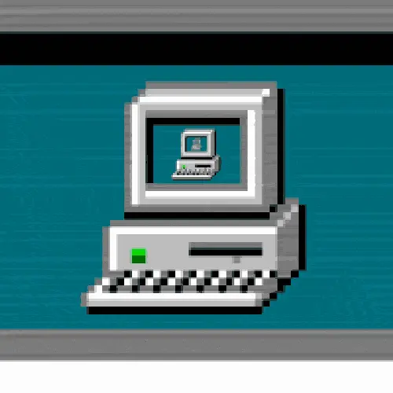
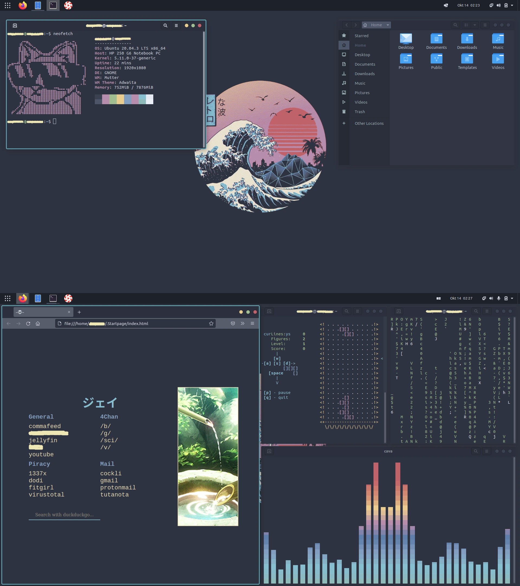
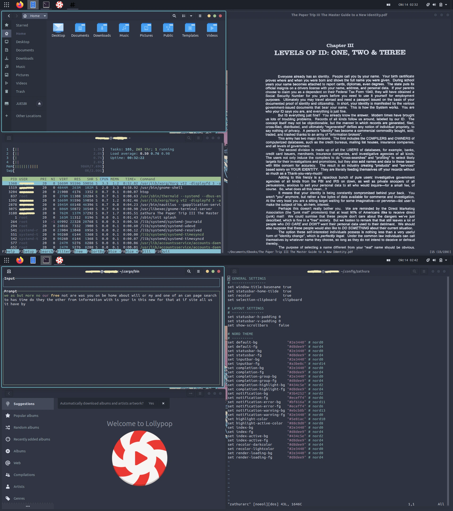

<p align="center">
  
</p>


<p align="center">
  <b>💻 Ubuntu mit einem nordischen Thema 💻</b>
</p>


**Hinweis**: Diese Seite wurde mit Hilfe von [DeepL](https://www.deepl.com/translator) und [Google Translate](https://translate.google.com/) ins Deutsche übersetzt.





Dies sind meine aktuellen Dotfiles von Ubuntu Linux.

Die Installation hilft Ihnen dabei, das gleiche Aussehen wie auf den Bildern zu erzielen. Hier sind die Schritt-für-Schritt-Anleitungen.

System-Spezifikationen:

> + **OS**: [Ubuntu](https://ubuntu.com/) 
> + **GTK Thema**: [Nordic](https://www.gnome-look.org/p/1267246)
> + **Icon Thema**: [Flatery_Dark](https://www.gnome-look.org/p/1332404)
> + **Cursor Thema**: [Oreo_Blue](https://www.gnome-look.org/s/Gnome/p/1360254/)
> + **Browser**: [Firefox](https://www.mozilla.org/en-US/firefox/new/)


## Installation

Ich gehe davon aus, dass Sie Ubuntu 20.04 mit minimaler Installation frisch installiert haben, um mit diesem Aussehen zu beginnen.

*Wenn Sie sich dafür interessieren, was eine Anwendung tut, hilft Ihnen Wikipedia weiter.*

### Repository-Upgrade und System-Upgrade

> ```shell
> sudo apt update
> sudo apt upgrade
> ```

### Installation der Gnome Tweak Tool

Wir müssen zuerst das Gnome Tweak Tool installieren, um die Gnome-Erweiterungen zu installieren.

   + **Installation der Gnome Tweak Tool**:

>   ```shell 
>   sudo apt install gnome-shell-extensions
>   ```

   + **Öffnen Sie dann Firefox und gehen Sie zu [Verknüpfung](https://extensions.gnome.org/) und laden Sie das Add-on herunter.**
 
   + **Laden Sie die erforderlichen Add-Ons herunter**:

   Nach dem Herunterladen des Gnome-Erweiterungs-Add-Ons müssen wir den Schieberegler für einige Add-Ons auf Ein stellen. Sie finden sie unter den folgenden Links:

>-    [Dash to Panel](https://extensions.gnome.org/extension/1160/dash-to-panel/)  
>-    [User Themes](https://extensions.gnome.org/extension/19/user-themes/)   
>-    [Transparent Window Moving](https://extensions.gnome.org/extension/1446/transparent-window-moving/)

  Stellen Sie dann sicher, dass sie im Betriebssystem enthalten sind, indem Sie die Gnome Tweak Tool-App öffnen und sicherstellen, dass die oben genannten Add-Ons enthalten sind; Deaktivieren Sie außerdem die Desktop-Symbole.
  

  **HINWEIS**: Sie können das Dash in den Einstellungen nach Belieben auf Panel setzen (um Symbole zu verkleinern usw.). Außerdem sind meine Einstellungen für das Verschieben von transparentem Fenster auf 0,2.


### Installation von Pop Shell

>   ```shell
>   sudo apt install git node-typescript make
>   ``` 

Nach der Installation der erforderlichen Abhängigkeiten müssen wir im Terminal zum Ordner Downloads gehen.

>   ```shell
>   cd ~/Downloads 
>   ```

Dann müssen wir das Repository klonen: 

>   ```shell
>   git clone https://github.com/pop-os/shell.git
>   ```

Dann betreten wir den Shell-Ordner:

>   ```shell
>   cd shell
>   ```

Installation von Pop Shell:

>   ```shell
>   make local-install
>   ```


### Installation anderer Anwendungen

   + Installation von neofetch: 

>   ```shell
>   sudo apt install neofetch
>   ```

   + Installation von zathura: 

>   ```shell
>   sudo apt install zathura
>   ```

   + Installation von tty-clock:

>   ```shell
>   sudo apt install tty-clock
>   ```

   + Installation von cmatrix:

>   ```shell
>   sudo apt install cmatrix
>   ```

   + Installation von htop:

>   ```shell
>   sudo apt install htop
>   ``` 

   + Installation von ranger:

>   ```shell
>   sudo apt install ranger
>   ```

   + Installation von Vim: 

>   ```shell
>   sudo apt install vim
>   ```

   + Installation von Lollypop: 

>   ```shell
>   sudo apt install lollypop
>   ```

   + Installation von cbonsai:

>   ```shell
>   cd ~/Downloads
>   sudo apt install libncursesw5-dev
>   git clone https://gitlab.com/jallbrit/cbonsai
>   cd cbonsai
>   make install PREFIX=~/.local
>   ```
    
   + Installation von tty-tetris:

>   ```shell
>   cd ~/Downloads
>   sudo apt install cmake
>   git clone https://github.com/Holixus/tty-tetris-v2.git
>   cmake .
>   make 
>   sudo make install
>   ```


   + Installation von Cava:

   Wir installieren zuerst die notwendigen Abhängigkeiten:

>    ```shell
>    sudo apt install libfftw3-dev libasound2-dev libncursesw5-dev libpulse-dev libtool automake libiniparser-dev
>
>    export CPPFLAGS=-I/usr/include/iniparser
>    ```

   Dann gehen wir zum Downloads-Ordner und klonen das Cava-Repository:

>    ```shell
>    cd ~/Downloads
>
>    git clone https://github.com/karlstav/cava.git
>    ```
 
   Dann müssen wir Cava kompilieren:

>    ```shell
>    cd cava
>    ./autogen.sh
>    ./configure
>    make
>    ```

   Jetzt können wir Cava installieren: 

>    ```shell
>    sudo make install
>    ```

   + Installation von Ttyper:

>    ```shell
>    sudo apt install cargo
>
>    sudo apt install ttyper
>    ```


### Installation des GRUB thema

   + Repository-Klonen:
   
>   ```shell
>   cd ~/Downloads
>   git clone https://github.com/semimqmo/sekiro_grub_theme
>   ```

   + Installation des GRUB thema: 

>   ```shell
>   sudo ./install.sh
>   ```

### Verschiedene Themeninstallationen

>- **GTK Thema**: [Nordic](https://www.gnome-look.org/p/1267246)
>- **Icon Thema**: [Flatery_Dark](https://www.gnome-look.org/p/1332404)
>- **Cursor Thema**: [Oreo_Blue](https://www.gnome-look.org/s/Gnome/p/1360254/)


**HINWEIS**: Um diese Designs zu installieren, müssen Sie zwei versteckte Ordner im Home-Verzeichnis erstellen.


>  ```shell
>  cd ~/
>  mkdir .themes
>  mkdir .icons
>  ```

+ In den Ordner `.themes` müssen wir das GTK-Thema und das Icon-Thema einfügen, und in den `.icons`-Ordner müssen wir das Cursor-Thema einfügen. Dann müssen wir sie über die Gnome Tweak Tools-Anwendung aktivieren.

+ Erstellen oder laden Sie eine vorhandene Startseite herunter und fügen Sie sie zu Firefox hinzu. 
+ Ändern Sie das Hintergrundbild mit dem Gnome Tweak Tool.


## Wikipedia

Nachdem wir diese GNOME-Konfiguration vorgenommen haben, ist es an der Zeit zu klären, was jede Anwendung tut.

+ 🧠 `[Pop Shell]`

   Pop Shell gibt uns die Möglichkeit, den Tilling Window Manager auf dem Desktop-System zu verwenden, der die Fenster per Skript auf dem Bildschirm anordnet und so Platz auf dem Bildschirm spart.

+ ⌨️ `[Neofetch]`

   Neofetch ist ein Befehl, der uns Systemspezifikationen liefert und außerdem ein cooles Aussehen hat.

+ 🍫 `[Zathura]`

   Zathura ist ein PDF Reader, bei dem es möglich ist, das Layout und viele andere Optionen mit einer einzigen Konfigurationsdatei zu ändern.


+ 🐚 `[Ranger]` 

  Ranger dient uns als Dateimanager im Terminal.
  

+ 📋 `[Vim]` texteditor

  Da viele Leute Notepad auf Windows-Betriebssystemen verwenden, verwenden wir Nano und Vim.

  Der Nano-Texteditor ist viel einfacher zu bedienen, während der Vim aufgrund seiner Verknüpfungen eher für Entwickler gemacht ist.


+ 🌳 `[cbonsai]`

  Cbonsai ist ein Skript, das in unserem Terminal einen Baum aus Zeichen, Buchstaben und Zahlen erstellt.

+ 🎮 `[tty-tetris]`

  Tty-Tetris ist eine Anwendung, mit der wir Tetris auf dem Terminal spielen können.

+ 📰 `[ttyper]`

  Ttyper ist eine Anwendung, die die Tippgeschwindigkeit im Terminal misst.


+ 🕶️ `[Nordic]` GTK thema.

   Nordic Dark ist ein GTK-Thema (Thema für Benutzeroberflächenanwendungen), das Anwendungen mit einer Benutzeroberfläche ein dunkles Aussehen verleiht.

+ 🔷 `[Flattery]` icon thema.

   Wie der Name schon sagt, haben Anwendungen, die eine Benutzeroberfläche haben, meistens Symbole, die wir mit der Maus anklicken können; Dieses Thema gibt uns ein anderes Aussehen der Symbole.

+ 🔵 `[Oreo Blue]` cursor thema.

   Dieses Thema gibt uns einen blauen Cursor-Look; Es wurde nur wegen des Aussehens eingefügt und weil es zu allen anderen Farben dieses Betriebssystems passt.

+ 🔥🦊 `[Firefox]` Web-Browser.

   Ich verwende Firefox, weil es meiner Meinung nach einer der besten datenschutzorientierten Webbrowser ist.


+ ⏰ `tty-clock` 

   Tty-clock ist eine Anwendung, die darauf abzielt, die Uhrzeit und das Datum im Terminal anzuzeigen.
   
+ 🎚️ `CAVA` Audio-Visualisierer.

   Cava ist eine Anwendung, die als Audiovisualisierer dient.

+ 📈 `HTop` 

  Die HTop-Anwendung zeigt, welche Prozessoren gerade laufen und wie viel RAM sie belegen, und viele andere Dinge. Stellen Sie sich HTop als Task-Manager in Windows vor.
  
+ 😎 `CMatrix` 

   CMatrix ist eine Anwendung, die nur zum Anschauen da ist, und ihr Zweck ist es, Text in einem offenen Terminal zu drucken, der darauf abzielt, eine Anzeige von Hacking aus dem Matrix-Film zu geben.

+ 🤠 `Ranger` 

   Ranger ist eine Anwendung, mit der wir alle Dateien auf dem Computer im Terminal sehen und darauf zugreifen können.
   
+ 🍭 `Lollypop` 

   Lollypop ist eine Musik-App, mit der wir Lieder abspielen.


## Vielen Dank für Ihre Zeit 💙

