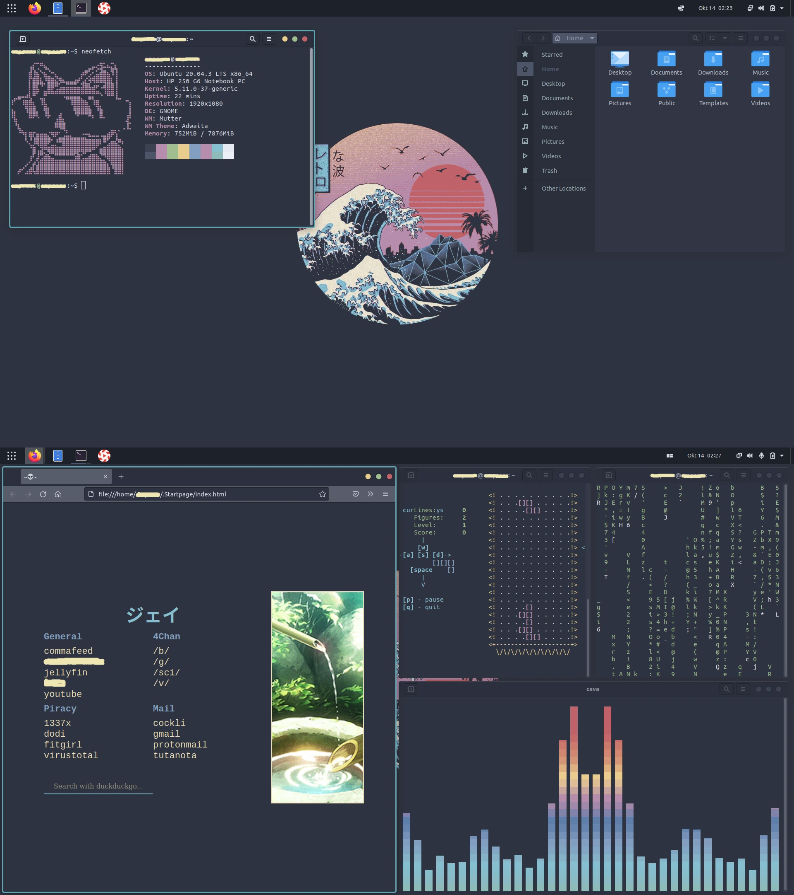

<p align="center">
  
</p>


<p align="center">
  <b>💻 GNOME goes NORD configuration files 💻</b>
</p>





These are my current dotfiles of Ubuntu Linux.

The installation will help you create the same look as in the pictures; here are the step-by-step instructions.

System specifications:

> + **OS**: [Ubuntu](https://ubuntu.com/) 
> + **GTK Theme**: [Nordic](https://www.gnome-look.org/p/1267246)
> + **Icon Theme**: [Flatery_Dark](https://www.gnome-look.org/p/1332404)
> + **Cursor Theme**: [Oreo_Blue](https://www.gnome-look.org/s/Gnome/p/1360254/)
> + **Browser**: [Firefox](https://www.mozilla.org/en-US/firefox/new/)


## Installation

I assume you have freshly installed Ubuntu 20.04 with minimal installation to start making this look.

*If you are interested in what an application does, Wikipedia will help you.*

### Repository upgrade and system upgrade

> ```shell
> sudo apt update
> sudo apt upgrade
> ```

### Installation of Gnome Tweak Tool

We must first install the gnome tweak tool to install the gnome extensions.

   + **Installation of Gnome Tweak Tool**:

>   ```shell 
>   sudo apt install gnome-shell-extensions
>   ```

   + **Then open Firefox and go to [LINK](https://extensions.gnome.org/) and download the add-on.**
 
   + **Download the necessary add-ons**:

   After downloading the Gnome Extension add-on, we need to move the slider to On for a few add-ons; you can find them at the links below:

>-    [Dash to Panel](https://extensions.gnome.org/extension/1160/dash-to-panel/)  
>-    [User Themes](https://extensions.gnome.org/extension/19/user-themes/)   
>-    [Transparent Window Moving](https://extensions.gnome.org/extension/1446/transparent-window-moving/)

  Then make sure they are included in the operating system by opening the Gnome Tweak Tool app and making sure the above add-ons are included; also, turn off the Desktop icons.


  **NOTE:** You can set Dash to Panel in the settings as you wish (to make icons smaller etc.). Also, Transparent Window moving my settings are at 0.2.


### Installation of Pop Shell

>   ```shell
>   sudo apt install git node-typescript make
>   ``` 

After installing the necessary dependencies, we need to go to the Downloads folder in the terminal.

>   ```shell
>   cd ~/Downloads 
>   ```

Then we need to clone the repository: 

>   ```shell
>   git clone https://github.com/pop-os/shell.git
>   ```

Then we enter the shell folder:

>   ```shell
>   cd shell
>   ```

Installation of Pop Shell:

>   ```shell
>   make local-install
>   ```


### Installation of other applications

   + Installation of neofetch: 

>   ```shell
>   sudo apt install neofetch
>   ```

   + Installation of zathura: 

>   ```shell
>   sudo apt install zathura
>   ```

   + Installation of tty-clock:

>   ```shell
>   sudo apt install tty-clock
>   ```

   + Installation of cmatrix:

>   ```shell
>   sudo apt install cmatrix
>   ```

   + Installation of htop:

>   ```shell
>   sudo apt install htop
>   ``` 

   + Installation of ranger:

>   ```shell
>   sudo apt install ranger
>   ```

   + Installation of Vim: 

>   ```shell
>   sudo apt install vim
>   ```

   + Installation of Lollypop: 

>   ```shell
>   sudo apt install lollypop
>   ```

   + Installation of cbonsai:

>   ```shell
>   cd ~/Downloads
>   sudo apt install libncursesw5-dev
>   git clone https://gitlab.com/jallbrit/cbonsai
>   cd cbonsai
>   make install PREFIX=~/.local
>   ```
    
   + Installation of tty-tetris:

>   ```shell
>   cd ~/Downloads
>   sudo apt install cmake
>   git clone https://github.com/Holixus/tty-tetris-v2.git
>   cmake .
>   make 
>   sudo make install
>   ```


   + Installation of Cava:

   We first install the necessary dependencies:

>    ```shell
>    sudo apt install libfftw3-dev libasound2-dev libncursesw5-dev libpulse-dev libtool automake libiniparser-dev
>
>    export CPPFLAGS=-I/usr/include/iniparser
>    ```

   Then we go to the Downloads folder and clone the Cava repository:

>    ```shell
>    cd ~/Downloads
>
>    git clone https://github.com/karlstav/cava.git
>    ```
 
   Then we need to compile Cava:

>    ```shell
>    cd cava
>    ./autogen.sh
>    ./configure
>    make
>    ```

   Now we can install Cava: 

>    ```shell
>    sudo make install
>    ```

   + Installation of Ttyper:

>    ```shell
>    sudo apt install cargo
>
>    sudo apt install ttyper
>    ```


### GRUB theme installation

   + Repository cloning:
   
>   ```shell
>   cd ~/Downloads
>   git clone https://github.com/semimqmo/sekiro_grub_theme
>   ```

   + GRUB theme installation: 

>   ```shell
>   sudo ./install.sh
>   ```

### Various theme installation 

>- **GTK Theme**: [Nordic](https://www.gnome-look.org/p/1267246)
>- **Icon Theme**: [Flatery_Dark](https://www.gnome-look.org/p/1332404)
>- **Cursor Theme**: [Oreo_Blue](https://www.gnome-look.org/s/Gnome/p/1360254/)


**NOTE**: To install these themes, you need to create two hidden folders in the home directory.


>  ```shell
>  cd ~/
>  mkdir .themes
>  mkdir .icons
>  ```

+ In the `.themes` folder, we need to insert the GTK theme and the Icon theme, and in the `.icons`, we need to insert the Cursor theme. Then we need to enable them from the Gnome Tweak Tools application.

+ Create or download an existing Startpage and add it to Firefox. 
+ Change Wallpaper through Gnome Tweak Tool.


## Wikipedia

Now that we've made this GNOME configuration, it's time to clarify what each application does.

+ 🧠 `[Pop Shell]`

   Pop Shell gives us the option to use the Tilling Window Manager on the Desktop system, which arranges the windows on the screen by a script and thus saves screen space.

+ ⌨️ `[Neofetch]`

   Neofetch is a command that gives us system specifications, plus it has a cool look.

+ 🍫 `[Zathura]`

   Zathura is a PDF reader where it is possible to change the layout and many other options using a single configuration file.


+ 🐚 `[Ranger]` 

  Ranger serves us as a file manager in the terminal.


+ 📋 `[Vim]` text editor

  As many people use notepad on Windows operating systems, we use nano and Vim.

  The Nano text editor is much easier to use, while the Vim is made more for developers because of its shortcuts.


+ 🌳 `[cbonsai]`

  Cbonsai is a script that makes a tree of characters, letters and numbers in our terminal.

+ 🎮 `[tty-tetris]`

  Tty-Tetris is an application that allows us to play Tetris on the terminal.

+ 📰 `[ttyper]`

  Ttyper is an application that measures the typing speed in the terminal. 


+ 🕶️ `[Nordic]` GTK theme.

   Nordic Dark is a GTK theme (theme for user interface applications) that gives us a dark look at applications with a user interface.

+ 🔷 `[Flattery]` icon theme.

   The name itself says, applications that have a user interface mostly have icons that we can click with the mouse; this theme gives us a different look to the icons.

+ 🔵 `[Oreo Blue]` cursor theme.

   This theme gives us a blue cursor look; it was inserted just for the looks and because it matches all the other colours of this operating system.

+ 🔥🦊 `[Firefox]` web browser.

   I use Firefox because it is one of the best privacy-oriented web browsers, in my opinion.


+ ⏰ `tty-clock` 

   Tty-clock is an application that aims to show the time and date in the terminal.

+ 🎚️ `CAVA` audio visualizer.

   Cava is an application that serves as an audio visualizer.

+ 📈 `HTop` 

  The HTop application shows which processors are currently running and how much RAM they are taking in, and many other things. Think of HTop as a Task Manager in Windows.

+ 😎 `CMatrix` 

   CMatrix is an application that is here just for looks, and its purpose is to print some text in an open terminal that aims to give a display of hacking from the Matrix movie.

+ 🤠 `Ranger` 

   Ranger is an application that allows us to see and access all files on the computer in the terminal.

+ 🍭 `Lollypop` 

   Lollypop is a music app; we play songs through it.


## Thanks you for your time 💙

