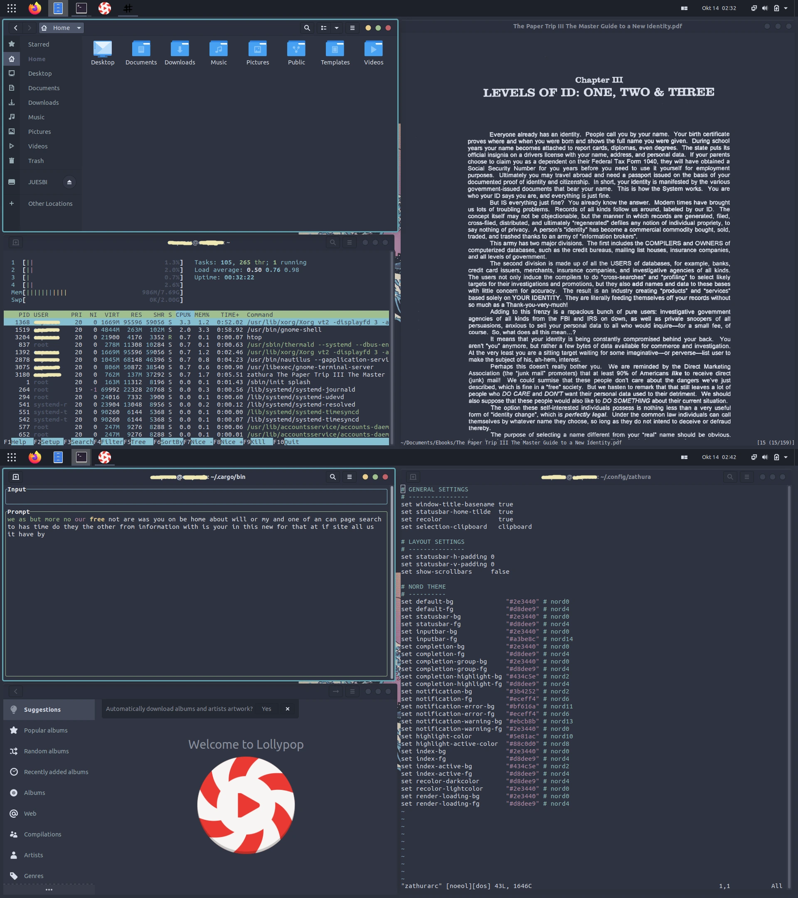

<p align="center">
  
</p>


<p align="center">
  <b>💻 GNOME ide NORD konfiguracijske datoteke 💻</b>
</p>




Ovo su moje trenutne dot datoteke Ubuntu Linuxa.

Instalacija će vam pomoći da stvorite isti izgled kao na slikama; ovdje su upute korak po korak.

Specifikacije sustava:

> + **OS**: [Ubuntu](https://ubuntu.com/) 
> + **Tema GTK-a**: [Nordic](https://www.gnome-look.org/p/1267246)
> + **Tema ikona**: [Flatery_Dark](https://www.gnome-look.org/p/1332404)
> + **Tema kursora**: [Oreo_Blue](https://www.gnome-look.org/s/Gnome/p/1360254/)
> + **Preglednik**: [Firefox](https://www.mozilla.org/en-US/firefox/new/)


## Instalacija

Pretpostavljam da ste svježe instalirali Ubuntu 20.04 s minimalnom instalacijom kako biste počeli stvarati ovaj izgled.

*Ako vas zanima što aplikacija radi, Wikipedia će vam pomoći.*

### Nadogradnja repozitorija i nadogradnja sustava

> ```shell
> sudo apt update
> sudo apt upgrade
> ```

### Instalacija Gnome alata za podešavanje

Prvo moramo instalirati gnome alat za podešavanje kako bismo instalirali gnome ekstenzije.

   + **Instalacija alata za podešavanje**:

>   ```shell 
>   sudo apt install gnome-shell-extensions
>   ```

   + **Zatim otvorite Firefox i idite na [LINK](https://extensions.gnome.org/) i preuzmite dodatak.**
 
   + **Preuzmite potrebne dodatke**:

   Nakon preuzimanja dodatka Gnome Extension, moramo pomaknuti klizač na Uključeno za nekoliko dodataka; možete ih pronaći na poveznicama ispod:

>-    [Dash to Panel](https://extensions.gnome.org/extension/1160/dash-to-panel/)  
>-    [User Themes](https://extensions.gnome.org/extension/19/user-themes/)   
>-    [Transparent Window Moving](https://extensions.gnome.org/extension/1446/transparent-window-moving/)

  Zatim provjerite jesu li uključeni u operativnom sustavu tako što ćete otvoriti aplikaciju Gnome Tweak Tool i provjeriti jesu li gore navedeni dodaci uključeni; također isključite ikone na radnoj površini.
  

  **NAPOMENA:** Možete postaviti Dash to Panel u postavkama kako želite (da ikone budu manje itd.). Također, Transparent Window move moje postavke su na 0.2.


### Instalacija Pop Shell-a

>   ```shell
>   sudo apt install git node-typescript make
>   ``` 

Nakon instaliranja potrebnih paketa, moramo otići u mapu Downloads.

>   ```shell
>   cd ~/Downloads 
>   ```

Zatim moramo klonirati repozitoriju: 

>   ```shell
>   git clone https://github.com/pop-os/shell.git
>   ```

Zatim ulazimo u shell mapu:

>   ```shell
>   cd shell
>   ```

Instalacija Pop Shell-a:

>   ```shell
>   make local-install
>   ```


### Instalacija drugih aplikacija

   + Instalacija neofetch-a: 

>   ```shell
>   sudo apt install neofetch
>   ```

   + Instalacija zathura-e: 

>   ```shell
>   sudo apt install zathura
>   ```

   + Instalacija tty-clock-a:

>   ```shell
>   sudo apt install tty-clock
>   ```

   + Instalacija cmatrix-a:

>   ```shell
>   sudo apt install cmatrix
>   ```

   + Instalacija htop-a:

>   ```shell
>   sudo apt install htop
>   ``` 

   + Instalacija ranger-a:

>   ```shell
>   sudo apt install ranger
>   ```

   + Instalacija Vim-a: 

>   ```shell
>   sudo apt install vim
>   ```

   + Instalacija Lollypop-a: 

>   ```shell
>   sudo apt install lollypop
>   ```

   + Instalacija cbonsai-a:

>   ```shell
>   cd ~/Downloads
>   sudo apt install libncursesw5-dev
>   git clone https://gitlab.com/jallbrit/cbonsai
>   cd cbonsai
>   make install PREFIX=~/.local
>   ```
    
   + Instalacija tty-tetris-a:

>   ```shell
>   cd ~/Downloads
>   sudo apt install cmake
>   git clone https://github.com/Holixus/tty-tetris-v2.git
>   cmake .
>   make 
>   sudo make install
>   ```


   + Instalacija Cava-e:

   Prvo instaliramo potrebne pakete:

>    ```shell
>    sudo apt install libfftw3-dev libasound2-dev libncursesw5-dev libpulse-dev libtool automake libiniparser-dev
>
>    export CPPFLAGS=-I/usr/include/iniparser
>    ```

   Zatim idemo u mapu Downloads i kloniramo Cava repozitorij:

>    ```shell
>    cd ~/Downloads
>
>    git clone https://github.com/karlstav/cava.git
>    ```
 
   Zatim moramo kompajlirati Cavu:

>    ```shell
>    cd cava
>    ./autogen.sh
>    ./configure
>    make
>    ```

   Sada možemo instalirati Cavu: 

>    ```shell
>    sudo make install
>    ```

   + Instalacija Ttyper-a:

>    ```shell
>    sudo apt install cargo
>
>    sudo apt install ttyper
>    ```


### Instalacija GRUB teme

   + Kloniranje repozitorija:
   
>   ```shell
>   cd ~/Downloads
>   git clone https://github.com/semimqmo/sekiro_grub_theme
>   ```

   + Instalacija GRUB teme: 

>   ```shell
>   sudo ./install.sh
>   ```

### Instalacija raznih tema

>- **Tema GTK-a**: [Nordic](https://www.gnome-look.org/p/1267246)
>- **Tema ikone**: [Flatery_Dark](https://www.gnome-look.org/p/1332404)
>- **Tema kursora**: [Oreo_Blue](https://www.gnome-look.org/s/Gnome/p/1360254/)


**NAPOMENA**: Za instaliranje ovih tema trebate stvoriti dvije skrivene mape u početnom direktoriju.


>  ```shell
>  cd ~/
>  mkdir .themes
>  mkdir .icons
>  ```

+ U mapu `.themes` trebamo ubaciti GTK temu i temu ikona, a u `.icons` temu kursora. Zatim ih moramo omogućiti iz aplikacije Gnome Tweak Tools.

+ Stvorite ili preuzmite postojeću početnu stranicu i dodajte je u Firefox.
+ Promijenite pozadinu pomoću aplikacije Gnome Tweak Tools.


## Wikipedia

Sada kada smo napravili ovu GNOME konfiguraciju, vrijeme je da razjasnimo što svaka aplikacija radi.

+ 🧠 `[Pop Shell]`

   Pop Shell nam daje mogućnost korištenja Tilling Window Managera na Desktop sustavu, koji raspoređuje prozore na ekranu pomoću skripte i tako štedi prostor na ekranu.

+ ⌨️ `[Neofetch]`

   Neofetch je naredba koja nam daje specifikacije sustava, plus ima cool izgled.

+ 🍫 `[Zathura]`

   Zathura je PDF čitač u kojem je moguće promijeniti izgled i mnoge druge opcije pomoću jedne konfiguracijske datoteke.


+ 🐚 `[Ranger]` 

  Ranger nam služi kao upravitelj datoteka u terminalu.


+ 📋 `[Vim]` uređivač teksta

  Kako mnogi ljudi koriste notepad na Windows operativnim sustavima, mi koristimo nano i Vim.

  Nano uređivač teksta puno je lakši za korištenje, dok je Vim više namijenjen programerima zbog svojih prečaca.

+ 🌳 `[cbonsai]`

  Cbonsai je skripta koja u našem terminalu čini stablo od znakova, slova i brojeva.

+ 🎮 `[tty-tetris]`

  Tty-Tetris je aplikacija koja nam omogućuje igranje Tetrisa na terminalu.

+ 📰 `[ttyper]`

  Ttyper je aplikacija koja mjeri brzinu tipkanja na terminalu.


+ 🕶️ `[Nordic]` Tema GTK-a.

   Nordic Dark je GTK tema (tema za aplikacije korisničkog sučelja) koja nam daje mračni izgled na aplikacije s korisničkim sučeljem.

+ 🔷 `[Flattery]` tema ikona.

   Sam naziv kaže, aplikacije koje imaju korisničko sučelje uglavnom imaju ikone na koje možemo kliknuti mišem; ova tema nam daje drugačiji izgleda ikona.

+ 🔵 `[Oreo Blue]` tema kursora.

   Ova tema daje izgled plavog kursora; umetnuta je samo zbog izgleda i odgovara svim ostalim bojama ovog operativnog sustava.

+ 🔥🦊 `[Firefox]` preglednik.

   Koristim Firefox jer je to jedan od najboljih web preglednika orijentiranih na privatnost, po mom mišljenju.


+ ⏰ `tty-clock` 

   Tty-clock je aplikacija koja ima za cilj prikazati vrijeme i datum na terminalu.

+ 🎚️ `CAVA` audio vizualizator.

   Cava je aplikacija koja služi kao audio vizualizator.

+ 📈 `HTop` 

  Aplikacija HTop pokazuje koji procesori trenutno rade i koliko RAM-a zauzimaju te mnoge druge stvari. Zamislite HTop kao upravitelj zadataka u sustavu Windows.

+ 😎 `CMatrix` 

   CMatrix je aplikacija koja je ovdje samo radi izgleda, a svrha joj je ispisati neki tekst u otvorenom terminalu koji ima za cilj dati prikaz hakiranja iz filma Matrix.

+ 🤠 `Ranger` 

   Ranger je aplikacija koja nam omogućuje pregled i pristup svim datotekama na računalu u terminalu.

+ 🍭 `Lollypop` 

   Lollypop je glazbena aplikacija.


## Hvala vam na vašem vremenu 💙

