<p align="center">
  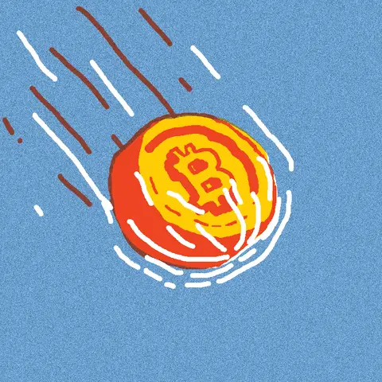
</p>

<p align="center">
  <b>💸 HSKY Token 💸</b>
</p>


**Hinweis**: Diese Seite wurde mit Hilfe von [DeepL](https://www.deepl.com/translator) und [Google Translate](https://translate.google.com/) ins Deutsche übersetzt.



## Was ist ein Krypto-Token?

Heutzutage verwenden immer mehr Menschen Kryptowährungen; Einige berühmte sind Bitcoin, Dogecoin, Etherium, Solana usw. Alle diese Kryptowährungen haben ihre Blockchain. Wir machen einen Krypto-Token; Im Gegensatz zu anderen gängigen Kryptowährungen mit eigener Blockchain funktionieren Krypto-Token auf Blockchains anderer Kryptowährungen. Insbesondere werden wir Solana wegen der günstigen Gebühr beim Wechsel dieses Tokens und der Geschwindigkeit verwenden (Solana hat im Gegensatz zu den anderen eine sehr schnelle Blockchain).

## Was wird benötigt:

>- **Betriebssystem:** [Debian Linux](https://www.debian.org/)  
>- **Github-Profil** [Github](https://github.com)
>- **Krypto-Austausch** [Binance](https://www.binance.com/en)
>- **Phantom-Brieftasche** [PhantomWallet](https://phantom.app/)
>- **Solflare** [Solflare](https://solflare.com/)


**HINWEIS**: Es ist notwendig, Solana zu kaufen!


## Anweisungen

Wir müssen eine virtuelle Maschine erstellen und dann Debian Linux in der CLI installieren (ohne grafische Oberfläche).

<p align="center">
  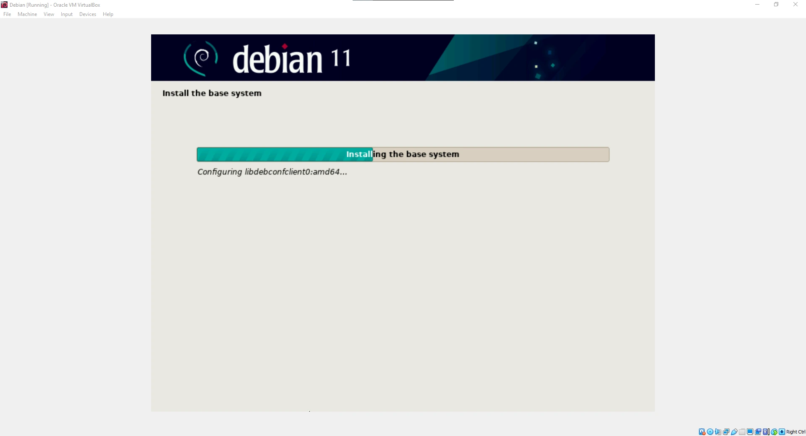
</p>

<p align="center">
  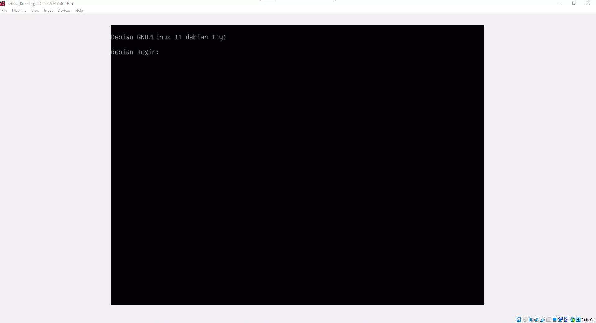
</p>

Nach der Installation von Debian müssen Sie als Erstes das System aktualisieren.


### Debian aktualisieren

> ```shell
> sudo apt update
> sudo apt upgrade
> ```

### Installieren von Solanas-Tools

> ```shell 
> sh -c "$(curl -sSfL https://release.solana.com/v1.8.5/install)"
> ```
     
Geben Sie dann **exit** ein und melden Sie sich erneut bei CLI an.

### Erstellen einer Krypto-Wallet

> ```shell
> solana-keygen new
> ```

Drücken Sie zweimal die Eingabetaste, und Sie haben erfolgreich eine Brieftasche erstellt.


**HINWEIS**: Der öffentliche Schlüssel ist eigentlich Ihre Brieftaschenadresse, und speichern Sie die Seed-Phrase irgendwo, falls Sie die Brieftasche verlieren!


<p align="center">
  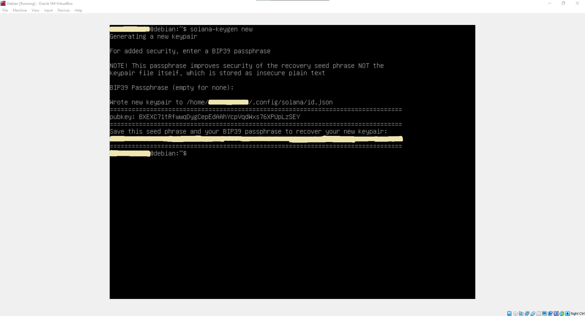
</p>

### Solana kaufen

Um unseren Token herzustellen, müssen wir Solana kaufen. Meine Empfehlung ist Binance.

<p align="center">
  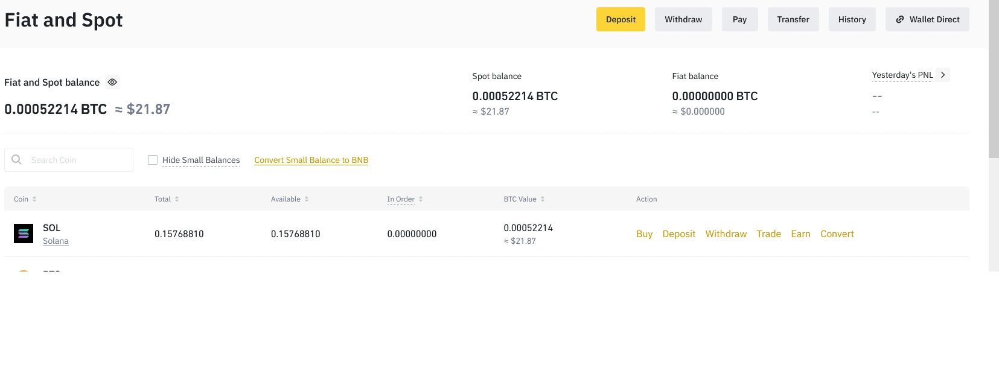
</p>

### Übertragung von Solana

Nachdem wir Solana gekauft haben, befindet es sich auf Binance. Wir müssen es in die Brieftasche auf der virtuellen Maschine übertragen.


**HINWEIS**: Die Adresse, an die Sie von Binance senden, ist der öffentliche Schlüssel, den wir in einer virtuellen Maschine erstellt haben!


<p align="center">
  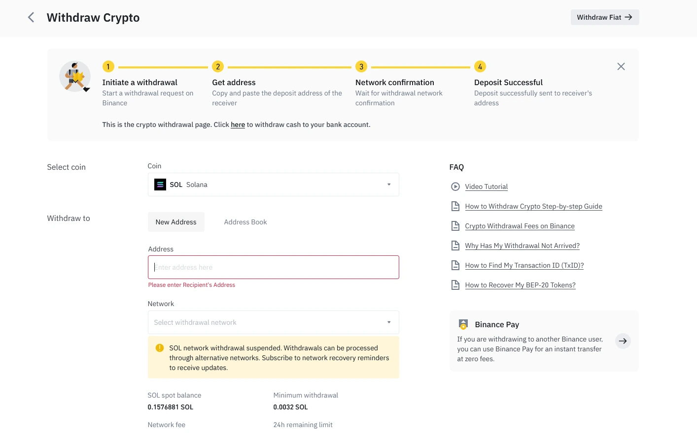
</p>

Nachdem wir Solana erfolgreich übertragen haben, wollen wir sehen, wie viele Solana wir in CLI haben; wir tippen: 

> ```shell
> solana balance
> ```

### Installation von Rust

> ```shell
> curl https://sh.rustup.rs -sSf | sh
> ```

Nachdem Sie auf die Eingabetaste geklickt haben, drücken Sie 1 für die Standardinstallation.

<p align="center">
  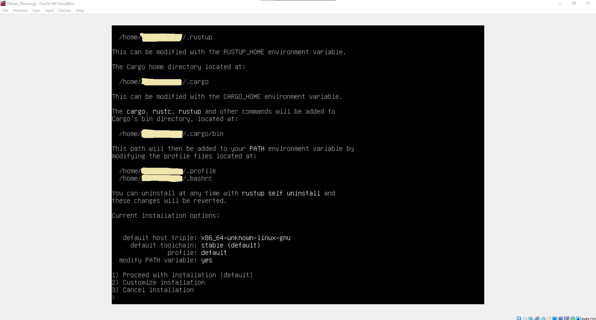
</p>

Geben Sie **exit** ein und melden Sie sich erneut bei der virtuellen Maschine an.

### Installation der erforderlichen Pakete

> ```shell
> sudo apt install libudev-dev libssl-dev pkg-config build-essential
> ```

### Installation von SPL

> ```shell
> cargo install spl-token-cli
> ```

### Erstellen eines Krypto-Tokens

> ```shell
> spl-token create-token
> ```

### Erstellen eines Kontos, das unser Token behält

> ```shell
> spl-token create-account *TOKEN ID*
> ```


**HINWEIS**: Die Token-ID ist ein Token, das wir durch die Eingabe des letzten Befehls erhalten haben!


<p align="center">
  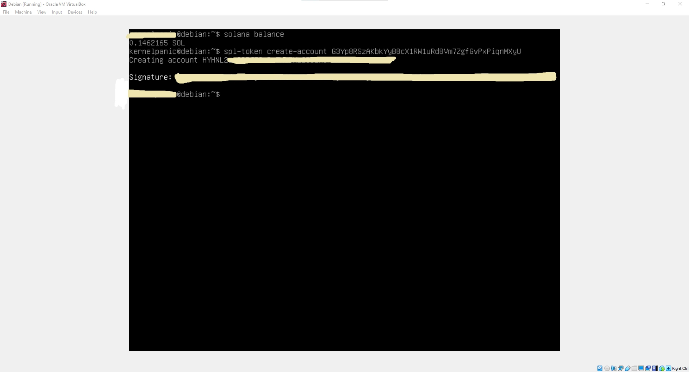
</p>

### Prägen von Token und Erstellen der Anzahl von Token

> ```shell
> spl-token mint *ERSTE TOKEN-ID* *ANZAHL DER MENGEN* *ZWEITE TOKEN-ID DES KONTOS*
> ```

<p align="center">
  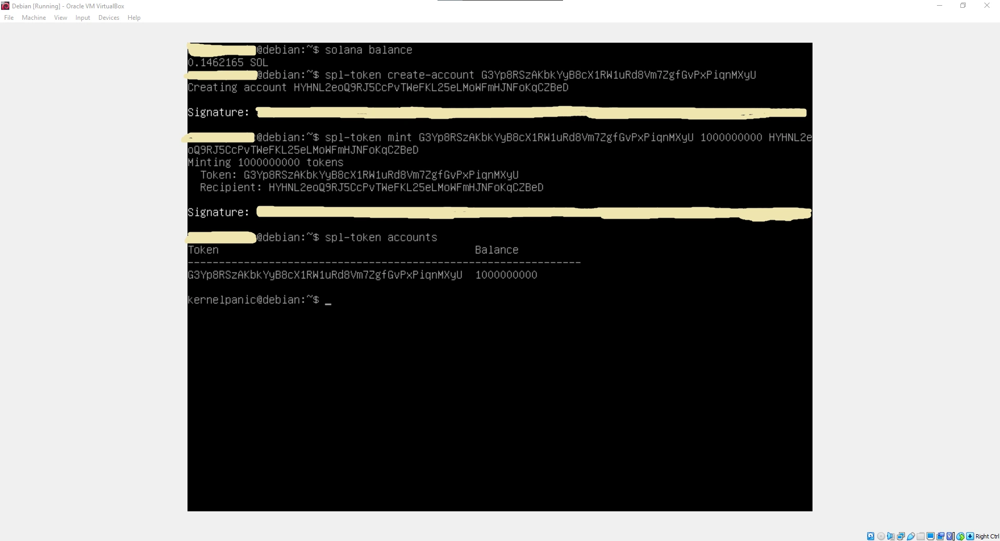
</p>

Sie haben Ihr Token erfolgreich erstellt.

### Übertragung Ihrer Token an andere:

Um Ihr Token an andere zu übertragen, müssen diese zunächst entweder auf dem Telefon oder in einem Webbrowser eine Brieftasche erstellen. Wenn Sie eine Brieftasche auf Ihrem Telefon erstellen möchten, ist Solflare eine großartige Brieftasche, und wenn Sie eine Brieftasche in einem Webbrowser erstellen möchten, schlage ich Phantom Wallet vor.

> ```shell
> spl-token transfer --fund-recipient --allow-unfunded-recipient *ERSTE TOKEN-ID* *WIE VIEL MÖCHTEN SIE SENDEN* *WALLET-ADRESSE, AN DIE WIR UNSERE TOKEN SENDEN WERDEN*
> ```

<p align="center">
  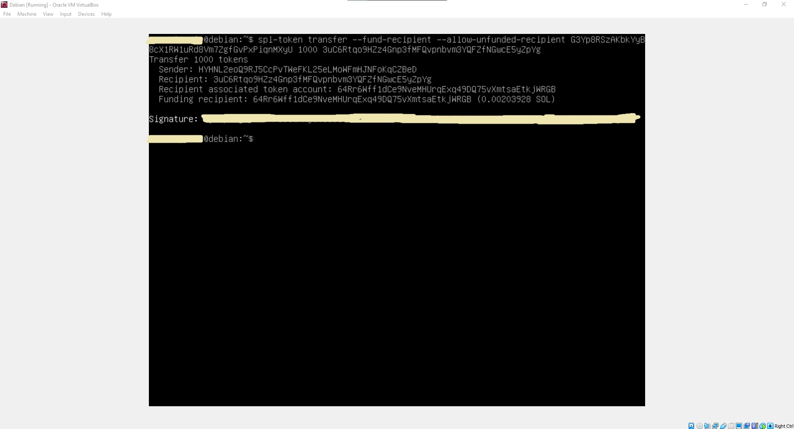
</p>

## Solscan Website

>- Solscan Website: https://solscan.io/

Wir können die erste **TOKEN-ID** auf dieser Seite einfügen, um unser Token zu überprüfen.

<p align="center">
  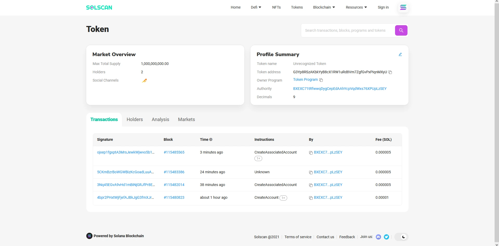
</p>

## Hinzufügen eines Tokens zur Solana-Registrierung

+ Erstellen Sie zunächst ein Bild für Ihren Token; es muss kleiner als 200 kb sein.
+ Erstellen Sie ein Github-Konto.

+ Bitte erstellen Sie ein neues Repository und laden Sie ein Bild Ihres Tokens in dieses Repository hoch (benennen Sie es logo.png).

<p align="center">
  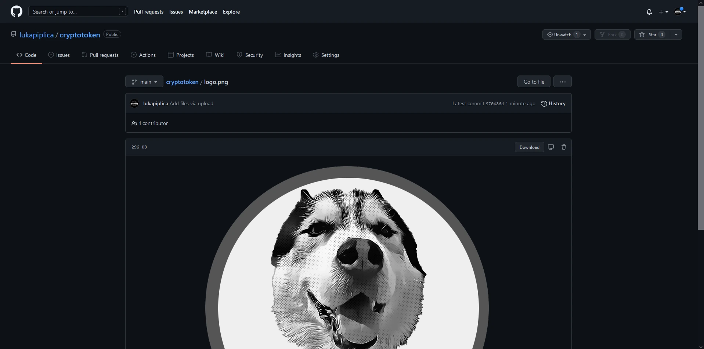
</p>

+ Besuchen Sie https://github.com/solana-labs/token-list und forken Sie es.

<p align="center">
  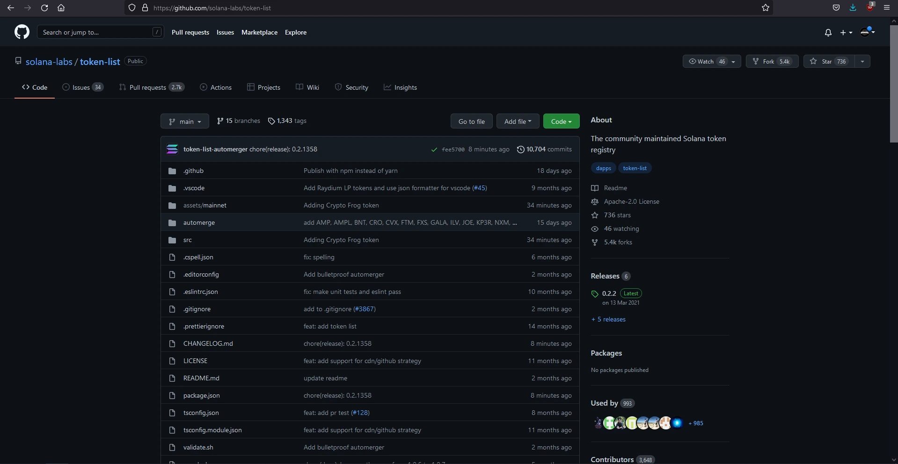
</p>

+ Drücken Sie . um Visual Studio Code in Ihrem Webbrowser zu öffnen.

<p align="center">
  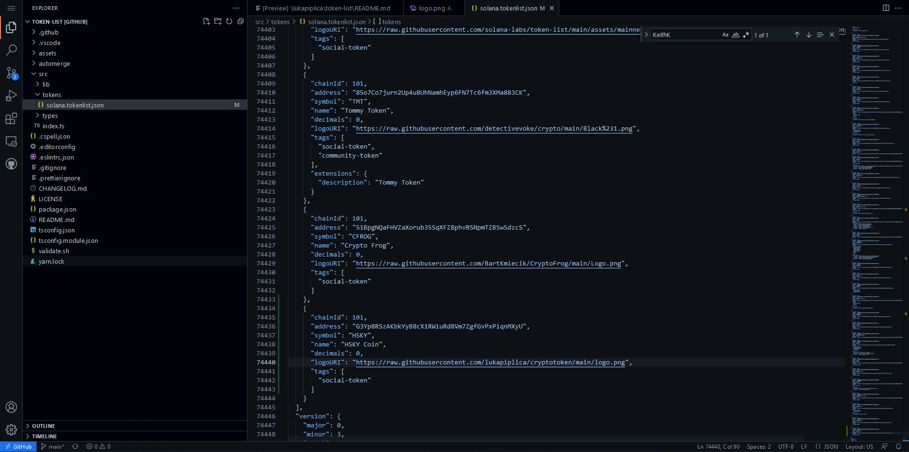
</p>

+ Gehen Sie links zu **assets/mainnet** rechts, klicken Sie auf und erstellen Sie einen neuen Ordner und fügen Sie die Token-Adresse ein.

+ Klicken Sie mit der rechten Maustaste auf den Ordner und klicken Sie auf Hochladen. Laden Sie dann das Bild Ihres Tokens hoch.

+ Gehen Sie dann zum Ordner **src** auf der linken Seite, und Sie sehen den Ordner **tokens**, öffnen Sie die Datei **solana.tokenlist.json**.

+ Gehen Sie zum Ende der Datei und fügen Sie dann Ihr Token im JSON-Format hinzu; Es ist am einfachsten, die Informationen aus dem Token vor Ihrem zu kopieren und einzufügen und dann die Werte zu ändern.

+ Auf der linken Seite befindet sich ein Symbol mit drei Punkten; Klicken Sie darauf, fügen Sie dann eine Nachricht darüber hinzu, was Sie tun, und klicken Sie auf das Häkchen.

+ Gehen Sie dann zurück zu Solanas GitHub und fordern Sie eine Pull-Anforderung an.

+ Führen Sie die Zusammenführung durch und warten Sie, bis der Vorgang beendet ist. Solana führt stündlich eine Überprüfung durch, sodass Ihre Pull-Anforderung möglicherweise erst nach einer Stunde empfangen wird.

## Endprodukt

<p align="center">
  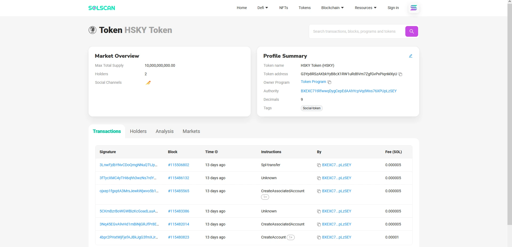
</p>

<p align="center">
  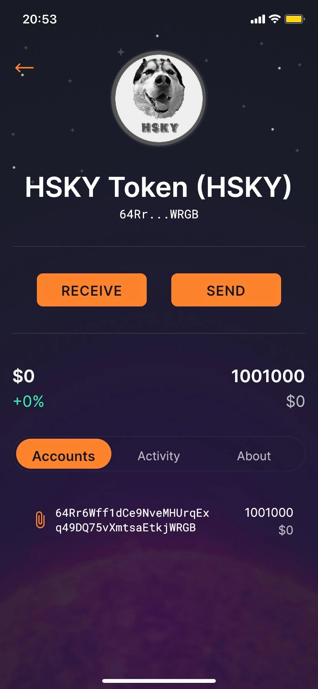
</p>


## Schlussfolgerung

Es ist ein spannendes Projekt; man kann viel lernen, insbesondere über Kryptowährungen und wie sie funktionieren. Derzeit hat dieses Projekt keine Anwendung und ist kein Projekt, mit dem Sie Geld verdienen können, aber Wissen reicht aus.

## Vielen Dank für Ihre Zeit 💙

