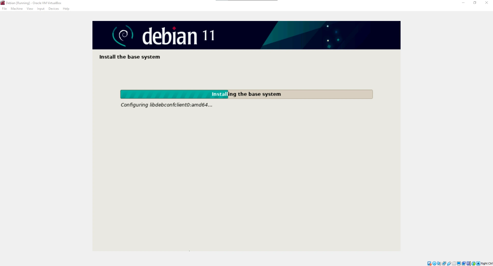
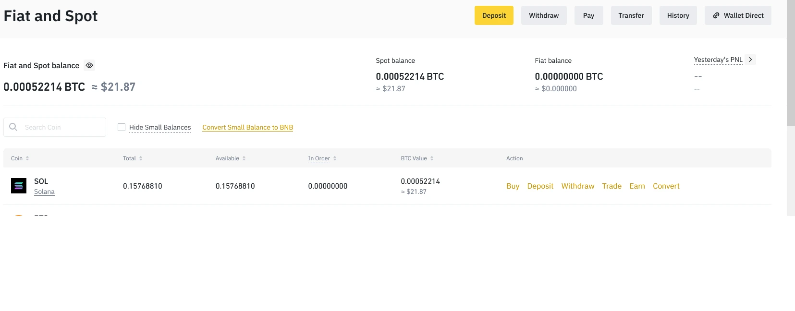
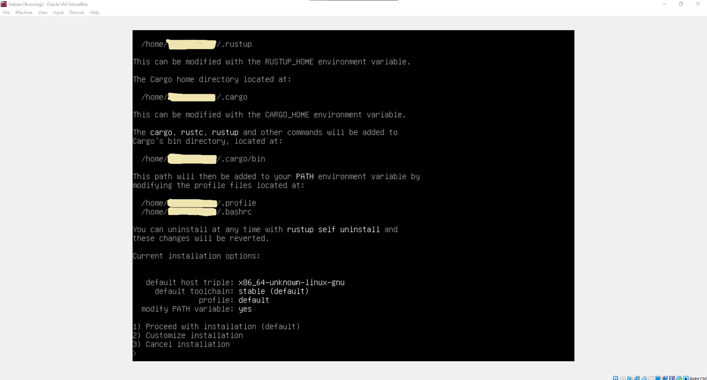
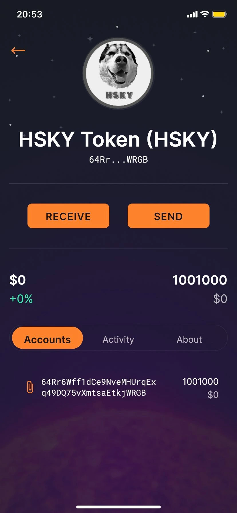

<p align="center">
  
</p>

<p align="center">
  <b>💸 HSKY Token 💸</b>
</p>


## What is a Crypto Token ?

Today more and more people use cryptocurrencies; some famous ones are Bitcoin, Dogecoin, Etherium, Solana etc. All these cryptocurrencies have their blockchain. We are making a crypto token; unlike other popular cryptocurrencies with their own blockchain, crypto tokens work on blockchains of other cryptocurrencies. Specifically, we will use Solana because of the cheap fee when switching this token and the speed (Solana has a very fast blockchain, unlike the others).

## What is needed:

>- **Operating system:** [Debian Linux](https://www.debian.org/)  
>- **Github profile** [Github](https://github.com)
>- **Crypto exchange** [Binance](https://www.binance.com/en)
>- **Phantom wallet** [PhantomWallet](https://phantom.app/)
>- **Solflare** [Solflare](https://solflare.com/)


**NOTE**: It is necessary to buy Solana!


## Instructions

We need to create a virtual machine and then install Debian Linux in the CLI (without a graphical interface).

<p align="center">
  
</p>

<p align="center">
  
</p>

After installing Debian, the first thing you need to do is update the system.

### Updating Debian 

> ```shell
> sudo apt update
> sudo apt upgrade
> ```

### Installing Solanas tools

> ```shell 
> sh -c "$(curl -sSfL https://release.solana.com/v1.8.5/install)"
> ```
     
Then type **exit** and log in to CLI again.

### Creating a Crypto Wallet

> ```shell
> solana-keygen new
> ```

Press enter twice, and you have successfully created a wallet.


**NOTE**: Public key is actually your wallet address, and save the seed phrase somewhere in case you lose the wallet!


<p align="center">
  
</p>

### Buying Solana

To make our token, we have to buy Solana. My recommendation is Binance.

<p align="center">
  
</p>

### Transfering Solana:

After we buy Solana, it is located on Binance. We need to transfer it to the wallet on the virtual machine.


**NOTE**: The address you are sending to from Binance is the public key we made in a virtual machine! 


<p align="center">
  
</p>

After we have successfully transferred Solana, we want to see how many Solana we have in CLI; we type: 

> ```shell
> solana balance
> ```

### Installation of Rust

> ```shell
> curl https://sh.rustup.rs -sSf | sh
> ```

After clicking enter, press 1 for the default installation. 

<p align="center">
  
</p>

Type **exit** and log in to the virtual machine again.

### Installation of required packages

> ```shell
> sudo apt install libudev-dev libssl-dev pkg-config build-essential
> ```

### Installation of SPL

> ```shell
> cargo install spl-token-cli
> ```

### Creating a crypto token

> ```shell
> spl-token create-token
> ```

### Creating an account that will keep our token

> ```shell
> spl-token create-account *TOKEN ID*
> ```


**NOTE**: Token ID is a token that we got by entering the last command!


<p align="center">
  
</p>

### Minting tokens and creating the number of tokens

> ```shell
> spl-token mint *FIRST TOKEN ID* *NUMBER OF QUANTITIES* *SECOND TOKEN ID OF THE ACCOUNT*
> ```

<p align="center">
  
</p>

You have successfully created your token.

### Transferring your tokens to others: 

To transfer your token to others, they must first make a wallet either on the phone or in a web browser. If you want to make a wallet on your phone, then Solflare is a great wallet, and if you're going to make a wallet in a web browser, I suggest Phantom Wallet.

> ```shell
> spl-token transfer --fund-recipient --allow-unfunded-recipient *FIRST TOKEN ID* *HOW MUCH DO YOU WANT TO SEND* *WALLET ADDRESS TO WHICH WE WILL SEND OUR TOKENS*
> ```

<p align="center">
  
</p>

## Solscan site

>- Solscan website: https://solscan.io/

We can paste the first **TOKEN ID** on this page to check our token.

<p align="center">
  
</p>

## Adding a Token to the Solana registry 

+ Firstly create an image for your token; it must be less than 200kb.
+ Make a Github account.

+ Please create a new repository and upload an image of your token to that repository (name it logo.png).

<p align="center">
  
</p>

+ Visit https://github.com/solana-labs/token-list and fork it.

<p align="center">
  
</p>

+ Press . to open Visual Studio Code in your web browser.

<p align="center">
  
</p>

+ On the left, go to **assets/mainnet** right, click and create a new folder and paste the Token address.

+ Right-click on the folder and click upload, then upload the image of your token.

+ Then go to the **src** folder on the left, and you will see **tokens** folder, open the **solana.tokenlist.json** file.

+ Go to the bottom of the file and then add your token in JSON format; it's easiest to copy and paste the information from the token before yours and then change the values.

+ On the left, there is an icon with three dots; click on it, then add a message about what you're doing and click on the checkmark.

+ Then go back to Solana's GitHub and request a pull request.

+ Do the merge and wait for the process to end. Solana does a check every hour, so your pull request may only be received after an hour.

## Final product 

<p align="center">
  
</p>

<p align="center">
  
</p>


## Conclusion

It is an exciting project; much can be learned, especially about cryptocurrencies and how they work. Currently, this project has no application and is not a project that can earn you money, but knowledge is enough.

## Thank you for your time 💙

