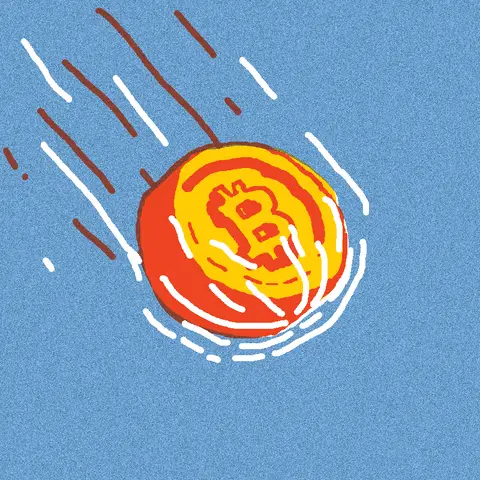
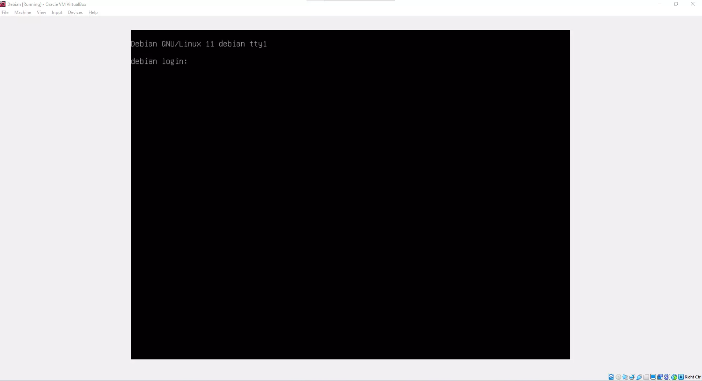
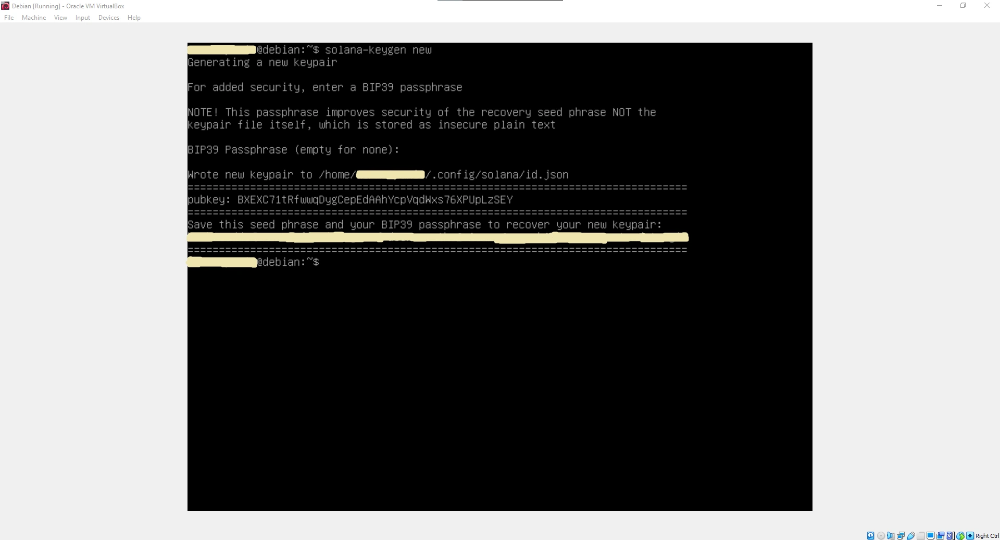
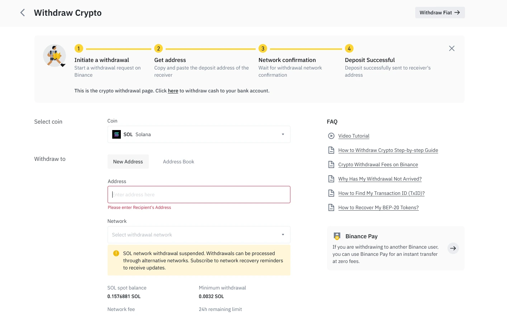
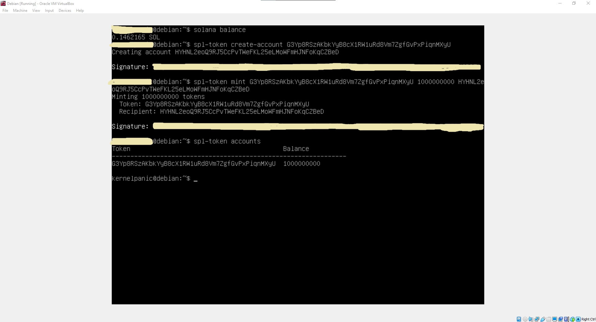
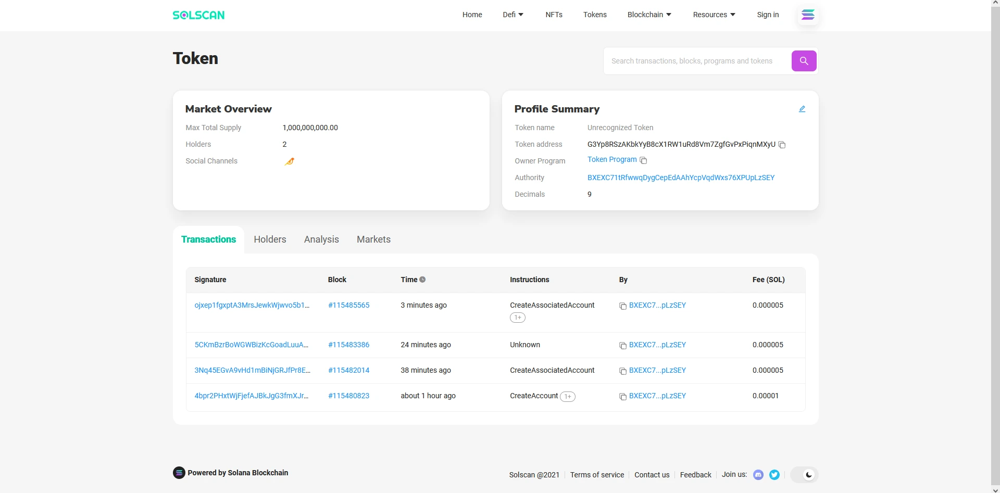
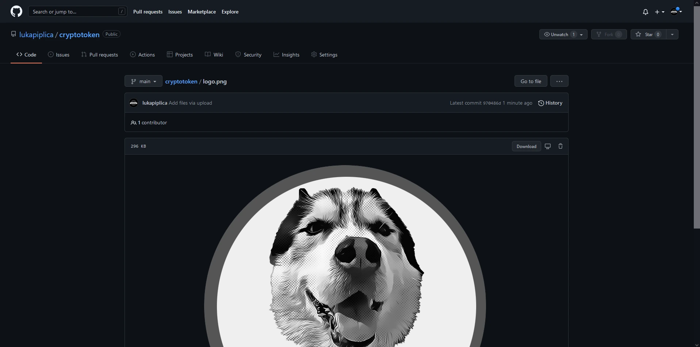
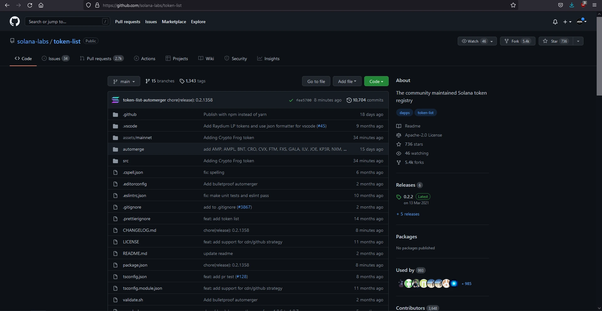

<p align="center">
  
</p>

<p align="center">
  <b>💸 HSKY Token 💸</b>
</p>


## 맚o je kripto token?

Danas sve više ljudi koristi kriptovalute; neke poznate su Bitcoin, Dogecoin, Etherium, Solana itd. Sve ove kriptovalute imaju svoj blockchain. Mi izrađujemo kripto token; za razliku od drugih popularnih kriptovaluta s vlastitim blockchain-om, kripto tokeni rade na blockchain-ovima drugih kriptovaluta. Konkretno, koristit ćemo Solanu zbog jeftine naknade prilikom prebacivanja ovog tokena i brzine (Solana ima vrlo brz blockchain, za razliku od ostalih).

## 맚o je potrebno:

>- **Operativni sustav:** [Debian Linux](https://www.debian.org/)  
>- **Github profil** [Github](https://github.com)
>- **Crypto mjenjačnica** [Binance](https://www.binance.com/en)
>- **Phantom novčanik** [PhantomWallet](https://phantom.app/)
>- **Solflare** [Solflare](https://solflare.com/)


**NAPOMENA**: Potrebno je kupiti Solanu!


## Upute

Moramo stvoriti virtualnu mašinu, a zatim instalirati Debian Linux u CLI (bez grafičkog sučelja).

<p align="center">
  
</p>

<p align="center">
  
</p>

Nakon instalacije Debian-a, prvo što trebate učiniti je a쬿rirati sustav.

### A쬿riranje Debian-a 

> ```shell
> sudo apt update
> sudo apt upgrade
> ```

### Instalacija Solana alata

> ```shell 
> sh -c "$(curl -sSfL https://release.solana.com/v1.8.5/install)"
> ```
     
Zatim upišite **exit** i ponovno se prijavite u CLI.

### Stvaranje kripto novčanika

> ```shell
> solana-keygen new
> ```

Dvaput pritisnite enter i uspješno ste kreirali novčanik.


**NAPOMENA**: Javni ključ je zapravo adresa vašeg novčanika, a početnu frazu spremite negdje u slučaju da izgubite novčanik!


<p align="center">
  
</p>

### Kupnja Solane

Da bismo napravili svoj token, moramo kupiti Solanu. Moja preporuka je Binance.

<p align="center">
  
</p>

### Transfer Solane:

Nakon što kupimo Solan-u, nalazi se na Binance-u. Moramo ju prenijeti u novčanik na virtualnoj mašini.


**NAPOMENA**: Adresa na koju šaljete s Binance-a je javni ključ koji smo napravili u virtualnoj mašini!


<p align="center">
  
</p>

Nakon što smo uspješno prenijeli Solanu, 쬰limo vidjeti koliko Solana imamo u CLI-u; upisujemo:

> ```shell
> solana balance
> ```

### Instalacija Rust-a

> ```shell
> curl https://sh.rustup.rs -sSf | sh
> ```

Nakon što kliknete enter, pritisnite 1 za zadanu instalaciju.

<p align="center">
  
</p>

Upišite **exit** i ponovno se prijavite na virtualnu mašinu.

### Instalacija potrebnih paketa

> ```shell
> sudo apt install libudev-dev libssl-dev pkg-config build-essential
> ```

### Instalacija SPL-a

> ```shell
> cargo install spl-token-cli
> ```

### Stvaranje kripto tokena

> ```shell
> spl-token create-token
> ```

### Stvaranje računa koji će zadr쬬ti naš token

> ```shell
> spl-token create-account *TOKEN ID*
> ```


**NAPOMENA**: Token ID je token koji smo dobili unosom zadnje naredbe!


<p align="center">
  
</p>

### Kovanje 쬰tona i kreiranje broja 쬰tona

> ```shell
> spl-token mint *PRVI ID TOKENA* *KOLIČINA* *DRUGI TOKEN ID RAČUNA*
> ```

<p align="center">
  
</p>

Uspješno ste izradili svoj token.

### Prijenos vaših tokena drugima

Da biste prenijeli svoj token drugima, oni prvo moraju napraviti novčanik ili na telefonu ili u web pregledniku. Ako 쬰lite napraviti novčanik na telefonu, onda je Solflare odličan novčanik, a ako ćete napraviti novčanik u web pregledniku, predla쬰m Phantom Wallet.

> ```shell
> spl-token transfer --fund-recipient --allow-unfunded-recipient *PRVI ID TOKENA* *KOLIKO ŽELITE POSLATI* *ADRESA NOVČANIKA NA KOJU ĆEMO SLATI NAŠE TOKENE*
> ```

<p align="center">
  
</p>

## Solscan stranica

>- Solscan stranica: https://solscan.io/

Mo쬰mo zalijepiti prvi **TOKEN ID** na ovu stranicu da provjerimo naš token.

<p align="center">
  
</p>

## Dodavanje tokena u Solana registar

+ Najprije izradite sliku za svoj token; mora biti manja od 200kb.
+ Napravite Github račun.

+ Stvorite novi repozitorij i prenesite sliku svog tokena u taj repozitorij (nazovite ga logo.png).

<p align="center">
  
</p>

+ Posjetite https://github.com/solana-labs/token-list i kliknite na fork.

<p align="center">
  
</p>

+ Pritisnite . da otvorite Visual Studio Code u svom web pregledniku.

<p align="center">
  
</p>

+ S lijeve strane idite na **assets/mainnet** desno, kliknite i kreirajte novu mapu i zalijepite adresu tokena.

+ Kliknite desnom tipkom miša na mapu i kliknite upload, a zatim prenesite sliku svog tokena.

+ Zatim idite u mapu **src** s lijeve strane i vidjet ćete mapu **tokens**, otvorite datoteku **solana.tokenlist.json**.

+ Idite na dno datoteke i dodajte svoj token u JSON formatu; najlakše je kopirati i zalijepiti podatke iz tokena prije vašeg i zatim promijeniti vrijednosti.

+ S lijeve strane nalazi se ikona s tri točke; kliknite na njega, zatim dodajte poruku o tome što radite i kliknite na kvačicu.

+ Zatim se vratite na Solanin GitHub i zatra쬴te zahtjev za povlačenje.

+ Izvršite spajanje i pričekajte da proces završi. Solana vrši provjeru svakih sat vremena, tako da vaš zahtjev za povlačenje mo쬰 biti primljen tek nakon sat vremena.

## Finalni proizvod

<p align="center">
  
</p>

<p align="center">
  
</p>


## Zaključak

Uzbudljiv projekt, mo쬰 se mnogo naučiti, posebno o kriptovalutama i njihovom funkcioniranju. Trenutno ovaj projekt nema primjenu i nije projekt na kojem mo쬰te zaraditi, ali znanje je dovoljno.

## Hvala na vašem vremenu 💙

