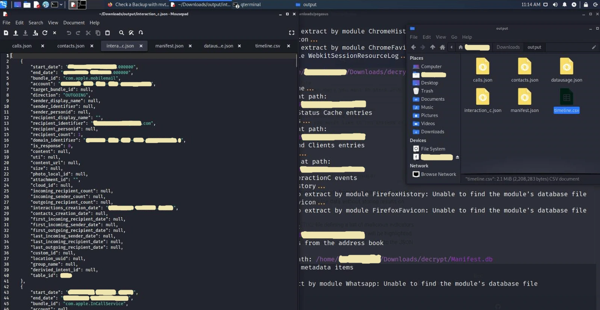

<p align="center">
  
</p>

<p align="center">
  <b>🔍 NSO Pegasus Spyware 🔍</b>
</p>


## What is Pegasus Spyware ?


Over the weekend, news leaked that several authoritarian governments (including Mexico, Morocco and the UAE) used spying software developed by the Israeli company [NSO Group](https://en.wikipedia.org/wiki/NSO_Group). Their goal was to spy on politicians, activists and journalists. A list of 50,000 telephone numbers potentially used for espionage has come into the possession of the Parisian non-profit organization [Forbidden Stories](https://forbiddenstories.org/) and [Amnesty International](https://www.amnesty.org/en/) , which they shared with the public [The Washington Post](https://www.washingtonpost.com/) and [The Guardian](https://www.theguardian.com/international).

After cyber security researchers analyzed several phones of victims of this attack, they discovered that it is a complex malware, which can access all data on the phone, from messages, and phone calls to your photos, and worst of all, Pegasus allows you to record conversations, and access the microphone and camera. This means this spyware can track you 24/7 and record whatever you say, do, and where you are.

Also, this spyware is made for both **iOS** and **Android** operating systems.

## How Pegasus works ?

Pegasus works using the so-called. "0-day exploits". These are system errors that almost no one knows about, not even the companies behind operating systems, electronics, etc. A more straightforward explanation is that Apple doesn't know that these bugs exist in the code, which is why there are "bug bounty" programs that cyber security researchers sign up for. They look for bugs in the system, and they are rewarded money depending on the impact of that bug. Of course, suppose cyber security researchers fail to detect code errors (bugs) before hackers with bad intentions. In that case, this is a problem and contributes to the development of various malicious software such as Pegasus. As far as we know, it is enough to receive only one call or text message (which you do not have to click or answer) to get your iOS or Android device infected.

## How to delete this spyware from your mobile device ? 

There is no way to remove Pegasus from your mobile device, but the best advice is to update your mobile operating system to the latest version constantly. The last known version of iOS that is vulnerable to this hacking method is **iOS 14.6**.

## How to detect Pegasus ?

Pegasus is difficult to detect after it is installed on your mobile device, and it is designed to be deleted by itself in case it gets the wrong phone number or recognizes that the device has not been active for more than 60 days. There are currently several IOCs (Indicators of Compromise) that have been found, and you can find them on [AmnestyTech Github](https://github.com/AmnestyTech/investigations/tree/master/2021-07-18_nso).

## How to do digital forensics on your device ?

Now I will show you how to do digital forensics on your device, with which you can check if you are infected with this spyware.


Required:

>+ **Operating system:** [Kali Linux](https://www.kali.org/)  
>+ **Program:** [MVT (Mobile Verification Toolkit)](https://github.com/mvt-project/mvt)
>+ **IOCs:** [AmnestyTech IOCs](https://github.com/AmnestyTech/investigations/tree/master/2021-07-18_nso)


## Instructions

After installing or booting the Kali Linux operating system into the virtual machine, the first thing we need to do is the system update.

*I use Kali Linux in this example, but any distribution based on Debian Linux should work with slight differences in commands.*

### Updating Kali Linux

We open the terminal and type the following commands: 

> ```shell
> sudo apt update
> sudo apt upgrade
> ```

### Installation of MVT

We first need to install a few "dependencies" to make the MVT work properly. 

+ Installation of dependencies:

> ```shell 
> sudo apt install python3 python3-pip libusb-1.0-0 git 
> ```
     

+ Installation of MVT:

  After installing the dependencies, we install the MVT. First, we enter the Downloads directory.
    
> ```shell
> cd Downloads
> ```

+ Then we have to download MVT from GitHub:

> ```shell
> git clone https://github.com/mvt-project/mvt.git 
> ```

+ We now enter the MVT directory we downloaded:

> ```shell
> cd mvt
> ```

+ We now install MVT using this command:

> ```shell
> pip3 install . 
> ```
     
+ Adding a PATH variable: 

> ```shell
> export PATH=$PATH:/home/*USERNAME*/.local/bin
> ```


**Note**: USERNAME you need to change depending on the username on Linux.


### Downloading IOCs 

+ We will first change the directory in the Downloads folder:

> ```shell
> cd ~/Downloads 
> ```
     
+ Then we clone the repository:

> ```shell
> git clone https://github.com/AmnestyTech/investigations.git
> ```


## Digital forensics on iOS devices.

If you have an iOS (Apple) device, follow the instructions below; if not, you can find instructions for Android systems under **Digital Forensics on Android devices**.


### A copy of your device's system

The first step in this process is to back up the operating system file on the mobile so we can analyze it. There are two methods **Filesystem dump** and **iTunes Backup**.

**Filesystem dump** is a method that requires **jailbreak** an iOS system that you can do using [checkra1n] (https://checkra.in/). The advantages of this method are that you can "dump" the entire system and use it to extract more data, but unfortunately, jailbreaking iPhone loses the warranty, and some iPhones on specific iOS versions cannot be jailbreaked.

**iTunes Backup** is an alternative option, although it will extract less data again, retaining your device's warranty.


**NOTE:** You can extract more data with the iTunes Backup method if you use encrypted backup.
   

### Backup of iOS using iTunes

You can back up iTunes on a Windows device. Instructions:

>+ Install iTunes on your computer or laptop.
>+ Connect iPhone with a cable to your computer or laptop.
>+ Open your iPhone in iTunes.
>+ If you want better results, then choose the encrypted backup option. 
>+ Run a backup; it can take up to 30 minutes.
      
Once the backup is complete, you can find its location on Windows 10 operating systems in one of two folders:

>+ %USERPROFILE%\Apple\MobileSync\  
>+ %USERPROFILE%\AppData\Roaming\Apple Computer\MobileSync\ 
      
The easiest way to find them is to paste %USERPROFILE% into the "Search" bar and check the folder manually. The important folder is the folder with **UDID** (a folder named 0000 [REDACTED]).


### Decrypting backup:

If you have encrypted your backup, let's transfer it to a computer or virtual machine with Linux (in this example, I will move the file from USB to the Documents folder); then we need to create a folder to decrypt:

> ```shell
> mkdir ~/Documents/decrypted
> ```

Now we are decrypting the file:

> ```shell
> mvt-ios decrypt-backup -p 'YOUR_PASSWORD' -d ~/Documents/decrypted ~/Documents/0000[REDACTED]
> ```

This command will take a long time, depending on the weight of the copy. Once the decryption is complete, it's time to make an output folder:

> ```shell
> mkdir ~/Downloads/output_forensics
> ```

After that, we are left with only one command that will perform a scan using a strix2 file and check whether the iPhone is infected with Pegasus or not.

> ```shell
> mvt-ios check-backup -i ~/Downloads/investigations/2021-07-18_nso/pegasus.strix2 -o ~/Downloads/output_forensics ~/Documents/decrypted
> ```

   <p align="center">
      
   </p>

## Digital forensics on Android devices

Digital forensics on Android devices is much more complicated; MVT currently provides two methods. 

>+ By downloading and analyzing the APK files that are installed.
>+ By extracting Android backups and check for suspicious SMS messages.


### APK file check

To use the MVT option **mvt-android**, your Android device needs to be connected to Linux. You will need to turn on the USB debugging option on your phone.

Then on the first connection, you will have to confirm the connection of the device on Android, so on Linux, we can create an output folder:

> ```shell
> mkdir ~/Downloads/output_forensics
> ```

You can then run the following command:

> ```shell 
> mvt-android download-apks -o ~/Downloads/output_forensics 
> ```

You can choose where you want to view the SHA256 Hash APKs extracted on [VirusTotal](https://www.virustotal.com/gui/). This can help identify malicious APK files (applications) on your Android device. We do this with the command:

> ```shell
> mvt-android download-apks -o ~/Downloads/output_forensics --virustotal
> ```

### Checking for malicious SMS messages

This method uses the MVT to check if your Android device is infected with malicious SMS. I assume you have already connected your device as in the instructions for APK files; now we run this command:

> ```shell
> adb backup com.android.providers.telephony
> ```

We need to approve the backup on your phone and potentially enter your backup password. The backup will then be stored in a folder called **backup.ab**.

Then we need to use [Android Backup Extractor](https://github.com/nelenkov/android-backup-extractor) to convert the previously obtained file into a readable format. Java must be installed on the system!

Then run the following commands:

> ```shell
> java -jar ~/Downloads/abe.jar unpack backup.ab backup.tar
> tar xvf backup.tar
> ```

Android Backup Extractor will ask you for the password if the backup is encrypted.

Then MVT checks whether malicious links are in SMS messages; we do it with the command: 

> ```shell
> mvt-android check-backup -o sms .
> ```
  
Using the **--iocs** or **--i** options we can specify the IOCs file. 

## Which files does mvt-ios create and then check ?

After the MVT has done analysing, the terminal will write you a Warning (suspicious file) if your device is infected with Pegasus. You will now see all the files that MVT has created and checked during the analysis.

+ 💵 `[cache_files.json]`

  This JSON file creates the **CacheFiles** module. The module extracts records from all SQLite database files saved on a disk named ** Cache.db **. These databases usually contain data from iOS Internal URL caching.

   You can use this module to see HTTP requests and responses. This is useful because we can see HTTP requests that are part of the "exploitation chain", and they work by the iOS service trying to download a malicious file during the first phase of this request.


+ 📱 `[calls.json]`

   This JSON file creates the **Calls** module. The module extracts records from the SQLite database located on `/private/var/mobile/Library/CallHistoryDB/CallHistory.store` data contains a list of all incoming and outgoing calls, including applications such as WhatsApp or Skype.

+ 💻 `[chrome_favicon.json]`

  This JSON file creates the **ChromeFavicon** module. The module extracts records from the SQLite database located on `/private/var/mobile/Containers/Data/Application/*/Library/Application Support/Google/Chrome/Default/Favicons`, and serves to save favicons (small icons in your web browser tabs) for faster loading.

  Favicons can be hacked; you can see more about this topic at [LINK](https://www.youtube.com/watch?v=X7OW5hTt5hY).

+ 💻 `[chrome_history.json]`

   This JSON file creates the **ChromeHistory** module. The module extracts records from the SQLite database located on `/private/var/mobile/Containers/Data/Application/*/Library/Application Support/Google/Chrome/Default/History`, which contains your Google Chrome web browser history.


+ 🤓 `[contacts.json]` 

   This JSON file creates the ** Contacts ** module. The module extracts records from the SQLite database located on `/private/var/mobile/Library/AddressBook/AddressBook.sqlitedb`, which contains a list of your contacts.

+ 🦊 `[firefox_favicon.json]` 

   The **FirefoxFavicon** module created this JSON file. The module extracts records from the SQLite database located on `/private/var/mobile/profile.profile/browser.db`, and serves to save favicons (small icons in your web browser's tabs) for faster loading.


+ 🦊 `[firefox_history.json]` 

   The **FirefoxHistory** module created this JSON file. The module extracts records from the SQLite database located at `/private/var/mobile/profile.profile/browser.db` contains your Firefox web browser history.


+ 📋 `[id_status_cache.json]` 

  This JSON file creates the **IDStatusCache** module. The module extracts records from the plist file located at `/private/var/mobile/Library/Preferences/com.apple.identityservices.idstatuscache.plist` which saves your Apple ID samples (this includes biometrics like Touch and Face ID).


+ 🤝 `[interaction_c.json]` 

   This JSON file creates the **InteractionC** module. The module extracts records from the SQLite database located at `/private/var/mobile/Library/CoreDuet/People/interactionC.db`, and contains details about user interactions with installed applications.

+ 📍 `[locationd_clients.json]` 

   This JSON file creates the **LocationdClients** module. The module extracts records from the plist file located at `/private/var/mobile/Library/Caches/locationd/clients.plist`, and it contains cached memory of applications that requested access to location services.

+ 🔷 `[manifest.json]` 

   The **Manifest** module created this JSON file. The module extracts records from the SQLite **Manifest.db** database created by iTunes during the backup and serves to tell the local backup where all the files are on the iOS device.

+ 💽 `[datausage.json]` 

   This JSON file creates the **Datausage** module. The module extracts records from the SQLite database located in `/private/var/wireless/Library/Databases/DataUsage.sqlite`. It contains the history of data usage by the processes used on the system.

+ 💻 `[safari_browser_state.json]` 

   This JSON file creates the **SafariBrowserState** module. The module extracts records from SQLite databases located on `/private/var/mobile/Library/Safari/BrowserState.db` or` /private/var/mobile/Containers/Data/Application/*/Library/Safari/BrowserState.db` , and contain a list of open tabs in the Safari web browser.

+ 💻 `[safari_favicon.json]`

   This JSON file creates the **SafariFavicon** module. The module extracts records from SQLite databases located on `/private/var/mobile/Library/Image Cache/Favicons/Favicons.db` or `/private/var/mobile/Containers/Data/Application/*/Library/Image Cache/Favicons/Favicons.db`, and serves to save favicons (small icons in the tabs of your web browser) for faster loading.

+ 🔥 `[safari_history.json]`

   This JSON file creates the **SafariHistory** module. The module extracts records from SQLite databases located on `/private/var/mobile/Library/Safari/History.db` or `/private/var/mobile/Containers/Data/Application/*/Library/Safari/History.db` , which contain search history.

+ 📝 `[sms.json]` 

   This JSON file creates a **SMS** module. The module extracts a list of SMS messages containing HTTP links from the SQLite database located at `/private/var/mobile/Library/SMS/sms.db`.

+ 📝 `[sms_attachments.json]` 

   This JSON file creates the **SMSAttachments** module. The module extracts details about attachments sent by SMS or iMessage from the same database used by the SMS module.

+ 📜 `[version_history.json]`

   This JSON file creates the **IOSVersionHistory** module. The module extracts iOS update records from the analytics list files located on `/private/var/db/analyticsd/Analytics-Journal-*.Ips`.

+ 🕸️ `[webkit_indexeddb.json]` 

   This JSON file creates the **WebkitIndexedDB** module. The module extracts a list of files and folders located in `/private/var/mobile/Containers/Data/Application/*/Library/WebKit/WebsiteData/IndexedDB`, and contains IndexedDB files created by any application.

+ 🕸️ `[webkit_local_storage.json]` 

   This JSON file creates the **WebkitLocalStorage** module. The module extracts a list of file and folder names found in `/private/var/mobile/Containers/Data/Application/*/Library/WebKit/WebsiteData/LocalStorage/`, and contains files from internal storage created by any application.

+ 🕸️ `[webkit_safari_view_service.json]` 

   This JSON file creates the **WebkitSafariViewService** module. The module extracts a list of file and folder names found in `/private/var/mobile/Containers/Data/Application/*/SystemData/com.apple.SafariViewService/Library/WebKit/WebsiteData/`, and contains files cached by SafariVewService .

+ 🕸️ `[webkit_session_resource_log.json]` 

   This JSON file creates the **WebkitSessionResourceLog** module. The module extracts records from plist files named **full_browsing_session_resourceLog.plist**, and contains resource records loaded from various web pages visited.

+ 📞 `[whatsapp.json]`

   This JSON file was created by the **WhatsApp** module. The module extracts a list of WhatsApp messages containing HTTP connections from the SQLite database located at `/private/var/mobile/Containers/Shared/AppGroup/*/ChatStorage.sqlite`.


## Conclusion

Pegasus is one of the most dangerous tools for espionage, I disagree with the actions of the NSO Group company, and I think everyone has the right to privacy. Currently, the only protection against Pegasus might be a phone that is neither Android nor iOS. A good alternative is the Nokia 8110 4G with [GerdaOS](https://gerda.tech/) operating system. I recommend watching The Guardian's [interview](https://www.theguardian.com/news/2021/jul/19/edward-snowden-calls-spyware-trade-ban-pegasus-revelations) with Edward Snowden on the subject of Pegasus.

## Thank you for your time 💙

