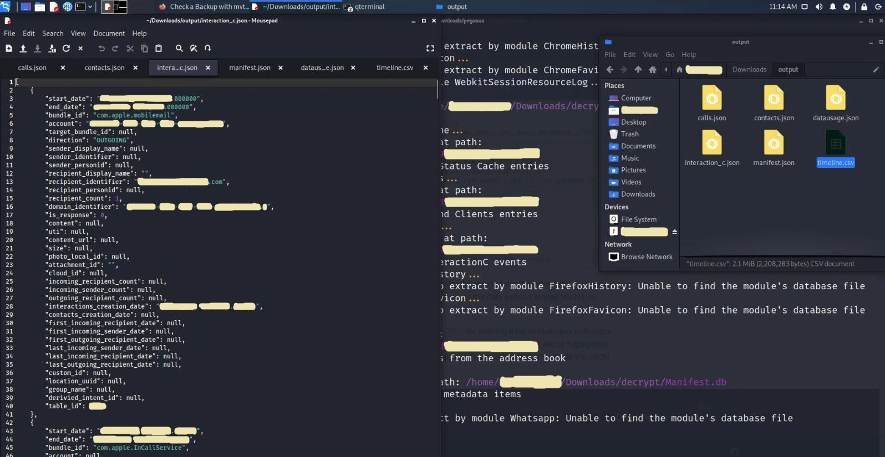

<p align="center">
  
</p>

<p align="center">
  <b>🔍 NSO Pegasus Spyware 🔍</b>
</p>


## Što je Pegasus Spyware?


Tijekom vikenda procurile su vijesti da je nekoliko autoritarnih vlada (uključujući Meksiko, Maroko i UAE) koristilo softver za špijuniranje koji je razvila izraelska tvrtka [NSO Group](https://en.wikipedia.org/wiki/NSO_Group). Cilj im je bio špijunirati političare, aktiviste i novinare. Popis od 50.000 telefonskih brojeva koji se potencijalno koriste za špijunažu došao je u posjed pariške neprofitne organizacije [Zabranjene priče](https://forbiddenstories.org/) i [Amnesty International](https://www.amnesty.org/en/), koje su podijelili s javnošću [The Washington Post](https://www.washingtonpost.com/) i [The Guardian](https://www.theguardian.com/international).

Nakon što su istraživači cyber sigurnosti analizirali nekoliko telefona žrtava ovog napada, otkrili su da se radi o složenom malwareu, koji može pristupiti svim podacima na telefonu, od poruka, telefonskih poziva do vaših fotografija, a što je najgore, Pegasus vam omogućuje da snimati razgovore i pristupiti mikrofonu i kameri. To znači da vas ovaj špijunski softver može pratiti 24/7 i bilježiti sve što kažete, učinite i gdje se nalazite.

Također, ovaj špijunski softver napravljen je i za **iOS** i za **Android** operativne sustave.

## Kako Pegasus radi?

Pegasus radi pomoću tzv. "0-day exploits". Riječ je o sistemskim greškama za koje gotovo nitko ne zna, čak ni tvrtke koje stoje iza operativnih sustava, elektronike itd. Jednostavnije objašnjenje je da Apple ne zna da te greške postoje u kodu, zbog čega postoje "bug bounty" " programe za koje se prijavljuju istraživači kibernetičke sigurnosti. Traže greške u sustavu i dobivaju novčanu nagradu ovisno o utjecaju te greške. Naravno, pretpostavimo da istraživači cyber sigurnosti ne uspiju otkriti pogreške koda (bugove) prije hakera s lošim namjerama. U tom slučaju to predstavlja problem i pridonosi razvoju raznog zlonamjernog softvera kao što je Pegasus. Koliko nam je poznato, dovoljno je primiti samo jedan poziv ili tekstualnu poruku (na koju ne morate kliknuti niti odgovoriti) da se vaš iOS ili Android uređaj zarazi.

## Kako izbrisati ovaj špijunski softver sa svog mobilnog uređaja?

Ne postoji način da uklonite Pegasus sa svog mobilnog uređaja, ali najbolji savjet je da stalno ažurirate mobilni operativni sustav na najnoviju verziju. Posljednja poznata verzija iOS-a koja je ranjiva na ovu metodu hakiranja je **iOS 14.6**.

## Kako otkriti Pegasus?

Pegasus je teško otkriti nakon što ga instalirate na mobilni uređaj, a dizajniran je tako da se sam izbriše u slučaju da dobije krivi broj telefona ili prepozna da uređaj nije bio aktivan dulje od 60 dana. Trenutačno postoji nekoliko IOC-ova (indikatora kompromisa) koji su pronađeni, a možete ih pronaći na [AmnestyTech Github](https://github.com/AmnestyTech/investigations/tree/master/2021-07-18_nso).

## Kako napraviti digitalnu forenziku na svom uređaju?

Sada ću vam pokazati kako napraviti digitalnu forenziku na vašem uređaju, pomoću koje možete provjeriti jeste li zaraženi ovim špijunskim softverom.


Potrebno:

>+ **Operacijski sustav:** [Kali Linux](https://www.kali.org/)  
>+ **Program:** [MVT (Mobile Verification Toolkit)](https://github.com/mvt-project/mvt)
>+ **IOCs:** [AmnestyTech IOCs](https://github.com/AmnestyTech/investigations/tree/master/2021-07-18_nso)


## Upute

Nakon instaliranja ili dizanja operativnog sustava Kali Linux u virtualnu mašinu, prvo što trebamo napraviti je ažuriranje sustava.

*Koristim Kali Linux u ovom primjeru, ali svaka distribucija temeljena na Debian Linuxu trebala bi raditi s malim razlikama u naredbama.*

### Ažuriranje Kali Linux-a

Otvaramo terminal i upisujemo sljedeće naredbe:

> ```shell
> sudo apt update
> sudo apt upgrade
> ```

### Instalacija MVT

Prvo moramo instalirati nekoliko potrebnih paketa kako bi MVT ispravno radio.

+ Instalacija potrebnih paketa:

> ```shell 
> sudo apt install python3 python3-pip libusb-1.0-0 git 
> ```
     

+ Instalacija MVT:

  Nakon instaliranja ovisnosti, instaliramo MVT. Prvo ulazimo u direktorij preuzimanja.
    
> ```shell
> cd Downloads
> ```

+ Zatim moramo preuzeti MVT s GitHuba:

> ```shell
> git clone https://github.com/mvt-project/mvt.git 
> ```

+ Sada ulazimo u MVT direktorij koji smo preuzeli:

> ```shell
> cd mvt
> ```

+ Sada instaliramo MVT pomoću ove naredbe:

> ```shell
> pip3 install . 
> ```
     
+ Dodavanje varijable PATH: 

> ```shell
> export PATH=$PATH:/home/*USERNAME*/.local/bin
> ```


**Napomena**: Korisničko ime morate promijeniti ovisno o korisničkom imenu na Linuxu.


### Preuzimanje IOC-a

+ Prvo ćemo promijeniti direktorij u Downloads:

> ```shell
> cd ~/Downloads 
> ```
     
+ Zatim kloniramo repozitorij:

> ```shell
> git clone https://github.com/AmnestyTech/investigations.git
> ```


## Digitalna forenzika na iOS uređajima

Ako imate iOS (Apple) uređaj, slijedite upute u nastavku; ako ne, možete pronaći upute za Android sustave pod **Digitalna forenzika na Android uređajima**.


### Kopija sustava vašeg uređaja

Prvi korak u ovom procesu je sigurnosna kopija datoteke operativnog sustava na mobilnom telefonu kako bismo je mogli analizirati. Postoje dvije metode **Filesystem dump** i **iTunes Backup**.

**Filesystem dump** je metoda koja zahtijeva **jailbreak** iOS sustava koji možete učiniti koristeći [checkra1n](https://checkra.in/). Prednosti ove metode su u tome što možete "izbaciti" cijeli sustav i koristiti ga za izdvajanje više podataka, ali nažalost, jailbreaking iPhone gubi jamstvo, a neki iPhone uređaji na određenim verzijama iOS-a ne mogu se jailbreakovati.

**iTunes sigurnosna kopija** je alternativna opcija, iako će ponovno izvući manje podataka, zadržavajući jamstvo vašeg uređaja.


**NAPOMENA:** Možete ekstraktovati više podataka pomoću iTunes sigurnosne kopije ako koristite šifriranu sigurnosnu kopiju.
   

### Sigurnosno kopiranje iOS-a pomoću iTunes-a

Možete sigurnosno kopirati iTunes na Windows uređaju. Upute:

>+ Instalirajte iTunes na svoje računalo ili prijenosno računalo.
>+ Spojite iPhone pomoću kabela na računalo ili prijenosno računalo.
>+ Otvorite svoj iPhone u aplikaciji iTunes.
>+ Ako želite bolje rezultate, odaberite opciju kriptirane sigurnosne kopije.
>+ Pokrenite sigurnosnu kopiju; može trajati do 30 minuta.
      
Nakon što je sigurnosna kopija dovršena, možete pronaći njezinu lokaciju u operativnim sustavima Windows 10 u jednoj od dvije mape:

>+ %USERPROFILE%\Apple\MobileSync\  
>+ %USERPROFILE%\AppData\Roaming\Apple Computer\MobileSync\ 
      
Najlakši način da ih pronađete je da zalijepite %USERPROFILE% u traku "Traži" i ručno provjerite mapu. Važna mapa je mapa s **UDID** (mapa pod nazivom 0000 [REDIGIRANO]).


### Dešifriranje sigurnosne kopije:

Ako ste šifrirali svoju sigurnosnu kopiju, prenesite je na računalo ili virtualnu mašinu s Linuxom (u ovom primjeru, premjestit ću datoteku s USB-a u mapu Dokumenti); tada moramo stvoriti mapu za dešifriranje:

> ```shell
> mkdir ~/Documents/decrypted
> ```

Sada dešifriramo datoteku:

> ```shell
> mvt-ios decrypt-backup -p 'YOUR_PASSWORD' -d ~/Documents/decrypted ~/Documents/0000[REDACTED]
> ```

Ova naredba će trajati dugo, ovisno o težini kopije. Nakon što je dešifriranje završeno, vrijeme je da napravite izlaznu mapu:

> ```shell
> mkdir ~/Downloads/output_forensics
> ```

Nakon toga ostaje nam samo jedna naredba koja će pomoću strix2 datoteke izvršiti skeniranje i provjeriti je li iPhone zaražen Pegasusom ili ne.

> ```shell
> mvt-ios check-backup -i ~/Downloads/investigations/2021-07-18_nso/pegasus.strix2 -o ~/Downloads/output_forensics ~/Documents/decrypted
> ```

   <p align="center">
      
   </p>

## Digitalna forenzika na Android uređajima

Digitalna forenzika na Android uređajima puno je kompliciranija; MVT trenutno nudi dvije metode.

>+ Preuzimanjem i analizom APK datoteka koje su instalirane.
>+ Izdvajanjem Android sigurnosnih kopija i provjerom sumnjivih SMS poruka.


### Provjera APK datoteke

Da biste koristili MVT opciju **mvt-android**, vaš Android uređaj mora biti povezan s Linuxom. Morat ćete uključiti USB debugging opciju na vašem telefonu.

Zatim ćete pri prvom povezivanju morati potvrditi povezivanje uređaja na Androidu, tako da na Linuxu možemo stvoriti izlaznu mapu:

> ```shell
> mkdir ~/Downloads/output_forensics
> ```

Zatim možete pokrenuti sljedeću naredbu:

> ```shell 
> mvt-android download-apks -o ~/Downloads/output_forensics 
> ```

Možete odabrati gdje želite vidjeti SHA256 Hash APK-ove ekstraktuje na [VirusTotal](https://www.virustotal.com/gui/). To može pomoći u prepoznavanju zlonamjernih APK datoteka (aplikacija) na vašem Android uređaju. To radimo naredbom:

> ```shell
> mvt-android download-apks -o ~/Downloads/output_forensics --virustotal
> ```

### Provjera zlonamjernih SMS poruka

Ova metoda koristi MVT za provjeru je li vaš Android uređaj zaražen zlonamjernim SMS-om. Pretpostavljam da ste već povezali svoj uređaj kao u uputama za APK datoteke; sada pokrećemo ovu naredbu:

> ```shell
> adb backup com.android.providers.telephony
> ```

Moramo odobriti sigurnosnu kopiju na vašem telefonu i potencijalno unijeti vašu sigurnosnu lozinku. Sigurnosna kopija će tada biti pohranjena u mapu pod nazivom **backup.ab**.

Zatim trebamo koristiti [Android Backup Extractor](https://github.com/nelenkov/android-backup-extractor) kako bismo prethodno dobivenu datoteku pretvorili u čitljiv format. Java mora biti instalirana na sustav!

Zatim pokrenite sljedeće naredbe:

> ```shell
> java -jar ~/Downloads/abe.jar unpack backup.ab backup.tar
> tar xvf backup.tar
> ```

Android Backup Extractor će vas pitati za lozinku ako je sigurnosna kopija šifrirana.

Zatim MVT provjerava postoje li zlonamjerne veze u SMS porukama; to radimo naredbom:

> ```shell
> mvt-android check-backup -o sms .
> ```
  
Pomoću opcija **--iocs** ili **--i** možemo odrediti IOCs datoteku.

## Koje datoteke mvt-ios stvara i zatim provjerava?

Nakon što MVT izvrši analizu, terminal će vam napisati upozorenje (sumnjiva datoteka) ako je vaš uređaj zaražen Pegasusom. Sada ćete vidjeti sve datoteke koje je MVT stvorio i provjerio tijekom analize.

+ 💵 `[cache_files.json]`

  Ova JSON datoteka stvara modul **CacheFiles**. Modul izvlači zapise iz svih datoteka SQLite baze podataka spremljenih na disk pod nazivom **Cache.db**. Ove baze podataka obično sadrže podatke iz internog predmemoriranja URL-a iOS-a.

   Ovaj modul možete koristiti za pregled HTTP zahtjeva i odgovora. Ovo je korisno jer možemo vidjeti HTTP zahtjeve koji su dio "lanca iskorištavanja", a rade tako da iOS servis pokušava preuzeti zlonamjernu datoteku tijekom prve faze ovog zahtjeva.


+ 📱 `[calls.json]`

   Ova JSON datoteka stvara modul **Pozivi**. Modul izvlači zapise iz SQLite baze podataka koja se nalazi na `/private/var/mobile/Library/CallHistoryDB/CallHistory.store` data sadrži popis svih dolaznih i odlaznih poziva, uključujući aplikacije kao što su WhatsApp ili Skype.

+ 💻 `[chrome_favicon.json]`

   Ova JSON datoteka stvara modul **ChromeFavicon**. Modul izvlači zapise iz SQLite baze podataka koja se nalazi na `/private/var/mobile/Containers/Data/Application/*/Library/Application Support/Google/Chrome/Default/Favicons`, i služi za spremanje favikona (male ikone u vašem kartice web preglednika) za brže učitavanje.

   Favicons se mogu hakirati; više o ovoj temi možete vidjeti na [LINK](https://www.youtube.com/watch?v=X7OW5hTt5hY).
   
+ 💻 `[chrome_history.json]`

   Ova JSON datoteka stvara modul **ChromeHistory**. Modul izdvaja zapise iz SQLite baze podataka koja se nalazi na `/private/var/mobile/Containers/Data/Application/*/Library/Application Support/Google/Chrome/Default/History`, koja sadrži vašu povijest Google Chrome web preglednika.


+ 🤓 `[contacts.json]` 

   Ova JSON datoteka stvara modul **Kontakti**. Modul izvlači zapise iz SQLite baze podataka koja se nalazi na `/private/var/mobile/Library/AddressBook/AddressBook.sqlitedb`, koja sadrži popis vaših kontakata.

+ 🦊 `[firefox_favicon.json]` 

   Modul **FirefoxFavicon** stvorio je ovu JSON datoteku. Modul izvlači zapise iz SQLite baze podataka koja se nalazi na `/private/var/mobile/profile.profile/browser.db`, te služi za spremanje favikona (malih ikona u karticama vašeg web preglednika) za brže učitavanje.


+ 🦊 `[firefox_history.json]` 

   Modul **FirefoxHistory** stvorio je ovu JSON datoteku. Modul izvlači zapise iz SQLite baze podataka koja se nalazi na `/private/var/mobile/profile.profile/browser.db` koja sadrži vašu povijest preglednika Firefox.


+ 📋 `[id_status_cache.json]` 

  Ova JSON datoteka stvara modul **IDStatusCache**. Modul izvlači zapise iz plist datoteke koja se nalazi na `/private/var/mobile/Library/Preferences/com.apple.identityservices.idstatuscache.plist` koja sprema uzorke vašeg Apple ID-a (ovo uključuje biometrijske podatke kao što su Touch i Face ID).


+ 🤝 `[interaction_c.json]` 

   Ova JSON datoteka stvara modul **InteractionC**. Modul izvlači zapise iz SQLite baze podataka koja se nalazi na `/private/var/mobile/Library/CoreDuet/People/interactionC.db`, i sadrži detalje o interakcijama korisnika s instaliranim aplikacijama.

+ 📍 `[locationd_clients.json]` 

   Ova JSON datoteka stvara modul **LocationdClients**. Modul izvlači zapise iz plist datoteke koja se nalazi na `/private/var/mobile/Library/Caches/locationd/clients.plist` i sadrži predmemoriranu memoriju aplikacija koje su tražile pristup uslugama lokacije.

+ 🔷 `[manifest.json]` 

   Modul **Manifest** stvorio je ovu JSON datoteku. Modul izvlači zapise iz SQLite **Manifest.db** baze podataka koju je stvorio iTunes tijekom izrade sigurnosne kopije i služi lokalnom sigurnosnom kopiranju gdje se nalaze sve datoteke na iOS uređaju.

+ 💽 `[datausage.json]` 

   Ova JSON datoteka stvara modul **Datausage**. Modul izvlači zapise iz SQLite baze podataka koja se nalazi u `/private/var/wireless/Library/Databases/DataUsage.sqlite`. Sadrži povijest korištenja podataka od strane procesa koji se koriste u sustavu.

+ 💻 `[safari_browser_state.json]` 

   Ova JSON datoteka stvara modul **SafariBrowserState**. Modul izvlači zapise iz SQLite baza podataka koje se nalaze na `/private/var/mobile/Library/Safari/BrowserState.db` ili` /private/var/mobile/Containers/Data/Application/*/Library/Safari/BrowserState.db` , i sadrže popis otvorenih kartica u web pregledniku Safari.

+ 💻 `[safari_favicon.json]`

   Ova JSON datoteka stvara modul **SafariFavicon**. Modul izvlači zapise iz SQLite baza podataka koje se nalaze na `/private/var/mobile/Library/Image Cache/Favicons/Favicons.db` ili `/private/var/mobile/Containers/Data/Application/*/Library/Image Cache/ Favicons/Favicons.db`, a služi za spremanje favikona (malih ikona u karticama vašeg web preglednika) radi bržeg učitavanja.

+ 🔥 `[safari_history.json]`

   Ova JSON datoteka stvara modul **SafariHistory**. Modul izvlači zapise iz SQLite baza podataka koje se nalaze na `/private/var/mobile/Library/Safari/History.db` ili `/private/var/mobile/Containers/Data/Application/*/Library/Safari/History.db`, koji sadrže povijest pretraživanja.

+ 📝 `[sms.json]` 

   Ova JSON datoteka stvara **SMS** modul. Modul izvlači popis SMS poruka koje sadrže HTTP veze iz SQLite baze podataka koja se nalazi na `/private/var/mobile/Library/SMS/sms.db`.

+ 📝 `[sms_attachments.json]` 

   Ova JSON datoteka stvara modul **SMSAttachments**. Modul izvlači pojedinosti o privicima poslanim putem SMS-a ili iMessage-a iz iste baze podataka koju koristi SMS modul.

+ 📜 `[version_history.json]`

   Ova JSON datoteka stvara modul **IOSVersionHistory**. Modul izvlači zapise ažuriranja iOS-a iz datoteka popisa analitike koje se nalaze na `/private/var/db/analyticsd/Analytics-Journal-*.Ips`.

+ 🕸️ `[webkit_indexeddb.json]` 

   Ova JSON datoteka stvara modul **WebkitIndexedDB**. Modul izvlači popis datoteka i mapa koje se nalaze u `/private/var/mobile/Containers/Data/Application/*/Library/WebKit/WebsiteData/IndexedDB` i sadrži IndexedDB datoteke koje je izradila bilo koja aplikacija.

+ 🕸️ `[webkit_local_storage.json]` 

   Ova JSON datoteka stvara modul **WebkitLocalStorage**. Modul izvlači popis naziva datoteka i mapa koji se nalaze u `/private/var/mobile/Containers/Data/Application/*/Library/WebKit/WebsiteData/LocalStorage/` i sadrži datoteke iz interne pohrane koju je stvorila bilo koja aplikacija.

+ 🕸️ `[webkit_safari_view_service.json]` 

   Ova JSON datoteka stvara modul **WebkitSafariViewService**. Modul izvlači popis naziva datoteka i mapa koji se nalaze u `/private/var/mobile/Containers/Data/Application/*/SystemData/com.apple.SafariViewService/Library/WebKit/WebsiteData/`, i sadrži datoteke koje je predmemorirao SafariVewService .

+ 🕸️ `[webkit_session_resource_log.json]` 

   Ova JSON datoteka stvara modul **WebkitSessionResourceLog**. Modul izvlači zapise iz plist datoteka pod nazivom **full_browsing_session_resourceLog.plist** i sadrži zapise o resursima učitane s raznih posjećenih web stranica.

+ 📞 `[whatsapp.json]`

   Ovu JSON datoteku izradio je modul **WhatsApp**. Modul izvlači popis WhatsApp poruka koje sadrže HTTP veze iz SQLite baze podataka koja se nalazi na `/private/var/mobile/Containers/Shared/AppGroup/*/ChatStorage.sqlite`.


## Zaključak

Pegasus je jedan od najopasnijih alata za špijunažu, ne slažem se s postupanjem tvrtke NSO Group i smatram da svatko ima pravo na privatnost. Trenutno bi jedina zaštita od Pegasusa mogao biti telefon koji nije ni Android ni iOS. Dobra alternativa je Nokia 8110 4G s operativnim sustavom [GerdaOS](https://gerda.tech/). Preporučujem da pogledate Guardianov [intervju](https://www.theguardian.com/news/2021/jul/19/edward-snowden-calls-spyware-trade-ban-pegasus-revelations) s Edwardom Snowdenom na temu Pegasus.

## Hvala na vašem vremenu 💙

