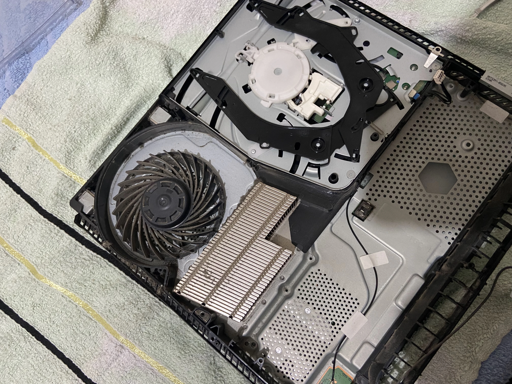
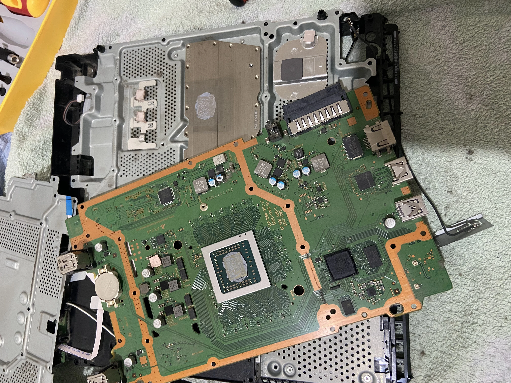
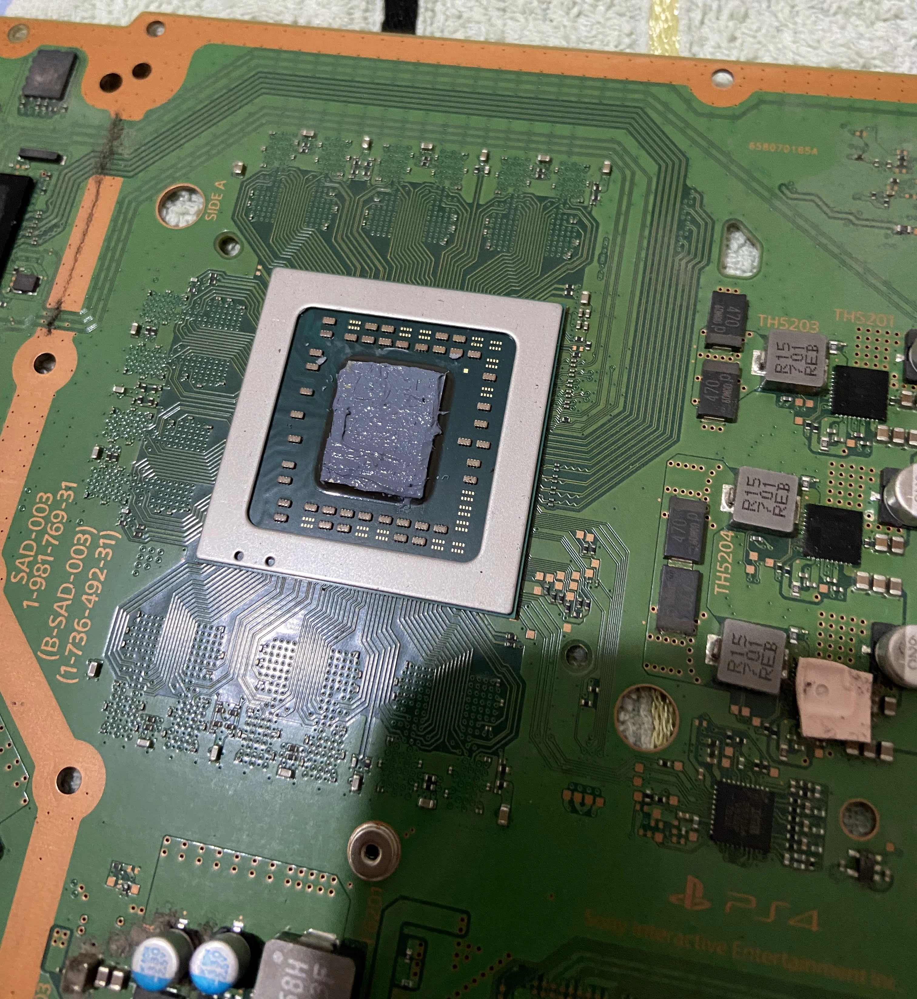
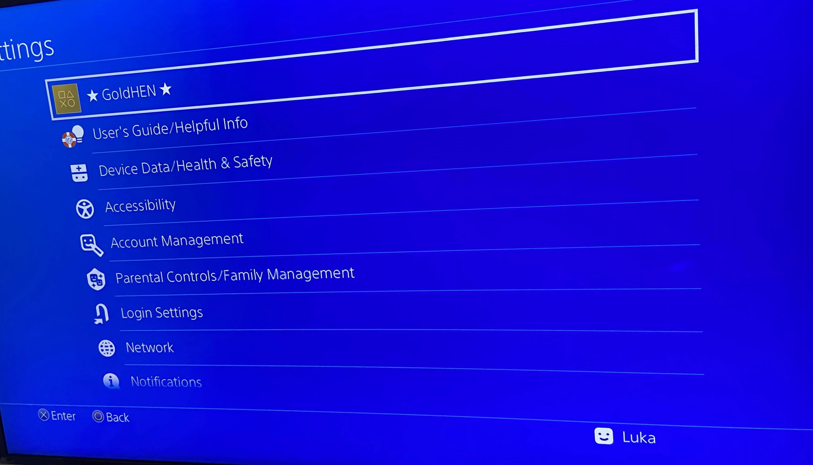

  

  <b>🎮 PS4-Wiederherstellung und 9.00 Jailbreak 🎮</b>


**Hinweis**: Diese Seite wurde mit Hilfe von [DeepL](https://www.deepl.com/translator) und [Google Translate](https://translate.google.com/) ins Deutsche übersetzt.



**Haftungsausschluss**: Ich plane, diese PS4 zu verwenden, um Linux darauf zu installieren und aus Neugier damit zu spielen. Ich dulde keine Piraterie; Dieser Artikel ist nur für Bildungszwecke gedacht! Ich übernehme keine Verantwortung für Ihre Taten!


Ich habe eine gebrauchte PS4 Slim-Konsole gekauft, um damit zu spielen, und sie war mit **8.50**-Firmware ausgestattet und wurde nie innen gereinigt. Das erste, was ich tat, war, es zu öffnen, um zu sehen, was "unter der Haube" war. Als ich es öffnete, sah ich Staub und als ich es einschaltete, war die PS4 so laut. Das bedeutete, dass die Wärmeleitpaste ausgetauscht und die Lüfter gereinigt werden mussten. Hier ist ein Bild von dem, was drin war:

    

Ich hatte vor, Linux auf dieser PS4 zu installieren, aber das erfordert einen Jailbreak und eine bestimmte Firmware-Version, und deshalb habe ich es mit einer ausreichend niedrigen Firmware-Version gekauft, damit ich es auf **9.00** aktualisieren kann.

**Sie können die Firmware auf der PS4 nicht downgraden; Sie können es nur upgraden!**

Was brauchen Sie:

>+ **USB-Stick formatiert** 
>+ **Wärmeleitpaste**
>+ **Schraubendreher**
>+ **Franzbranntwein**
>+ **Geduld**
>+ **Computer/Laptop**

## Wiederherstellung:

Zuerst öffnete ich die PS4, löste einige Schrauben und so sah das Innere aus:

    

    

Jetzt benutze ich Franzbranntwein, um die alte Wärmeleitpaste loszuwerden.

    

Die neue Wärmeleitpaste, die ich aufgetragen habe, ist Arctic MX-4. 

    

Nach der Reinigung des Lüfters und des Kühlkörpers sieht das Ergebnis so aus:

    

Viel besser !

## 9.00 Jailbreak

+ Nachdem ich die PS4 Slim zusammengebaut hatte, startete ich sie **ohne Internet** und führte einen Werksreset durch, indem ich zu **Einstellungen/Initialisierung/PS4 initialisieren** ging. Diese Option löschte alles, was zuvor auf der PS4 war, einschließlich Spiele und Konten.

+ Jetzt kommt der lustige Teil, der Jailbreak. Gehen Sie zuerst zu **Einstellungen/System/Automatische Downloads und stellen Sie sicher, dass alle Kästchen deaktiviert sind**.

+ Gehen Sie danach zu **Einstellungen/Netzwerk und deaktivieren Sie das Kontrollkästchen Mit dem Internet verbinden**. Diese Option verhindert, dass die PS4 das neueste Firmware-Update herunterlädt.

+ Gehen Sie nun zu **Einstellungen/System/Systeminformationen** und sehen Sie sich Ihre Firmware-Version an. Ich habe die Version 8.50, also muss ich meine PS4 manuell auf 9.00 aktualisieren. 

    

## Aktualisieren der PS4 auf 9.00

+ Um die PS4 auf 9.00 zu aktualisieren, benötigen Sie ein USB-Laufwerk und einen PC. Zuerst müssen Sie die Firmware 9.00 herunterladen. Es gibt zwei Websites, eine hat schnellere Downloads, erfordert aber ein kostenloses Konto, und die zweite hat langsamere Downloads, erfordert aber kein Konto.

1. [Dark Software (schnellere Downloads, erfordert aber ein Konto)](https://darksoftware.xyz/PS4/FWlist)

2. [Darth Sternie (langsamere Downloads, erfordert aber kein Konto)](https://darthsternie.net/ps4-firmwares/)

+ Unabhängig davon, wofür Sie sich entscheiden, stellen Sie sicher, dass Sie die Firmware 9.00 herunterladen.

+ Stellen Sie nach dem Download sicher, dass Sie die Datei **PS4UPDATE.PUP** benennen

+ Formatieren Sie es jetzt in **exFAT** auf Ihrem USB-Laufwerk.

+ Nachdem Ihr USB formatiert wurde, gehen Sie zum Stammordner Ihres USB und erstellen Sie einen neuen Ordner namens **PS4**, gehen Sie in diesen Ordner und erstellen Sie einen weiteren neuen Ordner namens **UPDATE** und dann im Ordner UPDATE, Sie werden die Datei PS4UPDATE.PUP kopieren. Denken Sie daran, dass die Ordner in Großbuchstaben geschrieben werden müssen.

+ Werfen Sie jetzt das USB-Laufwerk aus, gehen Sie zur PS4 und **überprüfen Sie Ihre Benachrichtigungen** und löschen Sie sie!

+ Schließe dein USB-Laufwerk an PS4 an und gehe zu **Einstellungen/Systemsoftware-Update**, das das Update von deinem USB auf 9.00 erkennen sollte. Folgen Sie den Anweisungen auf dem Bildschirm und aktualisieren Sie die PS4.

## Jailbreak der PS4

+ Nachdem Sie sich auf der Firmware-Version 9.00 befinden, gehen Sie zu **Einstellungen/Netzwerk** und aktivieren Sie das zuvor deaktivierte Kontrollkästchen **Mit dem Internet verbinden**.

+ Gehen Sie nun zu der unten stehenden Option **Internetverbindung einrichten**, Sie können entweder WLAN oder Ethernet verwenden, dann wählen Sie **Benutzerdefiniert**, Sie können wählen, ob Sie DHCP oder eine statische IP möchten, und dann wählen Sie **Nicht angeben* * für DHCP-Hostname und stellen Sie sicher, dass Sie **Manuell** für die **DNS-Einstellungen** auswählen!

+ Als meine **primäre DNS** verwende ich **192.241.221.79** und als meine **sekundäre DNS** verwende ich **165.227.83.145**! Diese DNS-IPs blockieren alle Verbindungen zu den Servern von Sony, damit die PS4 nicht versehentlich ein Update erhält.

+ Nachdem der DNS angegeben wurde, klicken Sie auf Weiter und wählen Sie **Automatisch** für MTU-Einstellungen und **Nicht verwenden** für Proxyserver.

+ Trennen Sie nun das USB-Laufwerk von der PS4 mit der Update-Datei 9.00 und schließen Sie es wieder an den PC an.

+ Auf dem PC müssen Sie [Rufus](https://rufus.ie/en/) und die [exfathax.img](https://github.com/ChendoChap/pOOBs4/blob/main/exfathax.img) von Github. Öffnen Sie Rufus, wählen Sie Ihr USB-Laufwerk und als ISO die Datei **exFAThax.img** aus und klicken Sie in Rufus auf Start.

+ Gehen Sie jetzt zur PS4 und öffnen Sie den PS4-Webbrowser, bevor Sie Ihren USB-Anschluss anschließen, und stellen Sie sicher, dass Sie **den gesamten Verlauf und Cache löschen**. Danach können Sie einen Host Ihrer Wahl verwenden, der Payloads anbietet.

+ Ich benutze [Karo218](http://www.karo218.ir)!

+ Nachdem Sie nun Ihren gesamten Browserverlauf, Cookies und Daten gelöscht haben, gehen Sie zum Host und klicken Sie auf **9,00 Gold**. Sie müssen warten, bis sich der Exploit für die Offline-Nutzung zwischengespeichert hat. Nachdem es fertig ist, klicken Sie auf **GoldHenV2.2.4, und der Exploit sagt Ihnen, wann Sie Ihren USB-Stick anschließen müssen.**

+ Warten Sie, bis die Payload die GoldHEN-Benachrichtigung anzeigt, und Sie haben eine PS4 mit Jailbreak.


**HINWEIS**: Wenn Fehler auftreten oder die Konsole abstürzt, starten Sie die PS4 neu und versuchen Sie es erneut!
**Dieser Jailbreak ist nicht persistent, d.h. nach einem Herunterfahren oder einem Neustart musst du alles neu machen, eine Lösung ist, deine PS4 in den Ruhemodus zu versetzen, oder du könntest alles automatisch machen, aber es erfordert einen ESP32-52 bzw ein Raspberry Pi!**


### Endergebnis 

    

## Schlussfolgerung

Angenehmes Projekt zu tun, vor allem da der Preis der PS4 wegen der PS5 Veröffentlichung gefallen ist. Reinigen Sie die PS4 war befriedigend, und ich muss sagen, es ist schwierig, das Slim-Modell zu öffnen. Jailbreak war erfolgreich wie erwartet, und für mich, es funktionierte fast 80% der Zeit, es hatte einige Abstürze hier und da, aber ein Neustart behoben. Ich freue mich schon darauf, Linux auf der Konsole zu installieren. 

## Vielen Dank für Ihre Zeit 💙

