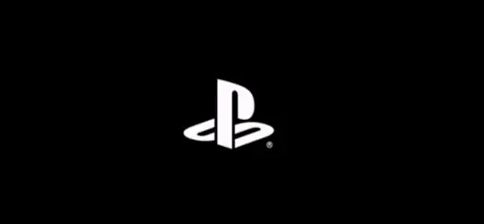
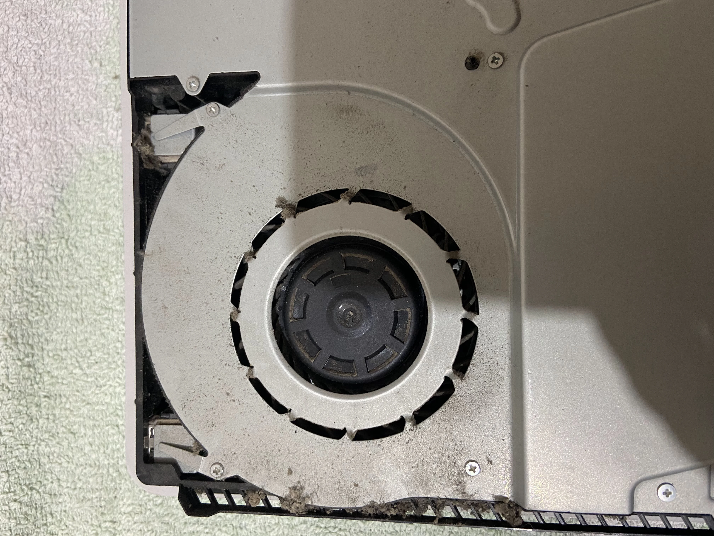
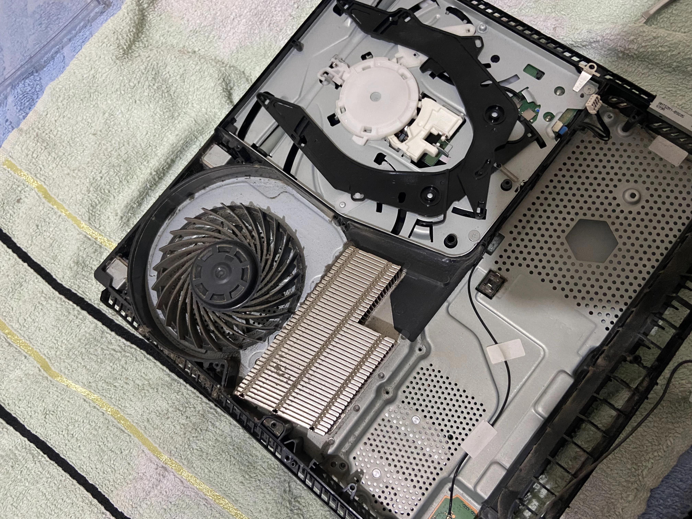
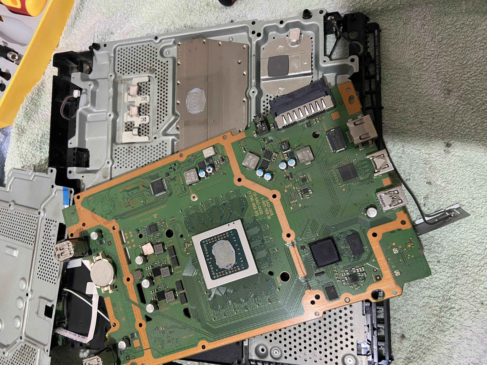
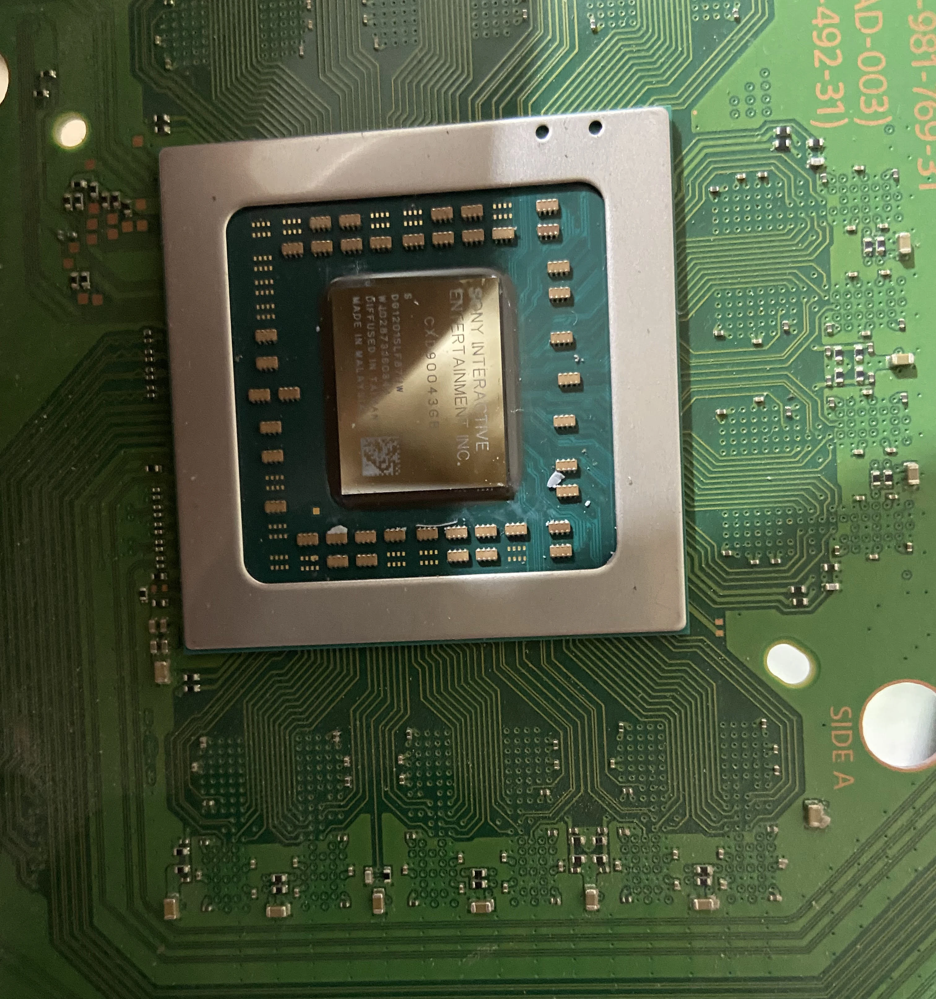
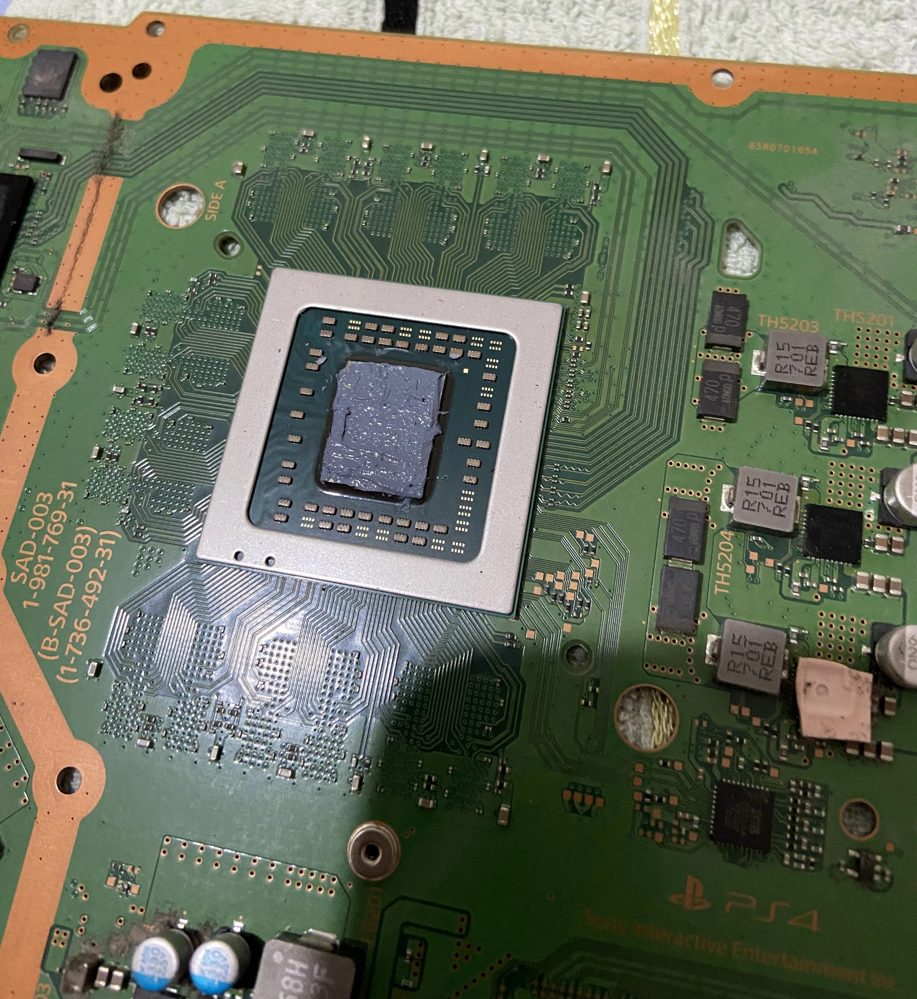
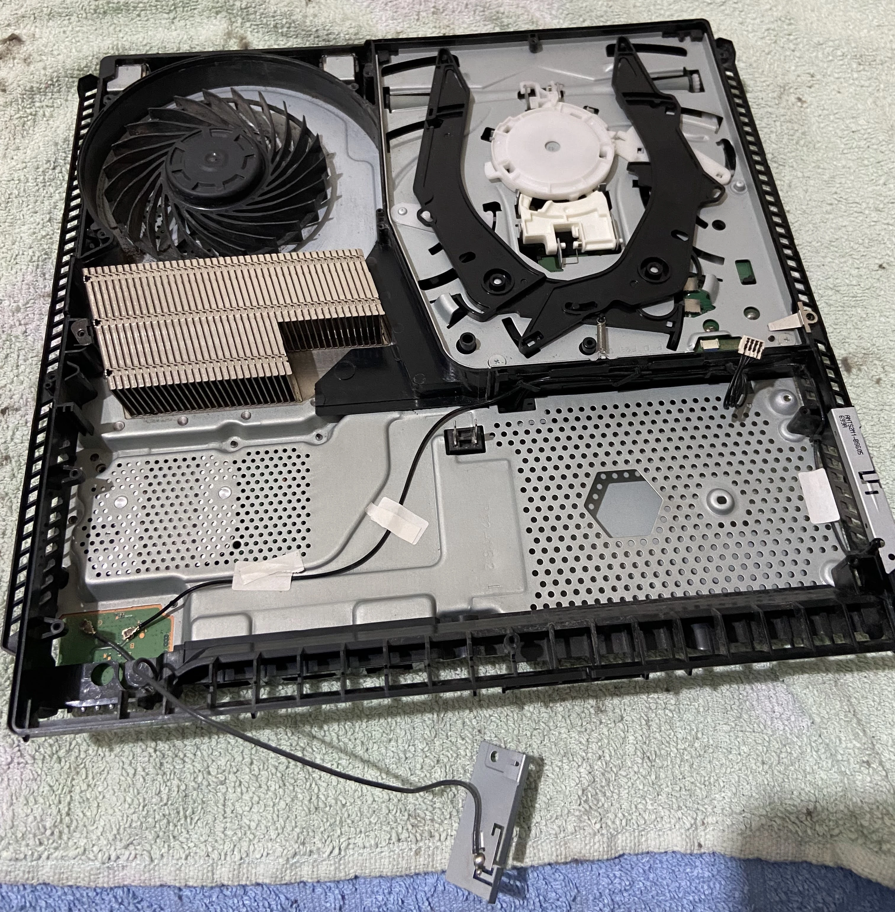
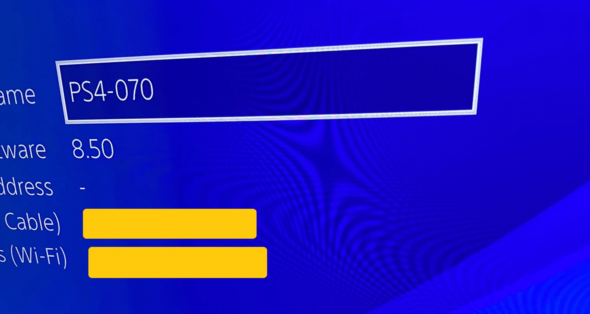
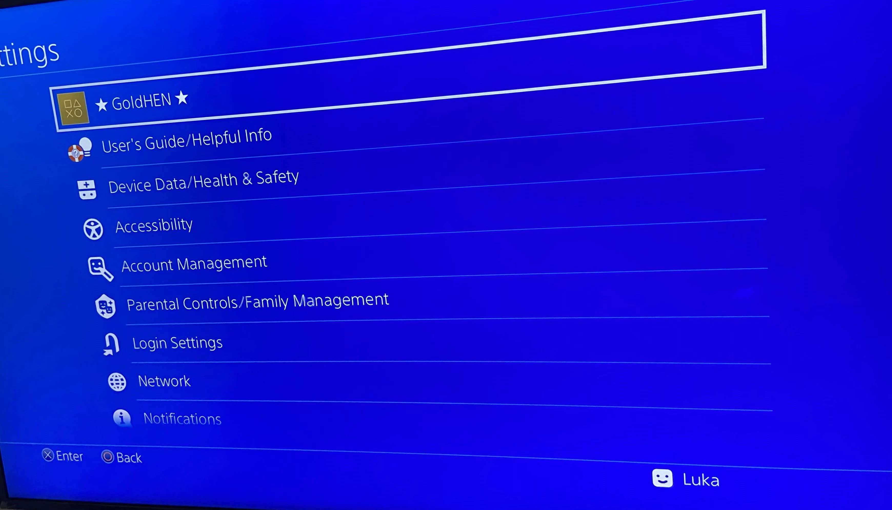

  

  <b>🎮 PS4 restauracija i 9.00 jailbreak 🎮</b>


**Pravno odricanje od odgovornosti**: Planiram koristiti ovaj PS4 da instaliram Linux na njega i igram se s njim iz znatiželje. Ne odobravam piratstvo; ovaj članak je samo u obrazovne svrhe! Ne odgovaram za tvoje postupke!


Kupio sam rabljenu PS4 Slim konzolu za igranje, a bila je na firmware-u **8.50** i nikada nije bila očišćena iznutra. Prvo što sam učinio je da sam ga otvorio da vidim što je "ispod haube". Kad sam ga otvorio, vidio sam prašinu i kad sam ga uključio, PS4 je bio jako glasan. To je značilo da treba zamijeniti termalnu pastu i očistiti ventilatore. Evo slike onoga što je bilo unutra:

    

Planirao sam instalirati Linux na ovaj PS4, ali to zahtijeva Jailbreak i određenu verziju firmvera, i zato sam ga kupio s dovoljno niskom verzijom firmvera da ga mogu nadograditi na **9.00**. 

**Ne možete vratiti firmware na PS4; možete ga samo nadograditi!**

Što je potrebno:

>+ **Formatiran USB stick** 
>+ **Termalna pasta**
>+ **Odvijači**
>+ **Medicinski alkohol**
>+ **Strpljenje**
>+ **Računalo/prijenosno računalo**

## Restauracija:

Prvo sam otvorio PS4, odvrnuo neke vijke i ovako je izgledala unutrašnjost:

    

    

Sada koristim alkohol da se riješim stare termalne paste.

    

Nova termalna pasta koju sam nanio je Arctic MX-4.

    

Nakon čišćenja ventilatora i hladnjaka rezultat izgleda ovako:

    

Puno bolje !

## 9.00 Jailbreak

+ Nakon što sam sklopio PS4 Slim, pokrenuo sam ga **bez interneta** i vratio na tvorničke postavke ulaskom u **Postavke/Inicijalizacija/Inicijalizacija PS4**. Ova je opcija izbrisala sve na PS4 što je prethodno bilo uključeno, uključujući igre i račune.

+ Sada dolazi zabavni dio, jailbreak. Najprije idite na **Postavke/Sustav/Automatska preuzimanja i poništite sve okvire**.

+ Nakon toga idite na **Postavke/Mreža i poništite okvir koji kaže Povezivanje na internet**. Ova opcija sprječava PS4 preuzimanje najnovijeg ažuriranja firmvera.

+ Sada idite na **Postavke/Sustav/Informacije o sustavu** i pogledajte svoju verziju firmvera. Imam verziju 8.50, pa moram ručno ažurirati svoj PS4 na 9.00.

    

## Ažuriranje PS4 na 9.00

+ Za ažuriranje PS4 na 9.00 trebat će vam USB i računalo. Prvo, morate nabaviti 9.00 firmware. Postoje dvije web stranice, jedna ima brže preuzimanje, ali zahtijeva besplatan račun, a druga ima sporije preuzimanje, ali ne zahtijeva račun.

1. [Dark Software (brža preuzimanja, ali zahtijeva račun)](https://darksoftware.xyz/PS4/FWlist)

2. [Darth Sternie (sporije preuzimanja ali ne zahtijeva račun)](https://darthsternie.net/ps4-firmwares/)

+ Što god odabrali, preuzmite firmware 9.00.

+ Nakon preuzimanja, dodijelite naziv datoteci **PS4UPDATE.PUP**

+ Sada USB formatirajte u **exFAT**.

+ Nakon što vaš USB završi formatiranje, idite u korijensku mapu vašeg USB-a i napravite novu mapu pod nazivom **PS4**, idite u tu mapu i stvorite drugu novu mapu pod nazivom **UPDATE**, a zatim unutar mape UPDATE, kopirat ćete datoteku PS4UPDATE.PUP. Imajte na umu da mape moraju biti napisane velikim slovima.

+ Sada izbacite USB disk, prijeđite na PS4 i **provjerite svoje obavijesti** i obrišite ih!

+ Priključite svoj USB disk u PS4 i idite na **Postavke/Ažuriranje softvera sustava**, što bi trebalo otkriti ažuriranje s vašeg USB-a na 9.00. Slijedite upute na zaslonu i ažurirajte PS4. 

## Jailbreak PS4 

+ Nakon što koristite verziju firmvera 9.00, idite na **Postavke/Mreža** i potvrdite okvir koji smo ranije poništili, **Poveži se na Internet**.

+ Sada idite na opciju ispod **Postavi internetsku vezu**, možete koristiti WiFi ili Ethernet, zatim odaberite **Prilagođeno**, možete odabrati želite li DHCP ili statičku IP adresu, zatim odaberite **Ne specificiraj** za DHCP hostname i obavezno odaberite **Manual** za **DNS Postavke**!

+ Kao **primarni DNS** koristim **192.241.221.79**, a kao **sekundarni DNS** koristim **165.227.83.145**! Ovi DNS IP-ovi blokiraju sve veze sa Sonyjevim poslužiteljima kako PS4 ne bi slučajno dobio ažuriranje.

+ Nakon što je DNS naveden, kliknite dalje i odaberite **Automatski** za MTU postavke i **Ne koristi** za proxy poslužitelj.

+ Sada isključite USB stik iz PS4 koji je imao datoteku ažuriranja 9.00 i ponovno ga uključite u računalo.

+ Na računalu ćete morati preuzeti [Rufus](https://rufus.ie/en/) i [exfathax.img](https://github.com/ChendoChap/pOOBs4/blob/main/exfathax.img) s Githuba. Otvorite Rufus, odaberite svoj USB stik, a kao ISO odaberite datoteku **exFAThax.img** i kliknite Start u Rufusu.

+ Sada idite na PS4 i prije nego što priključite svoj USB, otvorite web preglednik od PS4 i obavezno **obrišite svu povijest i predmemoriju** iz njega. Nakon toga možete koristiti host koji vam se sviđa i koji nudi korisna opterećenja.

+ Lično koristim [Karo218](http://www.karo218.ir)!

+ Sada, nakon što ste izbrisali svu svoju povijest pregledavanja, kolačiće i podatke, idite na host i kliknite na **9.00 Gold** morat ćete pričekati da se exploit sam spremi u predmemoriju za izvanmrežnu upotrebu. Nakon što završi, kliknite na **GoldHenV2.2.4, i exploit će vam reći kada da uključite svoj USB.**

+ Pričekajte da payload prikaže GoldHEN obavijest i imate jailbreak-an PS4. 


**NAPOMENA**: Ako ima bilo kakvih grešaka ili se konzola ruši, ponovno pokrenite PS4 i pokušajte ponovno!
**Ovaj Jailbreak nije trajan, što znači da nakon gašenja ili ponovnog pokretanja, morate sve učiniti ponovo, jedno od rješenja je da stavite svoj PS4 u način mirovanja ili možete sve učiniti automatskim, ali zahtijeva ESP32-52 ili Raspberry Pi!**


### Konačni rezultat

    

## Zaključak

Ugodan projekt za napraviti, značajno jer je cijena PS4 pala zbog izdanja PS5. Čišćenje PS4 bilo je zadovoljavajuće, a moram reći da je teško otvoriti Slim model. Jailbreak je bio uspješan kao što se i očekivalo, a za mene je radio gotovo 80% vremena, tu i tamo je imao rušenja, ali ponovno pokretanje je to popravilo. Veselim se instalaciji Linuxa na konzolu.

## Hvala na vašem vremenu 💙

