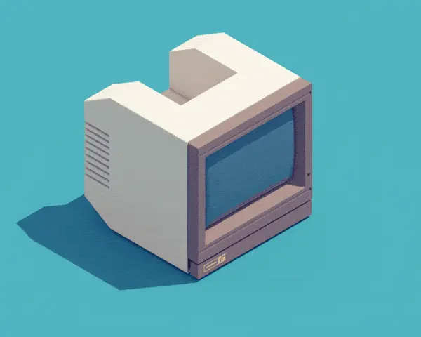
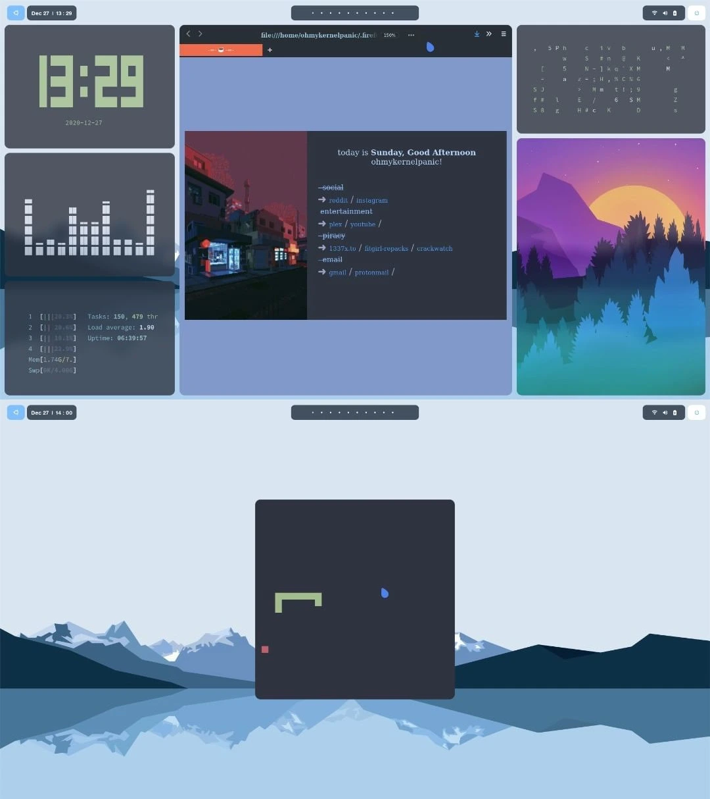

<p align="center">
  
</p>

<p align="center">
  <b>🖥️ Pop! Linux-Konfigurationsdateien 🖥️</b>
</p>


**Hinweis**: Diese Seite wurde mit Hilfe von [DeepL](https://www.deepl.com/translator) und [Google Translate](https://translate.google.com/) ins Deutsche übersetzt.




Dies sind meine aktuellen Dotfiles von Pop! Betriebssystem der Linux-Distribution.

Die Installation hilft Ihnen dabei, das gleiche Aussehen wie auf den Bildern zu erzielen. Hier sind die Schritt-für-Schritt-Anleitungen.

Systemspezifikationen:

>+ **OS**: [Pop!_OS](https://pop.system76.com/) 
>+ **WM**: [BSPWM](https://github.com/baskerville/bspwm) 
>+ **Tastatur-Daemon**: [Sxhkd](https://github.com/baskerville/sxhkd)
>+ **Bar**: [Polybar](https://github.com/polybar/polybar)
>+ **Setzer**: [Picom](https://github.com/ibhagwan/picom)
>+ **App Launcher**: [Rofi](https://github.com/davatorium/rofi)
>+ **Terminal**: [Alacritty](https://github.com/alacritty/alacritty)
>+ **Shell**: [Oh-my-ZSH](https://ohmyz.sh/)
>+ **Shell Thema**: [Powerlevel10k](https://github.com/romkatv/powerlevel10k)
>+ **Texteditor**: [Vim-Airline](https://github.com/vim-airline/vim-airline)
>+ **Sperrbildschirm**: Slim and Slimlock
>+ **Benachrichtigungen**: [Dunst](https://dunst-project.org/)
>+ **GTK Thema**: [Nordic_Dark](https://www.gnome-look.org/p/1267246/)
>+ **Icon Thema**: [Flatery_Dark](https://www.gnome-look.org/s/Gnome/p/1332404)
>+ **Mauszeiger Thema**: [Oreo_Blue](https://www.gnome-look.org/s/Gnome/p/1360254/)
>+ **Schriftart**: [Source_Code_Pro](https://fonts.google.com/specimen/Source+Code+Pro)
>+ **Browser**: [Firefox](https://www.mozilla.org/en-US/firefox/new/)
>+ **Browser Thema**: [Minimal_Functional_Fox](https://github.com/mut-ex/minimal-functional-fox)

## Installation

Um mit diesem Look zu beginnen, nehme ich an, dass Sie einen frisch installierten Pop! Betriebssystem.

*Wenn Sie daran interessiert sind, was eine Anwendung tut, hilft Ihnen Wikipedia weiter.*

### Repository-Upgrade und System-Upgrade

> ```shell
> sudo apt update
> sudo apt upgrade
> ```

### Installation des BSPWM Tiling Window Managers

Zuerst müssen wir einige notwendige sogenannte Abhängigkeiten installieren, die wir benötigen, um mit der Installation fortzufahren.

+ Installation benötigter Abhängigkeiten:

>```shell 
> sudo apt install build-essential git vim xcb libxcb-util0-dev libxcb-ewmh-dev libxcb-randr0-dev libxcb-icccm4-dev libxcb-keysyms1-dev libxcb-xinerama0-dev libasound2-dev libxcb-xtest0-dev libxcb-shape0-dev
> ```
     

+ Repository-Klonen:

> ```shell
> cd ~/Downloads
> git clone https://github.com/baskerville/bspwm.git
> ```

+ BSPWM kompilieren und installieren:

> ```shell
> cd bspwm
> make
> sudo make install
> ```
 
+ Kopieren Sie die BSPWM-Konfigurationsdateien:

> ```shell
> mkdir ~/.config/bspwm
> cp examples/bspwmrc ~/.config/bspwm
> chmod +x ~/.config/bspwm/bspwmrc
> cd ..
> ``` 

### Installation des Tastatur-Daemons

Zum Beispiel müssen wir den sogenannten Tastatur-Daemon verwenden, um Tastenkombinationen zum Öffnen eines Terminals, einer anderen Anwendung usw. zu verwenden. Es ist ein Prozess, der im Hintergrund läuft und BSPWM Tilling Window Manager anweist, was zu tun ist, wenn jemand eine bestimmte Tastenkombination drückt auf der Tastatur.

*Wenn Sie daran interessiert sind, was ein Shortcut gemäß meinen Einstellungen macht, hilft Ihnen der Shortcut-Abschnitt weiter.*

+ Repository-Klonen:

> ```shell
> cd ~/Downloads
> git clone https://github.com/baskerville/sxhkd.git
> ```

+ Kompilieren und Installieren von sxhkd:
      
> ```shell
> cd sxhkd
> make 
> sudo make install
> ```

+ Kopieren Sie die sxhkd-Konfigurationsdateien:

> ```shell
> mkdir ~/.config/sxhkd
> cp ../bspwm/examples/sxhkdrc ~/.config/sxhkd
> cd ..
> ```


**HINWEIS:** Wenn Sie irgendetwas in der sxhkdrc-Datei ändern, achten Sie darauf, auf welches Terminal Sie eingestellt sind; wenn Sie ein normales Pop-Betriebssystem verwenden! terminal, müssen Sie das Betriebssystem unter dem Terminal-Emulator auf `gnome-terminal` ändern.


### Installation von Polybar

+ Installation der erforderlichen Abhängigkeiten:

> ```shell
> sudo apt install cmake cmake-data pkg-config python3-sphinx libcairo2-dev libxcb1-dev libxcb-util0-dev libxcb-randr0-dev libxcb-composite0-dev python3-xcbgen xcb-proto libxcb-image0-dev libxcb-ewmh-dev libxcb-icccm4-dev libxcb-xkb-dev libxcb-xrm-dev libxcb-cursor-dev libasound2-dev libpulse-dev libjsoncpp-dev libmpdclient-dev libcurl4-openssl-dev libnl-genl-3-dev
> ```

+ Repository-Klonen:

> ```shell
> cd ~/Downloads
> git clone --recursive https://github.com/polybar/polybar
> ```

+ Zusammenstellung und Installation von polybar:

> ```shell
> cd polybar
> mkdir build
> cd build
> cmake ..
> make -j$(nproc)
> sudo make install
> ```

### Installation von Picom

+ Installation der erforderlichen Abhängigkeiten:
   
> ```shell
> sudo apt install meson libxext-dev libxcb1-dev libxcb-damage0-dev libxcb-xfixes0-dev libxcb-shape0-dev libxcb-render-util0-dev libxcb-render0-dev libxcb-randr0-dev libxcb-composite0-dev libxcb-image0-dev libxcb-present-dev libxcb-xinerama0-dev libpixman-1-dev libdbus-1-dev libconfig-dev libgl1-mesa-dev  libpcre2-dev  libevdev-dev uthash-dev libev-dev libx11-xcb-dev
> ```

+ Repository-Klonen:

> ```shell
> cd ~/Downloads
> git clone https://github.com/ibhagwan/picom.git
> ```

+ Picom mit Ninja machen:

> ```shell
> cd picom
> git submodule update --init --recursive
> meson --buildtype=release . build
> ninja -C build
> ```

+ Installation von Picom Compositor:

> ```shell 
> sudo ninja -C build install
> cd ..
> ```

### Installation von Rofi

> ```shell
> sudo apt install rofi
> ```

### Installation des Alacritty-Terminals

> ```shell
> sudo apt install alacritty
> ```

+ Klonen dieses Repositorys:

> ```shell
> cd ~/Downloads
> git clone https://github.com/lukapiplica/dots.git
> ```

+ Einrichten eines Alacritty-Themes:

> ```shell
> mkdir ~/.config/alacritty
> cp dots/alacritty/alacritty.yml ~/.config/alacritty/
> ```


**HINWEIS**: Wenn Sie die Fehlermeldung `GLSL 3.30 wird nicht unterstützt` erhalten, gehen Sie wie folgt vor:

    
> ```shell
> nano /usr/share/applications/com.alacritty.Alacritty.desktop
> ```

*Ändern Sie `Exec=alacritty` in `Exec=bash -c "LIBGL_ALWAYS_SOFTWARE=1 alacritty"`.*


**HINWEIS:** Nach diesem Schritt können Sie sich bei BSPWM anmelden; zuerst müssen Sie sich von der aktuellen Desktop-Oberfläche abmelden; Klicken Sie dann auf das Symbol ⚙️ in der unteren rechten Ecke und wählen Sie BSPWM aus.


### Installation von Schriftarten

> ```shell
> cd ~/Downloads
> cd dots
> sudo cp -r Source_Code_Pro /usr/share/fonts
> fc-cache -v
> ```

### Einstellen des Hintergrundbilds

+ Installation des **Feh**:
   
> ```shell
> sudo apt install feh
> ```

+ Bewegliche Hintergrundbilder:

> ```shell
> mkdir ~/Wall
> cp -r ~/Downloads/dots/Wallpapers/ ~/Wall
> ```

+ Hintergrundbild einstellen:

> ```shell
> echo 'feh --bg-fill $HOME/Downloads/dots/Wallpapers/wallpaper2.jpeg' >> ~/.config/bspwm/bspwmrc 
> ```

### Konfiguration von Polybar

> ```shell
> mkdir ~/.config/polybar
> cd ~/Downloads/dots/polybar
> cp * -r ~/.config/polybar
> echo '~/.config/polybar/./launch.sh' >> ~/.config/bspwm/bspwmrc
> cd fonts
> sudo cp * /usr/share/fonts/truetype/
> ```

### Installation von Oh-My-ZSH

> ```shell
> sudo apt install zsh
> sh -c "$(curl -fsSL https://raw.github.com/ohmyzsh/ohmyzsh/master/tools/install.sh)
> ```

### Installation von Powerlevel10k

+ Repository-Klonen: 

> ```shell
> git clone --depth=1 https://github.com/romkatv/powerlevel10k.git ${ZSH_CUSTOM:-$HOME/.oh-my-zsh/custom}/themes/powerlevel10k
> ```

+ Nach dem Klonen müssen wir dieses Thema in der `~/.zshrc`-Datei setzen; Wir tun dies, indem wir die `.zshrc`-Datei mit diesem Befehl `ZSH_THEME="powerlevel10k/powerlevel10k"` eingeben

+ Wir geben im Terminal ein: 

> ```shell 
> p10k configure
> ```

Folgen wir den Anweisungen im Terminal, um das gewünschte Thema zu erstellen.

### Installation des Vim Thema

> ```shell
> mkdir -p ~/.vim/colors
> cd ~/Downloads
> cp dots/nord.vim ~/.vim/colors
> ```

+ Klonen eines Vim Airline Thema:

> ```shell
> cd ~/Downloads
> git clone https://github.com/vim-airline/vim-airline.git
> cd vim-airline
> cp * -r ~/.vim
> echo 'colorscheme nord' >> ~/.vimrc
> echo 'let g:airline_theme='base16'' >> ~/.vimrc
> ```

### Rofi-Theme einrichten

> ```shell 
> mkdir -p ~/.config/rofi/themes
> cp ~/Downloads/dots/nord.rasi ~/.config/rofi/themes
> rofi-theme-selector
> ```

+ Rofi Theme Selector zeigt uns einige der Themen. Um unser Design auszuwählen, gehen Sie zu `Nord theme`, klicken Sie auf **Enter**, und drücken Sie dann **Alt + a**, um es für immer festzulegen.

> ```shell 
> nano ~/.config/sxhkd/sxhkdrc
> ```

+ Öffnet den Nano-Texteditor im Terminal und wir müssen **`dmenu`** in **`rofi -show drun`** ändern.

### Installation von Slim und Slimlock

> ```shell
> sudo apt instll slim libpam0g-dev libxrandr-dev libfreetype6-dev libimlib2-dev libxft-dev
> sudo dpkg-reconfigure gdm3 
> ```

      
**Hinweis**: Wenn wir ein Menü erhalten, müssen wir Slim als Option auswählen.


+ So stellen Sie das Thema ein:

> ```shell
> cd ~/Downloads/dots
> sudo cp slim.conf /etc && sudo cp slimlock.conf /etc
> sudo cp default /usr/share/slim/themes
> ```

## Verschiedene Werkzeuge

Wir haben das Aussehen dieses Betriebssystems erfolgreich erreicht; Jetzt installieren wir mehrere Programme aus den Bildern.

### Installation von tty-clock

> ```shell
> sudo apt-get install tty-clock
> ```

### Installation von CAVA Audio Visualizer

> ```shell
> sudo add-apt-repository ppa:hsheth2/ppa
> sudo apt-get update
> sudo apt-get install cava
> ```

### Installation von htop

> ```shell
> sudo apt-get install htop
> ```

### Installation von cmatrix

> ```shell
> sudo apt-get install cmatrix
> ```

### Installation von sxiv

> ```shell
> sudo apt-get install sxiv
> ```

### Installation von Ranger

> ```shell
> sudo apt-get install ranger
> ```

### Installation von pfetch

> ```shell
> cd ~/Downloads
> git clone https://github.com/dylanaraps/pfetch.git
> sudo install pfetch/pfetch /usr/local/bin/
> ls -l /usr/local/bin/pfetch
> ```

### Installation von chafa

> ```shell
> cd ~/Downloads
> git clone https://github.com/hpjansson/chafa.git
> cd chafa
> ./autogen.sh
> make 
> sudo make install
> ```

### Installation des Schlangenspiels
      
> ```shell 
> sudo apt install python3-pip
> python3 -m pip install -U pygame --user
> cd ~/Downloads
> git clone https://github.com/Unixado/Snake.git
> cd Snake
> python src/game.py
> ```

### Lollypop installieren

> ```shell
> sudo add-apt-repository ppa:gnumdk/lollypop
> sudo apt install lollypop
> ```

### Installation von Minimal Functional Fox

> ```shell
> sh -c "$(curl -fsSL https://raw.githubusercontent.com/mut-ex/minimal-functional-fox/master/install.sh)"
> ```
   
+ Richten Sie ein Firefox-Design ein

> ```shell
> cp -r ~/Downloads/dots/.firefoxthemes ~/
> ```

+ Öffnen Sie dann `Firefox` und gehen Sie zu `Einstellungen`, dann zu `Home` und wo es heißt `Homepage und neue Fenster` wählen wir `Benutzerdefinierte URLs ...`, unten schreiben wir dies:

> ```shell
> file:///home/*YOUR USERNAME*/.firefoxthemes/startpage/Startpage/index.html
> ```
 
+ `Starten Sie Firefox neu` 

## Installation des GTK Thema

### Installation von Lxappearance
      
> ```shell
> sudo apt-get install lxappearance
> ```
   
### Installation des Themas Nordic Dark

+ **Themenlink: https://www.gnome-look.org/p/1267246/**

+ Laden Sie die ZIP-Datei herunter, entpacken Sie sie und fügen Sie sie in Lxappearance ein.
 
### Installation des Flattery Dark Thema für Icons

+ **Themenlink: https://www.gnome-look.org/s/Gnome/p/1332404**

+ Laden Sie die ZIP-Datei herunter, entpacken Sie sie und fügen Sie sie in Lxappearance ein.
   
### Installation des Oreo Blue-Cursor-Thema

+ **Themenlink: https://www.gnome-look.org/s/Gnome/p/1360254/** 

+ Laden Sie die ZIP-Datei herunter, entpacken Sie sie und fügen Sie sie in Lxappearance ein.

## Wikipedia

Nachdem wir diese BSPWM-Konfiguration vorgenommen haben, ist es an der Zeit zu klären, was jede Anwendung tut. Innerhalb des Verzeichnisses `~/.config/` finden Sie alle Dateien, die Sie zum Ausführen von BSPWM benötigen.

+ 🧠 `[BSPWM]`

   BSPWM ist ein Tiling Window Manager, der im Gegensatz zu anderen Desktop-Oberflächen jedes neue Fenster nach einem Algorithmus öffnet.

    Wenn wir beispielsweise zwei Fenster haben, werden sie im Vollbildmodus geöffnet und können nicht übereinander angeordnet werden, wie z. B. in Windows- oder GNOME-Oberflächen. Theoretisch wird der Platz auf dem Bildschirm effektiv genutzt, sodass der gesamte Bildschirm ausgefüllt wird. Wenn uns auf dem ersten Desktop der Platz ausgeht, können wir per Tastaturkürzel oder Maus auf den zweiten Desktop wechseln und dieses Betriebssystem weiter verwenden.

+ ⌨️ `[SXHKD]`

   SXHKD ist ein Tastatur-Daemon. Es funktioniert für uns als Hintergrundprozess und teilt BSPWM mit, welche Anwendung geöffnet werden soll, wenn der Benutzer eine bestimmte Tastenkombination auf der Tastatur drückt.

+ 🍫 `[Polybar]`

   Polybar ist unsere Statusleiste oben auf unserem Desktop.

   Es dient uns zur Anzeige von Benachrichtigungen, Datum und Uhrzeit, Internet, Akku, Shutdown- und Restart-Menü des Betriebssystems und der wichtigsten Workspaces von BSPWM.

+ 📚 `[Picom]`

   Picom ist ein Compositor; Es dient uns als Prozess, der jeder Anwendung, die wir öffnen, abgerundete Kanten verleiht.

+ 🤓 `[Rofi]` 

   Rofi ist ein Prozess, der andere Anwendungen öffnet, am hilfreichsten beim Ausführen von GTK-Anwendungen (Benutzeroberflächenanwendungen).

+ 💻 `[Alacritty]` Terminal.

   Alacritty dient als Terminal-Emulator, also als Ersatz für das Standard-GNOME-Terminal.

   Wir verwenden es hauptsächlich, weil es uns die Möglichkeit gibt, durch Bearbeiten seiner Konfigurationsdateien ein besseres Aussehen zu erzielen.

+ 🐚 `[Oh-My-ZSH]` shell.

   Oh-My-ZSH ist ein Framework, das uns die Verwaltung von ZSH-Konfigurationen erleichtert.

    In diesem Fall wird es hauptsächlich verwendet, um Themen zu einem Terminal hinzuzufügen, das eine `ZSH-Shell` hat.

    `ZSH (Zshell)` wurde ausgewählt, weil es neuer ist und die meisten Updates von anderen Linux-Distributionen im Vergleich zu `Bash Shell` bereits darauf verschoben werden.

    + Wir haben die `Powerlevel10k`-Konfiguration verwendet, um die Themen festzulegen.


+ 📋 `[Vim]` Texteditor

  Da viele Leute Notepad auf Windows-Betriebssystemen verwenden, verwenden wir Nano und Vim.

  Der Nano-Texteditor ist viel einfacher zu bedienen, während der Vim aufgrund seiner Verknüpfungen eher für Entwickler gemacht ist.

   + Vim Airline ist ein Thema, das uns ein anderes Aussehen verleiht als ein normaler Vim.


+ 📺 `[Slim]` Sperrbildschirm

   Slim ist unser Sperrbildschirm.

   Slimlock ist das Thema, das wir für den Sperrbildschirm verwendet haben.

+ 💬 `[Dunst]` Benachrichtigungen

   Dunst ist ein Prozess, der im Hintergrund ausgeführt wird und dessen Hauptzweck darin besteht, Benachrichtigungen in der Statusleiste (Polybar) anzuzeigen.

   Der Vorteil von Dunst ist, dass es die Möglichkeit bietet, Themen für das Aussehen und viele andere Funktionen wie z. Welche Benachrichtigungen angezeigt werden sollen usw.

+ 🕶️ `[Nordic Dark]` GTK Thema.

  Nordic Dark ist ein GTK-Design (Design für Benutzeroberflächenanwendungen), das uns einen dunklen Blick auf Anwendungen mit einer Benutzeroberfläche gibt.

+ 🔷 `[Flattery Dark]` Icon Thema.

   Der Name sagt schon, dass Anwendungen mit einer Benutzeroberfläche meistens Symbole haben, die wir mit der Maus anklicken können; Dieses Thema gibt uns ein anderes Aussehen der Symbole.

+ 🔵 `[Oreo Blue]` Cursor-Thema.

   Dieses Thema gibt uns einen blauen Cursor-Look, es wurde nur wegen des Aussehens eingefügt und weil es zu allen anderen Farben dieses Betriebssystems passt.

+ 🔤 `[Source Code Pro]` Schriftart.

   Schriftart dieses Betriebssystems.

+ 🔥🦊 `[Firefox]` Webbrowser.

   Ich verwende Firefox, weil es meiner Meinung nach einer der besten datenschutzorientierten Webbrowser ist.

+ 🦊 `[Minimal Functional Fox]` Firefox-Thema.

   Dieses Thema dient hier hauptsächlich dem Aussehen, aber auch, weil es minimal ist.

+ ⏰ `tty-clock` 

   Tty-clock ist eine Anwendung, die den Zweck hat, die Uhrzeit und das Datum im Terminal anzuzeigen.
   
+ 🎚️ `CAVA` Audio-Visualisierer.

   Cava ist unsere Anwendung, die als Audiovisualisierer dient.

+ 📈 `HTop` 

   Die HTop-Anwendung zeigt, welche Prozessoren gerade laufen und wie viel RAM sie belegen, und viele andere Dinge. Stellen Sie sich HTop als Task-Manager im Windows-Betriebssystem vor.
   
+ 😎 `CMatrix` 

   CMatrix ist eine Anwendung, die nur zum Anschauen da ist, und ihr Zweck ist es, Text in einem offenen Terminal zu drucken, der darauf abzielt, eine Anzeige von Hacking aus dem Matrix-Film zu geben.

+ 🖼️ `SXIV` 

   SXIV ist eine Bildbetrachteranwendung, die Bilder für uns öffnet.

+ 🤠 `Ranger` 

   Ranger ist eine Anwendung, mit der wir alle Dateien auf dem Computer im Terminal sehen und darauf zugreifen können.

+ 🗄️ `Pfetch`

   Der Zweck der Pfetch-Anwendung besteht darin, anzuzeigen, welches Betriebssystem wir verwenden, welchen Laptop/Computer wir haben, welche Version des Kernels aktuell ist, wie viel Betriebszeit wir derzeit haben, wie viele Pakete wir haben und wie viel RAM wir haben.

+ ⚙️ `Chafa`

   Chafa ist eine Anwendung, die ein Bild zur Verwendung im Terminal druckt und so ein Retro/ASCII-Aussehen eines Bildes erzielt.

+ 🐍 `Snake`

   In diesem Fall handelt es sich bei der Snake-App um ein altes Snake-Spiel aus dem Nokia 3310-Handy, das farblich leicht modifiziert und für das Spielen im Terminal angepasst wurde.

+ 🍭 `Lollypop` 

   Lollypop ist eine Musik-App, wir spielen Songs darüber.


## Abkürzungen

Als <kbd>super</kbd> verwenden wir die Windows-Taste auf der Tastatur. Super ist die wichtigste Taste auf unserer Tastatur, weil wir damit dem SXHKD-Tastatur-Daemon Anweisungen geben.

## Keyboard

| Schlüssel | Aktion |
| --------- | ------ |
| <kbd>super + enter</kbd> | Öffnet Terminal |
| <kbd>super + space</kbd> | Öffnet Rofi, über das wir GTK-Anwendungen öffnen |
| <kbd>super + escape</kbd> | Lädt SXHKD und seine Konfigurationsdateien neu |
| <kbd>super + alt + r</kbd> | Startet den BSPWM Tiling Window Manager neu |
| <kbd>super + w</kbd> | Beendet die aktuelle Anwendung |
| <kbd>super + [1-0]</kbd> | Ändert den aktuellen Arbeitsbereich |
| <kbd>super + g</kbd> | Es ändert das aktuelle kleinere Fenster auf die Fläche des größeren Fensters, während das größere Fenster es in die Position des kleineren versetzt |
| <kbd>super + m</kbd> |Öffnet die Anwendung über den gesamten Desktop |
| <kbd>super + [h,j,k,l]</kbd> | Verschiebt den Fokus auf ein anderes Fenster|
| <kbd>super + alt + [h,j,k,l]</kbd> | Bewegt die Fenster nach außen |
| <kbd>super + alt + shift + [h,j,k,l]</kbd> | Bewegt die Fenster nach innen |
| <kbd>super + s</kbd> | Versetzt Fenster in den sogenannten Float-Modus, eine Option, bei der wir wie in Windows-Betriebssystemen ein Fenster auf das Fenster legen können |
| <kbd>super + ctrl + [Pfeiltasten]</kbd> | Verschiebt die schwebenden Fenster |


## Vielen Dank für Ihre Zeit 💙

