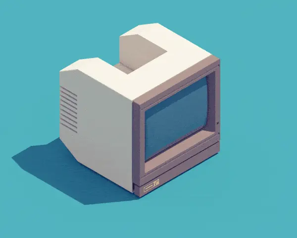

<p align="center">
  
</p>

<p align="center">
  <b>🖥️ Pop! Linux configuration files 🖥️</b>
</p>


These are my current dotfiles of Pop! Linux distribution OS.

The installation will help you create the same look like the pictures; here are the step-by-step instructions.

System specifications:

>+ **OS**: [Pop!_OS](https://pop.system76.com/) 
>+ **WM**: [BSPWM](https://github.com/baskerville/bspwm) 
>+ **Keyboard Deamon**: [Sxhkd](https://github.com/baskerville/sxhkd)
>+ **Bar**: [Polybar](https://github.com/polybar/polybar)
>+ **Compositor**: [Picom](https://github.com/ibhagwan/picom)
>+ **App Launcher**: [Rofi](https://github.com/davatorium/rofi)
>+ **Terminal**: [Alacritty](https://github.com/alacritty/alacritty)
>+ **Shell**: [Oh-my-ZSH](https://ohmyz.sh/)
>+ **Shell theme**: [Powerlevel10k](https://github.com/romkatv/powerlevel10k)
>+ **Text Editor**: [Vim-Airline](https://github.com/vim-airline/vim-airline)
>+ **Lockscreen**: Slim and Slimlock
>+ **Notifications**: [Dunst](https://dunst-project.org/)
>+ **GTK Theme**: [Nordic_Dark](https://www.gnome-look.org/p/1267246/)
>+ **Icon Theme**: [Flatery_Dark](https://www.gnome-look.org/s/Gnome/p/1332404)
>+ **Cursor Theme**: [Oreo_Blue](https://www.gnome-look.org/s/Gnome/p/1360254/)
>+ **Font**: [Source_Code_Pro](https://fonts.google.com/specimen/Source+Code+Pro)
>+ **Browser**: [Firefox](https://www.mozilla.org/en-US/firefox/new/)
>+ **Browser Theme**: [Minimal_Functional_Fox](https://github.com/mut-ex/minimal-functional-fox)

## Installation

To start making this look, I assume you have a freshly installed Pop! OS.

*If you are interested in what an application does, Wikipedia will help you.*

### Repository upgrade and system upgrade

> ```shell
> sudo apt update
> sudo apt upgrade
> ```

### Installation of BSPWM Tilling Window Manager

First, we need to install a few necessary so-called dependencies that we need to proceed with the installation.

+ Installation of required dependencies:

>```shell 
> sudo apt install build-essential git vim xcb libxcb-util0-dev libxcb-ewmh-dev libxcb-randr0-dev libxcb-icccm4-dev libxcb-keysyms1-dev libxcb-xinerama0-dev libasound2-dev libxcb-xtest0-dev libxcb-shape0-dev
> ```
     

+ Repository cloning:

> ```shell
> cd ~/Downloads
> git clone https://github.com/baskerville/bspwm.git
> ```

+ Compiling and installing BSPWM:

> ```shell
> cd bspwm
> make
> sudo make install
> ```
 
+ Copy BSPWM configuration files:

> ```shell
> mkdir ~/.config/bspwm
> cp examples/bspwmrc ~/.config/bspwm
> chmod +x ~/.config/bspwm/bspwmrc
> cd ..
> ``` 

### Installation of keyboard deamon

For example, we must use the so-called keyboard daemon to use keyboard shortcuts to open a terminal, another application, etc. It is a process that runs in the background and instructs BSPWM Tilling Window Manager what to do if someone presses a specific shortcut on the keyboard.

*If you are interested in what a shortcut does according to my settings, the shortcut section will help you.*

+ Repository cloning:

> ```shell
> cd ~/Downloads
> git clone https://github.com/baskerville/sxhkd.git
> ```

+ Compiling and installing sxhkd:
      
> ```shell
> cd sxhkd
> make 
> sudo make install
> ```

+ Copy sxhkd configuration files:

> ```shell
> mkdir ~/.config/sxhkd
> cp ../bspwm/examples/sxhkdrc ~/.config/sxhkd
> cd ..
> ```


**NOTE:** If you change anything in the sxhkdrc file, pay attention to which terminal you are set to; if you are using a regular Pop OS! terminal, you need to change the OS to `gnome-terminal` under the terminal emulator.


### Installation of Polybar

+ Installation of required dependencies: 

> ```shell
> sudo apt install cmake cmake-data pkg-config python3-sphinx libcairo2-dev libxcb1-dev libxcb-util0-dev libxcb-randr0-dev libxcb-composite0-dev python3-xcbgen xcb-proto libxcb-image0-dev libxcb-ewmh-dev libxcb-icccm4-dev libxcb-xkb-dev libxcb-xrm-dev libxcb-cursor-dev libasound2-dev libpulse-dev libjsoncpp-dev libmpdclient-dev libcurl4-openssl-dev libnl-genl-3-dev
> ```

+ Repository cloning: 

> ```shell
> cd ~/Downloads
> git clone --recursive https://github.com/polybar/polybar
> ```

+ Compilation and installation of polybar:

> ```shell
> cd polybar
> mkdir build
> cd build
> cmake ..
> make -j$(nproc)
> sudo make install
> ```

### Installation of Picom

+ Installation of required dependencies:
   
> ```shell
> sudo apt install meson libxext-dev libxcb1-dev libxcb-damage0-dev libxcb-xfixes0-dev libxcb-shape0-dev libxcb-render-util0-dev libxcb-render0-dev libxcb-randr0-dev libxcb-composite0-dev libxcb-image0-dev libxcb-present-dev libxcb-xinerama0-dev libpixman-1-dev libdbus-1-dev libconfig-dev libgl1-mesa-dev  libpcre2-dev  libevdev-dev uthash-dev libev-dev libx11-xcb-dev
> ```

+ Repository cloning: 

> ```shell
> cd ~/Downloads
> git clone https://github.com/ibhagwan/picom.git
> ```

+ Making picom with Ninja:

> ```shell
> cd picom
> git submodule update --init --recursive
> meson --buildtype=release . build
> ninja -C build
> ```

+ Installation of picom compositor: 

> ```shell 
> sudo ninja -C build install
> cd ..
> ```

### Installation of Rofi

> ```shell
> sudo apt install rofi
> ```

### Installation of Alacritty terminal 

> ```shell
> sudo apt install alacritty
> ```

+ Cloning this repository:

> ```shell
> cd ~/Downloads
> git clone https://github.com/lukapiplica/dots.git
> ```

+ Setting up an alacritty theme: 

> ```shell
> mkdir ~/.config/alacritty
> cp dots/alacritty/alacritty.yml ~/.config/alacritty/
> ```


**NOTE**: If you get error: `GLSL 3.30 is not supported`, do this:

    
> ```shell
> nano /usr/share/applications/com.alacritty.Alacritty.desktop
> ```

*Change `Exec=alacritty` into `Exec=bash -c "LIBGL_ALWAYS_SOFTWARE=1 alacritty"`.*


**NOTE:** After this step, you are ready to log in to BSPWM; first, you need to log out of the current desktop interface; then, click on the ⚙️ icon in the lower right corner and select BSPWM. 


### Installation of fonts

> ```shell
> cd ~/Downloads
> cd dots
> sudo cp -r Source_Code_Pro /usr/share/fonts
> fc-cache -v
> ```

### Setting the wallpaper

+ Installation of **Feh** program:
   
> ```shell
> sudo apt install feh
> ```

+ Moving wallpapers:

> ```shell
> mkdir ~/Wall
> cp -r ~/Downloads/dots/Wallpapers/ ~/Wall
> ```

+ Setting the wallpaper:

> ```shell
> echo 'feh --bg-fill $HOME/Downloads/dots/Wallpapers/wallpaper2.jpeg' >> ~/.config/bspwm/bspwmrc 
> ```

### Configuration of polybar

> ```shell
> mkdir ~/.config/polybar
> cd ~/Downloads/dots/polybar
> cp * -r ~/.config/polybar
> echo '~/.config/polybar/./launch.sh' >> ~/.config/bspwm/bspwmrc
> cd fonts
> sudo cp * /usr/share/fonts/truetype/
> ```

### Installation of Oh-My-ZSH 

> ```shell
> sudo apt install zsh
> sh -c "$(curl -fsSL https://raw.github.com/ohmyzsh/ohmyzsh/master/tools/install.sh)
> ```

### Installation of Powerlevel10k

+ Repository cloning: 

> ```shell
> git clone --depth=1 https://github.com/romkatv/powerlevel10k.git ${ZSH_CUSTOM:-$HOME/.oh-my-zsh/custom}/themes/powerlevel10k
> ```

+ After cloning, we have to set this topic in the `~/.zshrc` file; we do this by typing in the `.zshrc` file with this command `ZSH_THEME="powerlevel10k/powerlevel10k"`

+ We type in the terminal: 

> ```shell 
> p10k configure
> ```

And let's follow the instructions in the terminal to make the theme we want.

### Installation of Vim theme

> ```shell
> mkdir -p ~/.vim/colors
> cd ~/Downloads
> cp dots/nord.vim ~/.vim/colors
> ```

+ Cloning a Vim Airline theme: 

> ```shell
> cd ~/Downloads
> git clone https://github.com/vim-airline/vim-airline.git
> cd vim-airline
> cp * -r ~/.vim
> echo 'colorscheme nord' >> ~/.vimrc
> echo 'let g:airline_theme='base16'' >> ~/.vimrc
> ```

### Setting up rofi theme

> ```shell 
> mkdir -p ~/.config/rofi/themes
> cp ~/Downloads/dots/nord.rasi ~/.config/rofi/themes
> rofi-theme-selector
> ```

+ Rofi Theme Selector will show us some of the themes. To select our theme go to `Nord theme` click **Enter**, and then to set it forever, press **Alt + a**

> ```shell 
> nano ~/.config/sxhkd/sxhkdrc
> ```

+ Opens the nano text editor in the terminal and we have to change **`dmenu ** ** to **` rofi -show drun`**

### Installation of Slim and Slimlock

> ```shell
> sudo apt instll slim libpam0g-dev libxrandr-dev libfreetype6-dev libimlib2-dev libxft-dev
> sudo dpkg-reconfigure gdm3 
> ```

      
**Note**: If we get a menu, we have to choose Slim as an option. 


+ To set the theme:

> ```shell
> cd ~/Downloads/dots
> sudo cp slim.conf /etc && sudo cp slimlock.conf /etc
> sudo cp default /usr/share/slim/themes
> ```

## Various tools

We have successfully achieved the look of this operating system; now, we are installing several programs from the pictures.

### Installation of tty-clock

> ```shell
> sudo apt-get install tty-clock
> ```

### Installation of CAVA Audio Visualizer

> ```shell
> sudo add-apt-repository ppa:hsheth2/ppa
> sudo apt-get update
> sudo apt-get install cava
> ```

### Installation of htop

> ```shell
> sudo apt-get install htop
> ```

### Installation of cmatrix

> ```shell
> sudo apt-get install cmatrix
> ```

### Installation of sxiv

> ```shell
> sudo apt-get install sxiv
> ```

### Installation of Ranger

> ```shell
> sudo apt-get install ranger
> ```

### Installation of pfetch

> ```shell
> cd ~/Downloads
> git clone https://github.com/dylanaraps/pfetch.git
> sudo install pfetch/pfetch /usr/local/bin/
> ls -l /usr/local/bin/pfetch
> ```

### Installation of chafa

> ```shell
> cd ~/Downloads
> git clone https://github.com/hpjansson/chafa.git
> cd chafa
> ./autogen.sh
> make 
> sudo make install
> ```

### Installation of snake game
      
> ```shell 
> sudo apt install python3-pip
> python3 -m pip install -U pygame --user
> cd ~/Downloads
> git clone https://github.com/Unixado/Snake.git
> cd Snake
> python src/game.py
> ```

### Installation of lollypop

> ```shell
> sudo add-apt-repository ppa:gnumdk/lollypop
> sudo apt install lollypop
> ```

### Installation of Minimal Functional Fox

> ```shell
> sh -c "$(curl -fsSL https://raw.githubusercontent.com/mut-ex/minimal-functional-fox/master/install.sh)"
> ```
   
+ Set up a Firefox theme

> ```shell
> cp -r ~/Downloads/dots/.firefoxthemes ~/
> ```

+ Then open `Firefox` and go to `preferences`, then to `Home` and where it says `Homepage and new windows` we select `Custom URLs ...`, below we write this:

> ```shell
> file:///home/*YOUR USERNAME*/.firefoxthemes/startpage/Startpage/index.html
> ```
 
+ `Restart Firefox` 

## Installation of GTK Theme 

### Installation of Lxappearance
      
> ```shell
> sudo apt-get install lxappearance
> ```
   
### Installation of Nordic Dark theme

+ **Theme link: https://www.gnome-look.org/p/1267246/**

+ Download the zip file, extract it and insert it in Lxappearance.
 
### Installation of Flattery Dark theme for icons

+ **Theme link: https://www.gnome-look.org/s/Gnome/p/1332404**

+ Download the zip file, extract it and insert it in Lxappearance.
   
### Installation of Oreo Blue cursor theme

+ **Theme link: https://www.gnome-look.org/s/Gnome/p/1360254/** 

+ Download the zip file, extract it and insert it in Lxappearance.

## Wikipedia

Once we have made this BSPWM configuration, it is time to clarify what each application does. Within the `~/.config/` directory you can find all the files you need to run BSPWM.

+ 🧠 `[BSPWM]`

   BSPWM is a tiling window manager that, unlike other desktop interfaces, each new window opens according to an algorithm.

   If we have, for example, two windows, they will be open in full screen, and they cannot be located one over the other, such as in Windows or GNOME interfaces. Theoretically, it effectively uses the space on the screen so that the entire screen is filled. If we run out of space on the first desktop, we can switch to the second desktop using the keyboard shortcut or mouse and continue using this operating system.

+ ⌨️ `[SXHKD]`

   SXHKD is a keyboard daemon. It works for us as a background process and tells BSPWM which application to open if the user presses a specific shortcut on the keyboard.

+ 🍫 `[Polybar]`

   Polybar is our status bar at the top of our desktop.

   It serves us to display notifications, date and time, internet, battery, shutdown and restart menu of the operating system and most important workspaces from BSPWM.

+ 📚 `[Picom]`

   Picom is a compositor; it serves us as a process that sets rounded edges on every application we open.

+ 🤓 `[Rofi]` 

   Rofi is a process that opens up other applications, most helpful in running GTK applications (user interface applications).

+ 💻 `[Alacritty]` terminal.

   Alacritty serves as a terminal emulator, i.e. a replacement for the standard GNOME terminal.

   We use it mainly because it gives us the ability to achieve better looks by editing its config files.

+ 🐚 `[Oh-My-ZSH]` shell.

   Oh-My-ZSH is a framework that makes it easier for us to manage ZSH configurations.

   In this case, it is mostly used to add topics to a terminal that has a `ZSH shell`.

   `ZSH (Zshell)` was chosen because it is newer, and most of the updates from other Linux distributions are already moving to it compared to `Bash shell`.

    + We used the `Powerlevel10k` configuration to set the themes.


+ 📋 `[Vim]` text editor

  As many people use notepad on Windows operating systems, we use nano and Vim.

  The Nano text editor is much easier to use, while the Vim is made more for developers because of its shortcuts.

   + Vim Airline is a theme that gives us a different look than a regular Vim.


+ 📺 `[Slim]` lockscreen

   Slim is our lock screen. 

   Slimlock is the theme that we used for the lock screen.

+ 💬 `[Dunst]` notifications.

   Dunst is a process that runs in the background, and its primary purpose is to display notifications on the status bar (Polybar).

   The advantage of dunst is that it provides the ability to code themes for appearance and many other functions such as. Which notifications to display, etc.

+ 🕶️ `[Nordic Dark]` GTK theme.

  Nordic Dark is a GTK theme (theme for user interface applications) that gives us a dark look at applications with a user interface.

+ 🔷 `[Flattery Dark]` icon theme.

   The name itself says that applications with a user interface mostly have icons that we can click with the mouse; this theme gives us a different look to the icons.

+ 🔵 `[Oreo Blue]` cursor theme.

   This theme gives us a blue cursor look, it was inserted just for the looks and because it matches all the other colours of this operating system.

+ 🔤 `[Source Code Pro]` font.

   Font of this operating system. 

+ 🔥🦊 `[Firefox]` web browser.

   I use Firefox because it is one of the best privacy-oriented web browsers, in my opinion.

+ 🦊 `[Minimal Functional Fox]` firefox theme.

   This topic is here mainly for appearance but also because it is minimal. 

+ ⏰ `tty-clock` 

   Tty-clock is an application that has the purpose of showing the time and date in the terminal. 

+ 🎚️ `CAVA` audio visualizer.

   Cava is our application that serves as an audio visualizer.

+ 📈 `HTop` 

   The HTop application shows which processors are currently running and how much RAM they are taking in, and many other things. Think of HTop as a Task Manager in the Windows operating system.

+ 😎 `CMatrix` 

   CMatrix is an application that is here just for looks, and its purpose is to print some text in an open terminal that aims to give a display of hacking from the Matrix movie.

+ 🖼️ `SXIV` 

   SXIV is an image viewer application that is an application that opens images to us.

+ 🤠 `Ranger` 

   Ranger is an application that allows us to see and access all files on the computer in the terminal. 

+ 🗄️ `Pfetch`

   The purpose of the Pfetch application is to show which operating system we use, which laptop/computer we have, which is the current version of the kernel, how much uptime we currently have, how many packets we have and how much RAM we have.

+ ⚙️ `Chafa`

   Chafa is an application that prints an image to use in the terminal, thus achieving a retro/ASCII look of an image.

+ 🐍 `Snake`

   In this case, the Snake app is an old snake game from the Nokia 3310 phone that has been slightly modified in terms of colours and is adapted to be played in the terminal. 

+ 🍭 `Lollypop` 

   Lollypop is a music app, we play songs through it. 


## Shortcuts

As <kbd>super</kbd> we use the Windows key on the keyboard. Super is the most important key on our keyboard because we use it to give instructions to the SXHKD keyboard daemon.

## Keyboard

| Keys | Action |
| --- | --- |
| <kbd>super + enter</kbd> | Opens terminal |
| <kbd>super + space</kbd> | Opens Rofi through which we open GTK applications |
| <kbd>super + escape</kbd> | Reloads SXHKD and its configuration files |
| <kbd>super + alt + r</kbd> | Restarts the BSPWM Tiling Window Manager |
| <kbd>super + w</kbd> | Shuts down the current application |
| <kbd>super + [1-0]</kbd> | Changes the current work space |
| <kbd>super + g</kbd> | It changes the current window that is smaller to the area of the larger window, while the larger window puts it in the position of the smaller one |
| <kbd>super + m</kbd> |Opens the application across the entire desktop |
| <kbd>super + [h,j,k,l]</kbd> | Moves focus to another window |
| <kbd>super + alt + [h,j,k,l]</kbd> |Moves the windows outward |
| <kbd>super + alt + shift + [h,j,k,l]</kbd> | Moves the windows inwards |
| <kbd>super + s</kbd> | Puts windows in the so-called float mode, an option where we can put a window on the window as in Windows operating systems |
| <kbd>super + ctrl + [arrow keys]</kbd> | Moves the float windows |


## Thanks you for your time 💙

